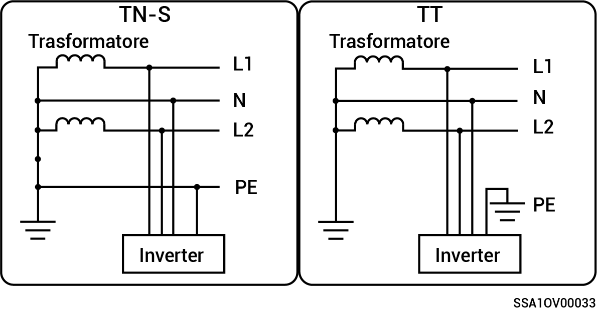

# Sistema a doppia tensione

* Le modalità di alimentazione della rete supportate sono TN-S e TT.
* Quando è applicato alla modalità di alimentazione della rete TT, la tensione richiesta tra N e PE è inferiore a 30 V.

<figure><figcaption></figcaption></figure>
