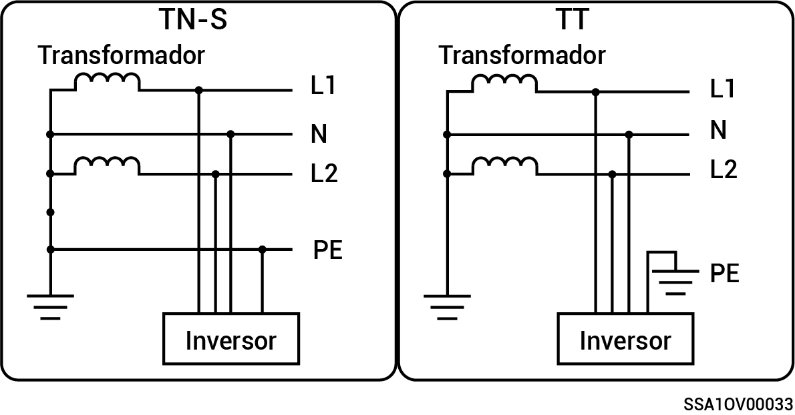

# Sistema de fase dividida

* Los métodos de alimentación a la red admitidos son TN-S y TT.
* Cuando se aplica al modo de conexión a la red TT, el requisito de voltaje para N a PE es menor de 30 V.

<figure><figcaption></figcaption></figure>
