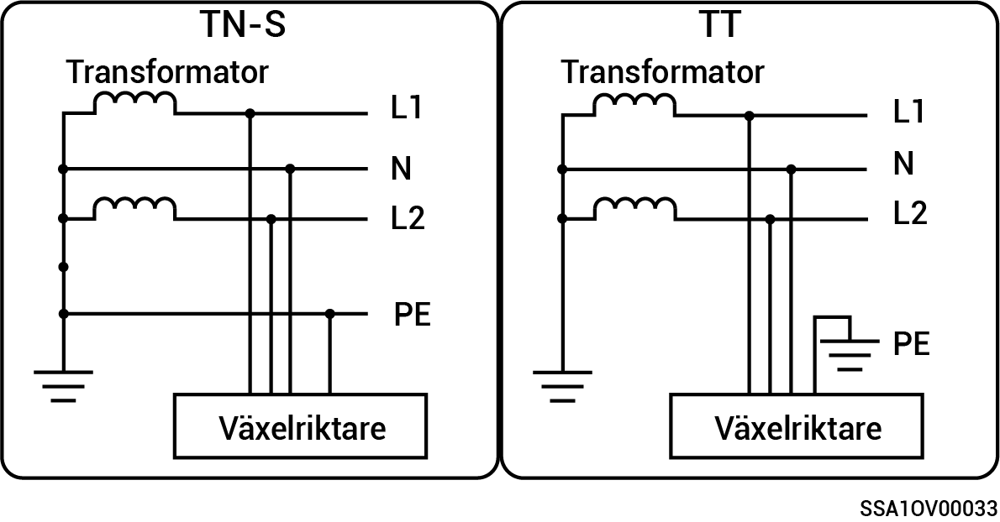

# Enfassystem med hjälpfas

* De lägen för nätförsörjning som stöds är TN-S och TT.
* Vid tillämpningar i TT-nätförsörjningsläge är spänningskravet för N till PE mindre än 30 V.

<figure><figcaption></figcaption></figure>
