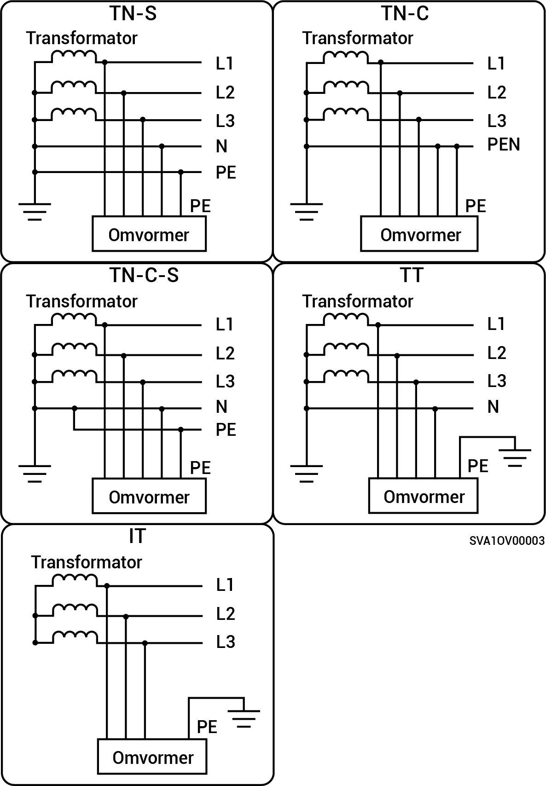

# Driefasig systeem

* De ondersteunde netvoedingsmodi zijn TN-S, TN-C, TN-C-S, TT en IT.
* Wanneer toegepast op de TT-netvoedingsmodus, is de spanningsvereiste voor N naar PE minder dan 30V.

<figure><figcaption></figcaption></figure>
