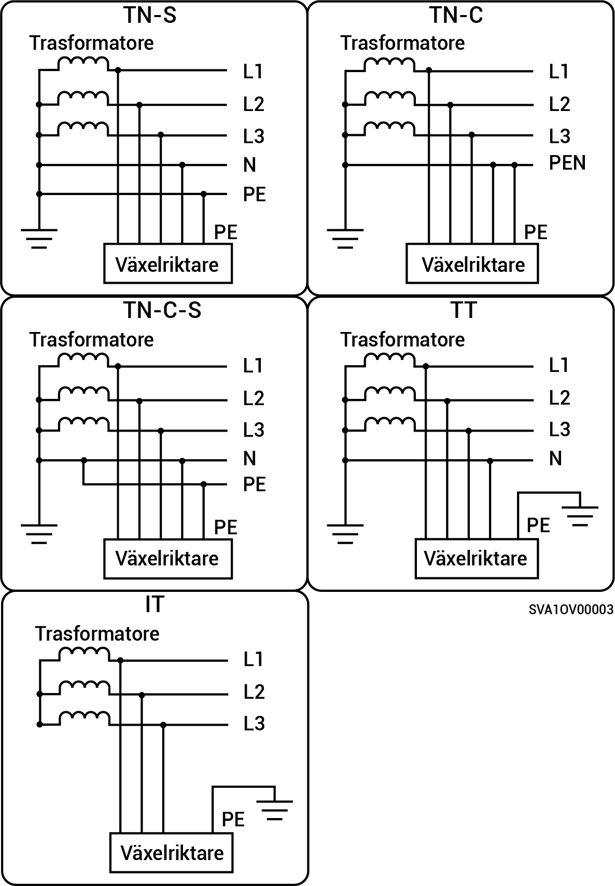

# Sigen Hybrid (3.0-12.0) serie TP2

* Le modalità di alimentazione della rete supportate sono TN-S, TN-C, TN-C-S, TT e IT.
* Quando è applicato alla modalità di alimentazione della rete TT, la tensione richiesta tra N e PE è inferiore a 30 V.

<figure><figcaption></figcaption></figure>
