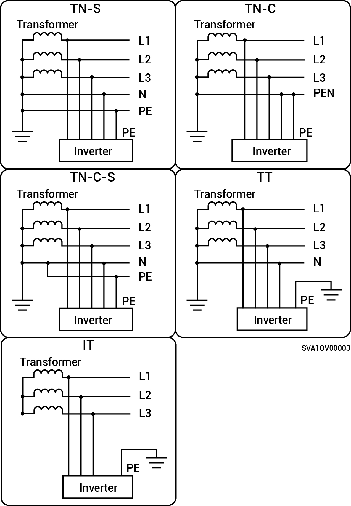

# Sigen Hybrid (3.0-12.0) TP2 Series

* Supported grid power modes are TN-S, TN-C, TN-C-S, TT and IT.
* When applied to the TT grid power mode, the voltage requirement for N to PE is less than 30V.

<figure><figcaption></figcaption></figure>
