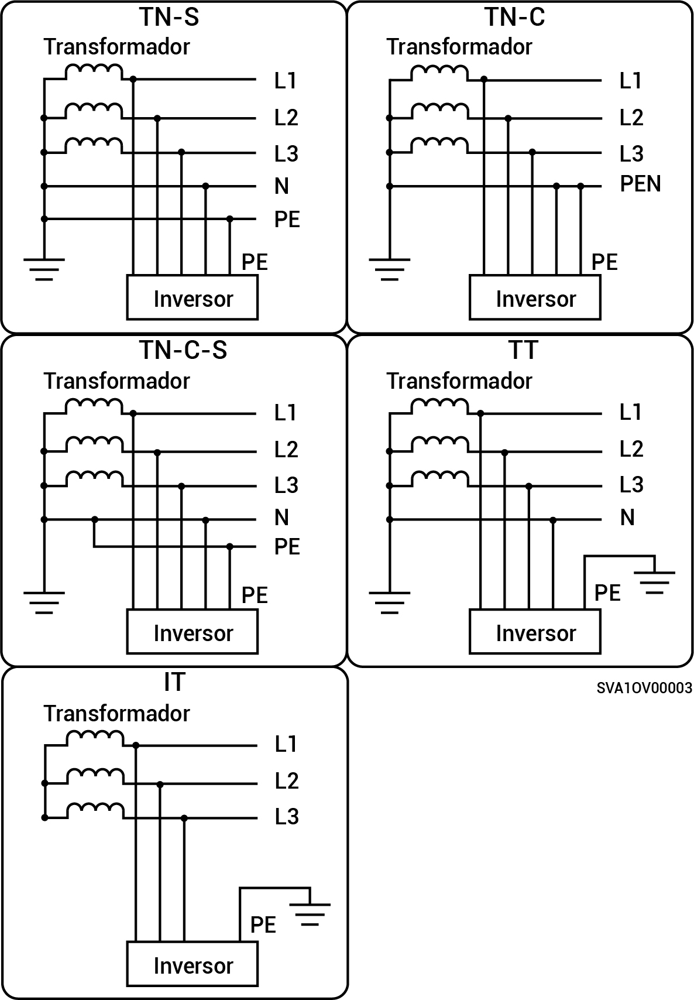

# Sigen Hybrid (3.0-12.0) serie TP2

* Los métodos de alimentación a la red admitidos son TN-S, TN-C, TN-C-S, TT e IT.
* Cuando se aplica al modo de conexión a la red TT, el requisito de voltaje para N a PE es menor de 30 V.

<figure><figcaption></figcaption></figure>
