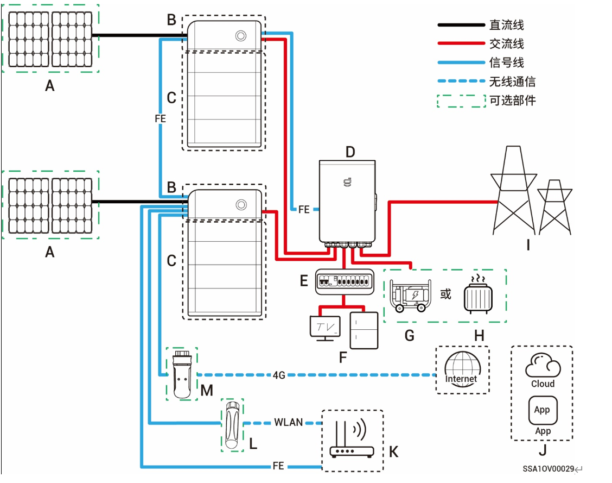
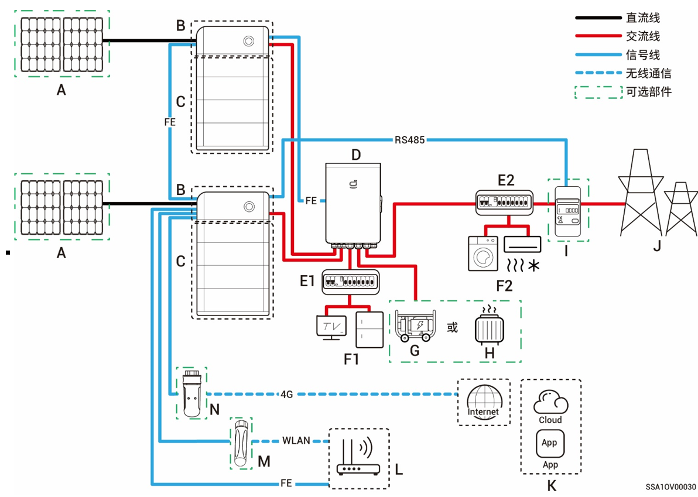
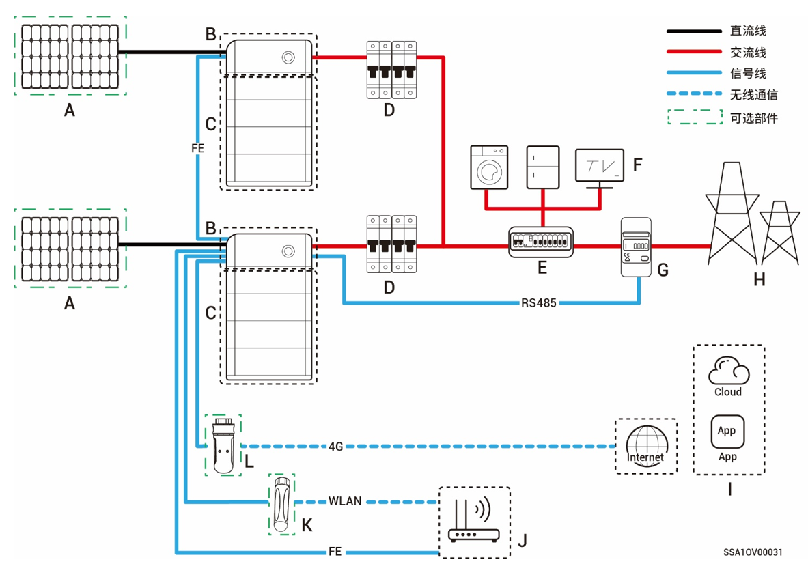

# 典型组网介绍

* SigenStor适用于单相SigenStor Home储能系统。SigenStor Home储能系统由光伏板【注】、逆变器、电池包、总控制开关、Gateway、负载、电网等组成。
* SigenStor Home储能系统主要功能是将光伏板产生的直流电存储到电池包中，也可以将光伏与电池包中的电转化成交流电提供给负载使用或并入电网。
* 注：不可使用连接功能地线的光伏板。



<mark style="color:blue;">备电组网下，备电负载离网运行时长与光储系统供电能力相关，若离网运行时，光储系统供电出现异常（包含但不限于光伏发电异常、电池电量不足、油机等供电源异常），备电负载依然存在无法运行情况。</mark>

## 组网图（全屋备电）

<figure><figcaption></figcaption></figure>

| 序号    | 说明      | 序号    | 说明           | 序号    | 说明            |
| ----- | ------- | ----- | ------------ | ----- | ------------- |
| **A** | 光伏板     | **B** | SigenStor EC | **C** | SigenStor BAT |
| **D** | Gateway | **E** | 备电配电单元       | **F** | 备电家用负载        |
| **G** | 柴油发电机   | **H** | 智能负载         | **I** | 电网            |
| **J** | mySigen | **K** | 路由器          | **L** | 天线棒           |
| **M** | CommMod |       |              |       |               |



* <mark style="color:blue;">柴油发电机可作为长期离网场景的备份能源，与Gateway配合可实现光储柴无缝切换的用电体验。</mark>
* <mark style="color:blue;">业主家中的用电设备均可作为智能负载接入。为保证本产品对用户利益最大化，建议大功率设备作为智能负载接入（如热泵、泳池加热器、干衣机、热得快等），当储能电量不足时可切出。其他小功率设备作为家用负载接入（如热泵、泳池加热器、干衣机、热得快等），当储能电量不足时可切出其他小功率设备作为家用负载接入（如灯、路由器等）。</mark>\
  <mark style="color:blue;">热得快最大功率需≤17.6kW/80A。</mark>
* <mark style="color:blue;">通信方式推荐采用FE和WLAN。采用4G通信，需您购买Sigen CommMod。CommMod赠送4G流量用完后，需用户自行充值或更换SIM卡。</mark>

## 组网图（部分备电）

<figure><figcaption></figcaption></figure>

| 序号     | 说明      | 序号     | 说明           | 序号     | 说明            |
| ------ | ------- | ------ | ------------ | ------ | ------------- |
| **A**  | 光伏板     | **B**  | SigenStor EC | **C**  | SigenStor BAT |
| **D**  | Gateway | **E1** | 备电配电单元       | **E2** | 非备电配电单元       |
| **F1** | 备电家用负载  | **F2** | 非备电家用负载      | **G**  | 柴油发电机         |
| **H**  | 智能负载    | **I**  | 功率传感器        | **J**  | 电网            |
| **K**  | mySigen | **L**  | 路由器          | **M**  | 天线棒           |
| **N**  | CommMod |        |              |        |               |



* <mark style="color:blue;">柴油发电机可作为长期离网场景的备份能源，与Gateway配合可实现光储柴无缝切换的用体验。</mark>
* <mark style="color:blue;">业主家中的用电设备均可作为智能负载接入。为保证本产品对用户利益最大化，建议大功率设备作为智能负载接入（如热泵、泳池加热器、干衣机、热得快等），当储能电量不足时可切出。其他小功率设备作为家用负载接入（如灯、路由器等）。</mark>\ <mark style="color:blue;">热得快最大功率需≤17.6kW/80A。</mark>
* <mark style="color:blue;">功率传感器具备并网点数据采集实现零功率并网功能。仅部分备电时，功率传感器可不配置；部分备电+零功率并网控制时，功率传感器需配置。</mark>
* <mark style="color:blue;">通信方式推荐采用FE和WLAN。采用4G通信，需您购买Sigen CommMod。CommMod赠送4G流量用完后，需用户自行充值或更换SIM卡。</mark>

## 组网图（非备电组网）

<figure><figcaption></figcaption></figure>

| 序号    | 说明    | 序号    | 说明           | 序号    | 说明            |
| ----- | ----- | ----- | ------------ | ----- | ------------- |
| **A** | 光伏板   | **B** | SigenStor EC | **C** | SigenStor BAT |
| **D** | 交流开关  | **E** | 配电单元         | **F** | 家用负载          |
| **G** | 功率传感器 | **H** | 电网           | **I** | mySigen       |
| **J** | 路由器   | **K** | 天线棒          | **L** | CommMod       |



* <mark style="color:blue;">与每一台逆变器连接的交流开关额定电压均需≥240 Va.c.，额定电流为40A</mark>
* <mark style="color:blue;">通信方式推荐采用FE和WLAN。采用4G通信，需您购买Sigen CommMod。CommMod赠送4G流量用完后，需用户自行充值或更换SIM卡。</mark>
* <mark style="color:blue;">配电单元的交流开关额定电压需 ≥240 Va.c., 额定电流需：≥ 逆变器最大输出电流 x 并机数量 x 1.25【1】</mark>

注【1】：逆变器最大输出电流可在产品Data sheets上获取
