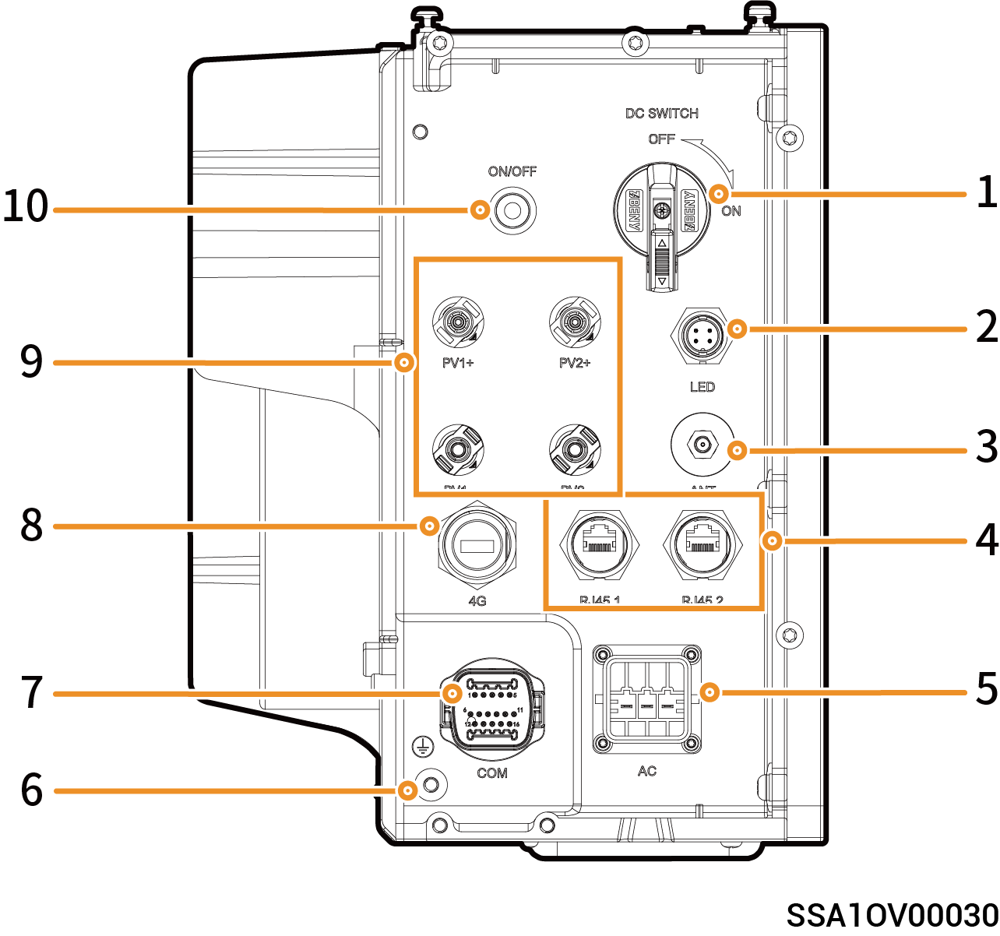
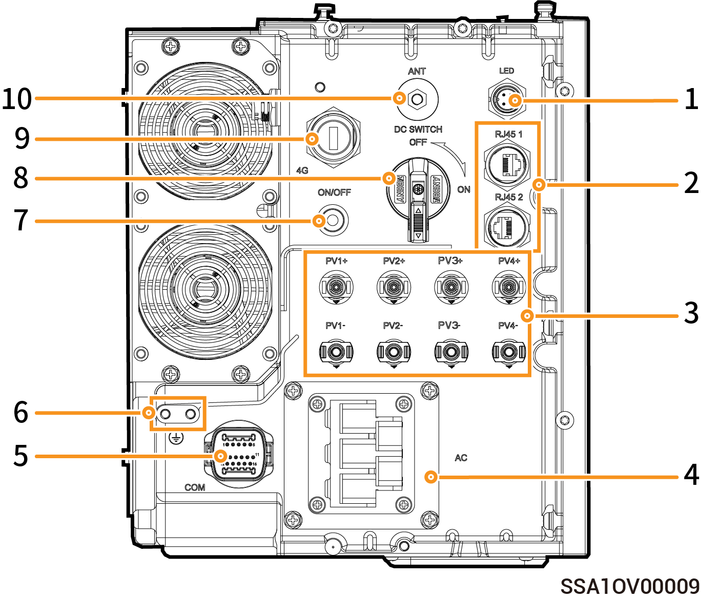
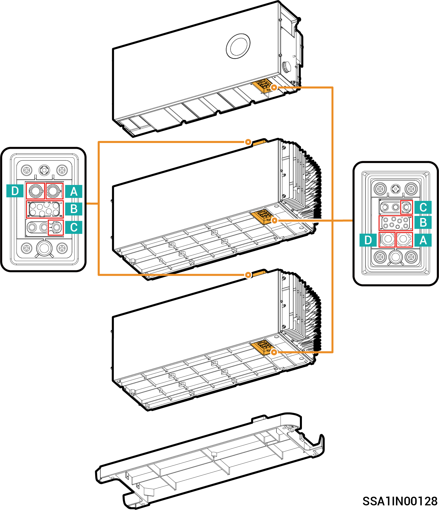

# 端口介绍

### **SigenStor EC (5.0, 6.0) SP**

<figure><figcaption></figcaption></figure>

| 序号 | 名称        | 丝印                   |
| -- | --------- | -------------------- |
| 1  | 直流开关      | DC SWITCH            |
| 2  | 装饰盖灯带接口   | LED                  |
| 3  | 天线接口      | ANT                  |
| 4  | 网线接口      | RJ45 1/ RJ45 2       |
| 5  | 交流输出接口    | AC                   |
| 6  | 接地螺钉      | -                    |
| 7  | RS485通信接口 | COM                  |
| 8  | CommMod接口 | 4G                   |
| 9  | 直流输入接口    | PV1+/PV2+/ PV1-/PV2- |
| 10 | 开关按钮      | ON/OFF               |

### **SigenStor EC (5.0–30.0) TP AU**

<figure><figcaption></figcaption></figure>

| 序号 | 名称              | 丝印                                         |
| -- | --------------- | ------------------------------------------ |
| 1  | 装饰件灯带接口         | LED                                        |
| 2  | 网线接口            | RJ45 1/ RJ45 2                             |
| 3  | 直流输入接口          | PV1+/PV2+/ PV3+/PV4+/ PV1–/PV2– /PV3–/PV4– |
| 4  | 交流输出接口          | AC                                         |
| 5  | 通信接口            | COM                                        |
| 6  | 接地螺钉            | –                                          |
| 7  | 开关按钮            | ON/OFF                                     |
| 8  | 直流开关            | DC SWITCH                                  |
| 9  | Sigen CommMod接口 | 4G                                         |
| 10 | 天线接口            | ANT                                        |

### **SigenStor EC-(8.0–12.0) SP AU**

<figure><figcaption></figcaption></figure>

| 序号 | 名称              | 丝印                                         |
| -- | --------------- | ------------------------------------------ |
| 1  | 装饰件灯带接口         | LED                                        |
| 2  | 网线接口            | RJ45 1/ RJ45 2                             |
| 3  | 直流输入接口          | PV1+/PV2+/ PV3+/PV4+/ PV1–/PV2– /PV3–/PV4– |
| 4  | 交流输出接口          | AC                                         |
| 5  | 通信接口            | COM                                        |
| 6  | 接地螺钉            | –                                          |
| 7  | 开关按钮            | ON/OFF                                     |
| 8  | 直流开关            | DC SWITCH                                  |
| 9  | Sigen CommMod接口 | 4G                                         |
| 10 | 天线接口            | ANT                                        |

### **模块盲插连接器**

| 序号 | 含义   |
| -- | ---- |
| A  | BAT- |
| B  | 通信接口 |
| C  | PE   |
| D  | BAT+ |
