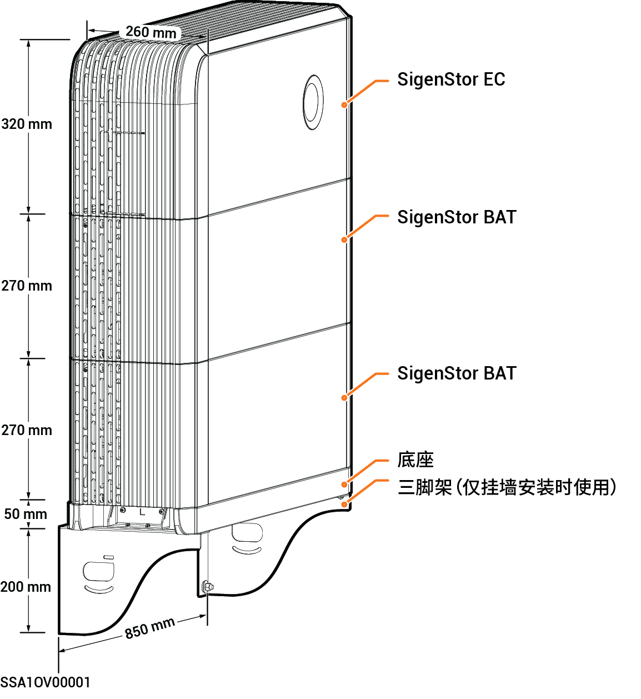
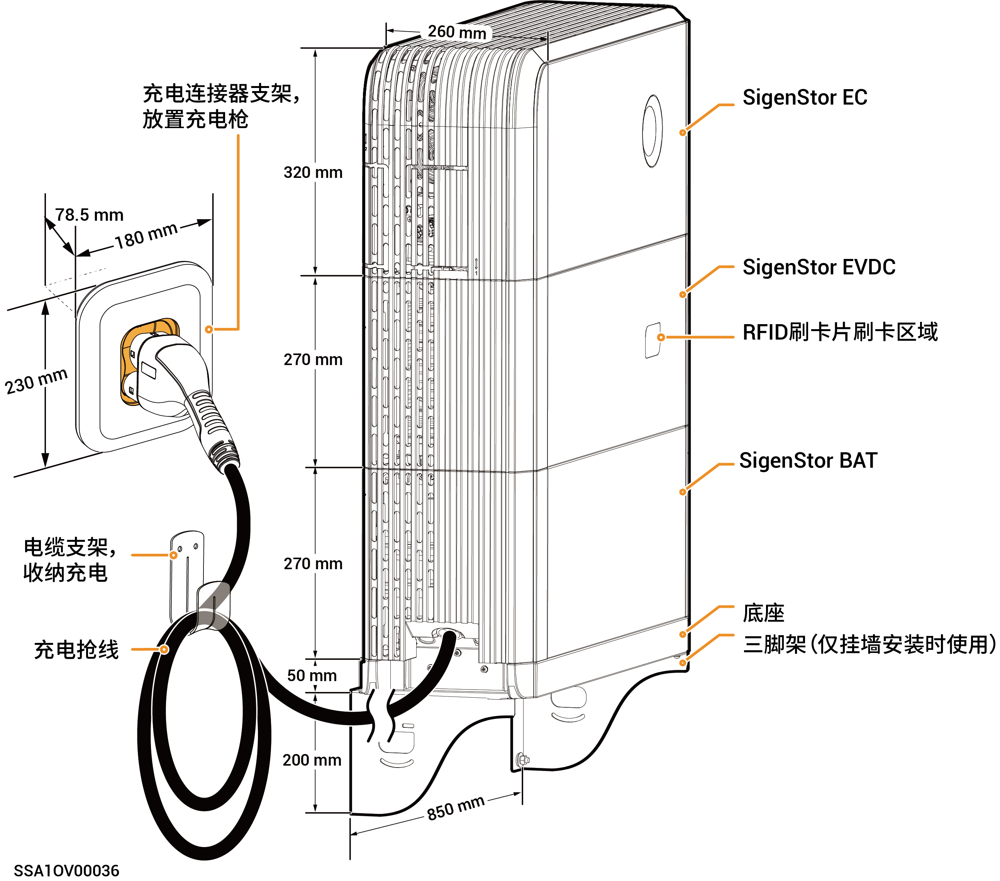

# 外观与尺寸

### **未配置SigenStor EVDC系列**



<mark style="color:blue;">以配置2台SigenStor BAT为例展示外观。</mark>

<figure><figcaption></figcaption></figure>

### **配置SigenStor EVDC系列**



<mark style="color:$primary;">以配置1台SigenStor BAT为例展示外观。</mark>

<figure><figcaption></figcaption></figure>
