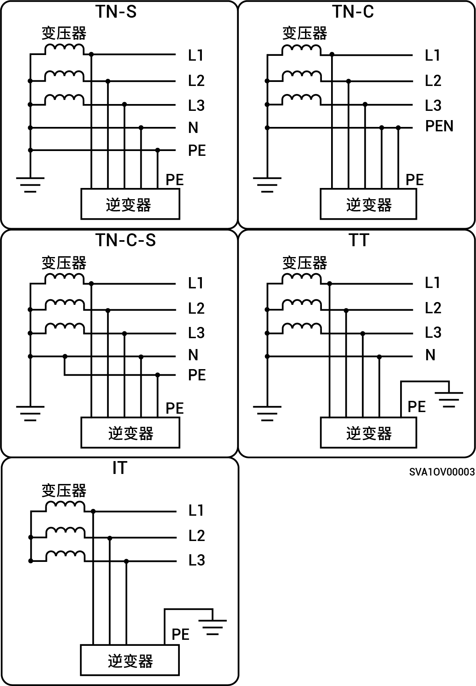

# 支持的电网供电方式

### SigenStor-(5S, 6S)系列\&SigenStor-(8S–12S)系列

* 支持的电网供电方式为TN-S、TN-C、TN-C-S 和 TT。
* 当应用于TT的电网供电方式时，N对PE的电压要求＜30V。

.jpeg>)

### SigenStor-(5T–30T)系列

* 支持的电网供电方式为TN-S、TN-C、TN-C-S、TT和IT。
* 当应用于TT的电网供电方式时，N对PE的电压要求＜30V。

<figure><figcaption></figcaption></figure>
