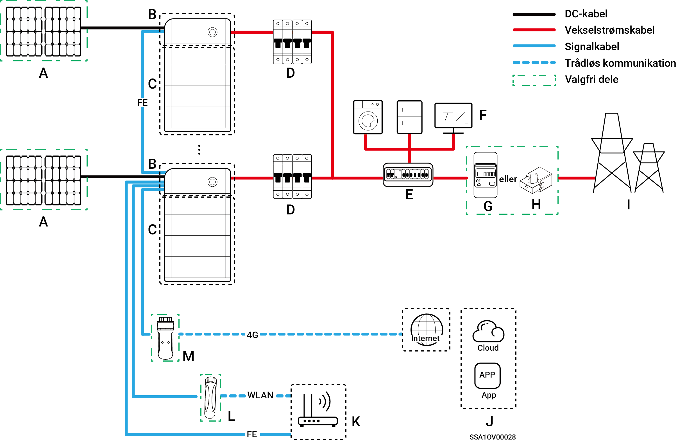

# Introduktion til systemets kabelføring

* vores virksomheds produkter kan bruges til energilagringssystemer til hjemmet. Hjemmets energilagringssystem består af solcellepaneler, invertere, batteripakker, hovedafbrydere, gateway, belastninger, elnet osv.
* Hjemmeenergilagringssystemets hovedfunktion er at lagre den jævnstrøm, der genereres af solcellepaneler, i batteripakker. Alternativt kan elektriciteten i solcelleanlægget og batteripakken omdannes til vekselstrøm til brug for forbruget eller indføres i elnettet.



* <mark style="color:blue;">Under kabelføring til backupstrømsystemet er varigheden af backupstrømsbelastningens drift uden for nettet relateret til strømforsyningskapaciteten i PV-lagringssystemet. Hvis der opstår en fejl i strømforsyningen til PV-lagringssystemet under drift uden for nettet (herunder, men ikke begrænset til, unormal PV-strømproduktion, utilstrækkelig batteristrøm og unormal strømforsyning til dieselgeneratoren), vil backupstrømbelastningen stadig ikke kunne fungere.</mark>
* <mark style="color:blue;">Lavspændings trefasesystem Home Series-produkter understøtter ikke backup-scenarier, og kun ledningsdiagrammet for ikke-backup-systemer er tilgængeligt.</mark>

## **Ledningsdiagram for backup-system til hele hjemmet**

<figure><figcaption></figcaption></figure>

<table data-header-hidden><thead><tr><th width="61.11114501953125" align="center">Nej.</th><th width="114.77777099609375">Beskrivelse</th><th width="60.33331298828125" align="center">Nej.</th><th>Beskrivelse</th><th width="59" align="center" valign="middle">Nej.</th><th>Beskrivelse</th></tr></thead><tbody><tr><td align="center"><strong>A</strong></td><td>PV-panel</td><td align="center"><strong>B</strong></td><td>SigenStor EC/ Sigen Hybrid</td><td align="center" valign="middle"><strong>C</strong></td><td>SigenStor BAT</td></tr><tr><td align="center"><strong>D</strong></td><td>Gateway</td><td align="center"><strong>E</strong></td><td>Backup-fordelingstavle</td><td align="center" valign="middle"><strong>F</strong></td><td>Backup-husholdningsbelastninger</td></tr><tr><td align="center"><strong>G</strong></td><td>Generator</td><td align="center"><strong>H</strong></td><td>Smarte belastninger</td><td align="center" valign="middle"><strong>I</strong></td><td>Elnet</td></tr><tr><td align="center"><strong>J</strong></td><td>mySigen</td><td align="center"><strong>K</strong></td><td>Router</td><td align="center" valign="middle"><strong>L</strong></td><td>Antenne</td></tr><tr><td align="center"><strong>M</strong></td><td>CommMod</td><td align="center"></td><td></td><td align="center" valign="middle"></td><td></td></tr></tbody></table>



* <mark style="color:blue;">Der kan ikke kædes mere end 20 SigenStor-enheder sammen.</mark>
* <mark style="color:blue;">Når B er Sigen Hybrid, er C valgfrit.</mark>
* <mark style="color:blue;">Hvis der er lækage i F (backup-husholdningsbelastning), kan det udgøre en risiko for elektrisk stød. For at undgå denne fare skal der installeres en fejlstrømsafbryder (RCD) mellem D (Gateway) og F (backup-husholdningsbelastning).</mark>
* <mark style="color:blue;">Som backup-energikilde til langvarige off-grid-anvendelser kan dieselgeneratoren arbejde sideløbende med Gateway for at sikre en jævn overgang mellem PV, lagring og dieselproduktion.</mark>
* <mark style="color:blue;">Alt det elektriske udstyr i ejerens hjem kan tilsluttes som smarte belastninger. For at sikre, at produktet maksimerer fordelene for brugere, anbefales det, at strømkrævende udstyr tilsluttes som smarte belastninger (varmepumper, poolvarmere, tørretumblere osv.), som kan afbrydes, når energilagringssystemet løber tør for strøm. Andet laveffektudstyr er tilsluttet som husholdningsbelastninger (lamper, routere osv.).</mark>
* <mark style="color:blue;">Det anbefales at bruge Fast Ethernet og WLAN til kommunikation med invertere. Når CommMod gratis 4G-trafik er opbrugt, skal brugerne fylde deres konti op eller udskifte deres SIM-kort.</mark>

## **Ledningsdiagram for delvist backup-system til hjemmet**

<figure><figcaption></figcaption></figure>

<table data-header-hidden><thead><tr><th width="59.11114501953125" align="center">Nej.</th><th width="170">Beskrivelse</th><th width="60.22216796875" align="center">Nej.</th><th width="229">Beskrivelse</th><th width="60.22216796875" align="center">Nej.</th><th>Beskrivelse</th></tr></thead><tbody><tr><td align="center"><strong>A</strong></td><td>PV-panel</td><td align="center"><strong>B</strong></td><td>SigenStor EC/ Sigen Hybrid</td><td align="center"><strong>C</strong></td><td>SigenStor BAT</td></tr><tr><td align="center"><strong>D</strong></td><td>Gateway</td><td align="center"><strong>E1</strong></td><td>Backup-fordelingstavle</td><td align="center"><strong>E2</strong></td><td>Ikke-backup-fordelingstavle</td></tr><tr><td align="center"><strong>F1</strong></td><td>Backup-husholdningsbelastninger</td><td align="center"><strong>F2</strong></td><td>Ikke-backup-husholdningsbelastninger</td><td align="center"><strong>G</strong></td><td>Generator</td></tr><tr><td align="center"><strong>H</strong></td><td>Smarte belastninger</td><td align="center"><strong>I</strong></td><td>Effektsensor</td><td align="center"><strong>J</strong></td><td>CT-sensor</td></tr><tr><td align="center"><strong>K</strong></td><td>Elnet</td><td align="center"><strong>L</strong></td><td>mySigen</td><td align="center"><strong>M</strong></td><td>Router</td></tr><tr><td align="center"><strong>N</strong></td><td>Antenne</td><td align="center"><strong>O</strong></td><td>CommMod</td><td align="center"></td><td></td></tr></tbody></table>



* <mark style="color:blue;">Der kan ikke kædes mere end 20 SigenStor-enheder sammen.</mark>
* <mark style="color:blue;">Når B er Sigen Hybrid, er C valgfrit.</mark>
* <mark style="color:blue;">Hvis E2 (ikke-backup fordelingstavle) har lækagebeskyttelse, anbefales det, at den mærkede reststrømsværdi er større end eller lig med antallet af invertere × 100 mA.</mark>
* <mark style="color:blue;">Hvis der er lækage i F1 (backup-husholdningsbelastning), kan det udgøre en risiko for elektrisk stød. For at undgå denne fare skal der installeres en fejlstrømsafbryder (RCD) mellem D (Gateway) F1 (backup-husholdningsbelastning).</mark>
* <mark style="color:blue;">Som backup-energikilde til langvarige off-grid-anvendelser kan dieselgeneratoren arbejde sideløbende med Gateway for at sikre en jævn overgang mellem PV, lagring og diesel-strømproduktion.</mark>
* <mark style="color:blue;">Alt det elektriske udstyr i ejerens hjem kan tilsluttes som smarte belastninger. For at sikre, at produktet maksimerer fordelene for brugere, anbefales det, at strømkrævende udstyr tilsluttes som smarte belastninger (varmepumper, poolvarmere, tørretumblere osv.), som kan afbrydes, når energilagringssystemet løber tør for strøm. Andet lavt strømforbrugende udstyr tilsluttes som husholdningsbelastninger (lys, routere osv.)</mark> <mark style="color:blue;">Den maksimale effekt for elvarmeren må ikke overstige 17,6 kW/80 A.</mark>
* <mark style="color:blue;">Strømsensoren har som funktion at foretage dataindsamling for nettilslutningspunkter og muliggør nuleffekt-nettilslutning. Til ledningsføringen i et delvist backupsystem til hjemmet behøver strømsensoren ikke at blive konfigureret. For delvis backup-strøm og nul-eksport nettilslutningskontrolsystemets ledningsføring er effektmåleren konfigureret.</mark>
* <mark style="color:blue;">Kun splitfase-systemet bruger CT-sensorer. CT-sensoren understøtter indsamling af data fra netforbindelsespunkter for at opnå netforbindelsesfunktionalitet uden strømforsyning. CT-sensoren er muligvis ikke nødvendig i tilfælde af delvis backupstrøm. Når delvis backupstrøm + nul-strøm netforbindelseskontrol anvendes, skal CT-sensoren konfigureres.</mark>
* <mark style="color:blue;">Det anbefales at bruge Fast Ethernet og WLAN til kommunikation med invertere. Når CommMod gratis 4G-trafik er opbrugt, skal brugerne fylde deres konti op eller udskifte deres SIM-kort.</mark>

## **Ledningsdiagram for system uden backup**

<figure><figcaption></figcaption></figure>

<table data-header-hidden><thead><tr><th width="55">Nej.</th><th width="149">Beskrivelse</th><th width="52">Nej.</th><th width="239">Beskrivelse</th><th width="45">Nej.</th><th>Beskrivelse</th></tr></thead><tbody><tr><td><strong>A</strong></td><td>PV-panel</td><td><strong>B</strong></td><td>SigenStor EC/ Sigen Hybrid</td><td><strong>C</strong></td><td>SigenStor BAT</td></tr><tr><td><strong>D</strong></td><td>AC-afbryder</td><td><strong>E</strong></td><td>Fordelingstavle</td><td><strong>F</strong></td><td>Husholdningsbelastninger</td></tr><tr><td><strong>G</strong></td><td>Effektsensor</td><td><strong>H</strong></td><td>CT-sensor</td><td><strong>I</strong></td><td>Elnet</td></tr><tr><td><strong>J</strong></td><td>mySigen</td><td><strong>K</strong></td><td>Router</td><td><strong>L</strong></td><td>Antenne</td></tr><tr><td><strong>M</strong></td><td>CommMod</td><td></td><td></td><td></td><td></td></tr></tbody></table>



* <mark style="color:blue;">Der kan ikke kædes mere end 20 SigenStor-enheder sammen.</mark>
* <mark style="color:blue;">Når B er Sigen Hybrid, er C valgfrit.</mark>
* <mark style="color:blue;">Den nominelle spænding for vekselstrømsafbryderen, der er tilsluttet hver enkeltfaset systeminverter, skal være ≥ 240 V AC, og de anbefalede specifikationer for nominel strøm er:</mark>
  * <mark style="color:blue;">SigenStor EC/Sigen Hybrid (3.0-4.0) SP: Den nominelle strøm er 25 A.</mark>
  * <mark style="color:blue;">SigenStor EC/Sigen Hybrid (4.6-6.0) SP: Den nominelle strøm er 40 A.</mark>
  * <mark style="color:blue;">SigenStor EC/ Sigen Hybrid 8.0 SP: Den nominelle strøm er 50 A.</mark>
  * <mark style="color:blue;">SigenStor EC/ Sigen Hybrid (10.0-12.0) SP: Den nominelle strøm er 60 A.</mark>
* <mark style="color:blue;">Den nominelle spænding for vekselstrømsafbryderen, der er tilsluttet hver trefaset systeminverter, skal være ≥ 380 V AC, og de anbefalede specifikationer for nominel strøm er:</mark>
  * <mark style="color:blue;">SigenStor EC/Sigen Hybrid (5.0-8.0) TP: Den nominelle strøm er 25 A.</mark>
  * <mark style="color:blue;">SigenStor EC/Sigen Hybrid (10.0-15.0) TP: Den nominelle strøm er 32 A.</mark>
  * <mark style="color:blue;">SigenStor EC/Sigen Hybrid (17.0-20.0) TP: Den nominelle strøm er 40 A.</mark>
  * <mark style="color:blue;">SigenStor EC/Sigen Hybrid 25.0 TP: Den nominelle strøm er 50 A.</mark>
  * <mark style="color:blue;">SigenStor EC/Sigen Hybrid 30.0 TP: Den nominelle strøm er 63 A.</mark>
* <mark style="color:blue;">Den nominelle spænding for vekselstrømsafbryderen, der er tilsluttet hver lavspændings‑trefasesysteminverter, skal være ≥ 230 V AC, og de anbefalede specifikationer for nominel strøm er:</mark>
  * <mark style="color:blue;">SigenStor EC/Sigen Hybrid (5.0, 6.0) TPLV: Den nominelle strøm er 25 A.</mark>
  * <mark style="color:blue;">SigenStor EC/Sigen Hybrid 8.0 TPLV: Den nominelle strøm er 32 A.</mark>
  * <mark style="color:blue;">SigenStor EC/Sigen Hybrid 10.0 TPLV: Den nominelle strøm er 40 A.</mark>
  * <mark style="color:blue;">SigenStor EC/Sigen Hybrid 12.0 TPLV: Den nominelle strøm er 50 A.</mark>
* <mark style="color:blue;">Den nominelle spænding for vekselstrømsafbryderen, der er tilsluttet hver splitfasesysteminverter, skal være ≥ 240 V AC, og de anbefalede specifikationer for nominel strøm er:</mark>
  * <mark style="color:blue;">SigenStor EC/Sigen Hybrid 4.8 SP: Den nominelle strøm er 25 A.</mark>
  * <mark style="color:blue;">SigenStor EC/Sigen Hybrid 7.6 SP: Den nominelle strøm er 40 A.</mark>
  * <mark style="color:blue;">SigenStor EC/Sigen Hybrid 11.4 SP: Den nominelle strøm er 63 A.</mark>
* <mark style="color:blue;">Hvis E (fordelingspanel) har lækagebeskyttelse, anbefales det, at den nominelle reststrøm er større end eller lig med antallet af omformere × 100 mA.</mark>
* <mark style="color:blue;">Den nominelle spænding for vekselstrømsafbryderen på fordelingspanelet for enfaset systeminverter skal være ≥ 240 V AC; den nominelle spænding for vekselstrømsafbryderen på fordelingspanelet for Lavspændings‑trefasesysteminverter skal være ≥ 380 V AC; den nominelle spænding for vekselstrømsafbryderen på fordelingspanelet for Lavspændings‑trefasesysteminverter skal være ≥ 230 V AC; den nominelle spænding for vekselstrømsafbryderen på fordelingspanelet for splitfasesystemets inverter skal være ≥ 240 V AC; den nominelle strøm skal være: ≥ den maksimale udgangsstrøm for en inverter × antallet af invertere i parallelforbindelse × 1,25</mark><mark style="color:blue;">\[1]<mark style="color:blue;">
* <mark style="color:blue;">Effektsensoren indsamler data ved nettilslutningspunktet for at opnå en nettilslutning med nul effekt. Når der kun er reservestrøm til en del af belastningerne, er strømsensoren ikke nødvendig. Når delvis backupstrøm kombineres med en strømforsyning uden tilslutning til elnettet, skal strømsensoren konfigureres.</mark>
* <mark style="color:blue;">Kun splitfase-systemet bruger CT-sensorer. CT-sensoren understøtter indsamling af data fra nettilslutningspunktet for at opnå en nettilslutningsfunktion uden strømforbrug. CT-sensoren er muligvis ikke nødvendig i tilfælde af delvis backupstrøm. Når delvis backupstrøm + nul-strøm netforbindelseskontrol anvendes, skal CT-sensoren konfigureres.</mark>
* <mark style="color:blue;">Det anbefales at bruge Fast Ethernet og WLAN til kommunikation med invertere. Når CommMod gratis 4G-trafik er opbrugt, skal brugerne fylde deres konti op eller udskifte deres SIM-kort.</mark>

Bemærk \[1]: Den maksimale udgangsstrøm for en inverter kan findes i dens respektive datablad.
