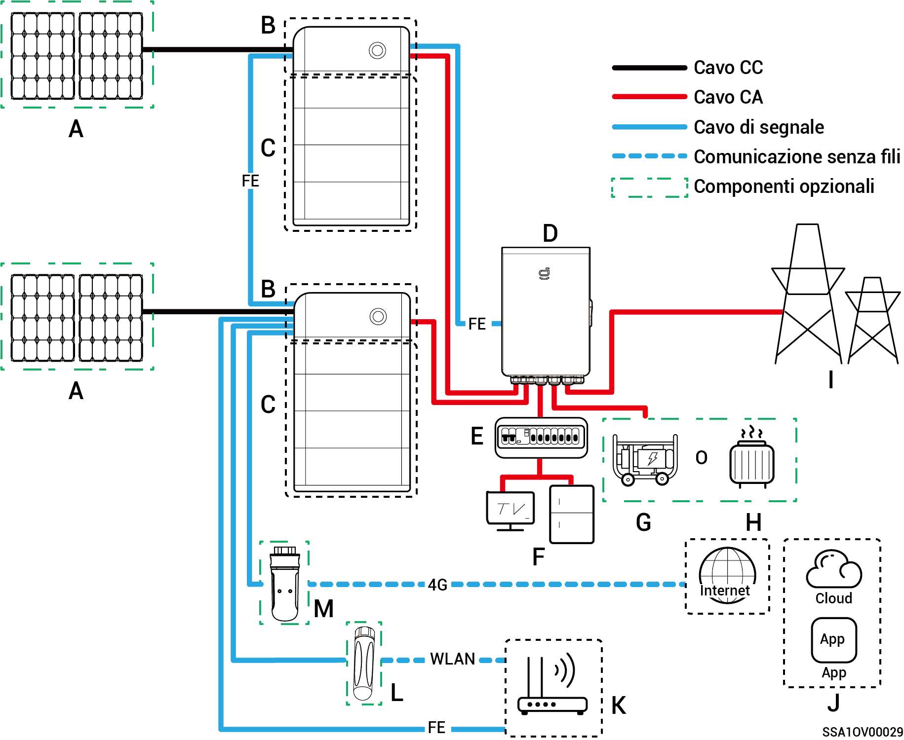
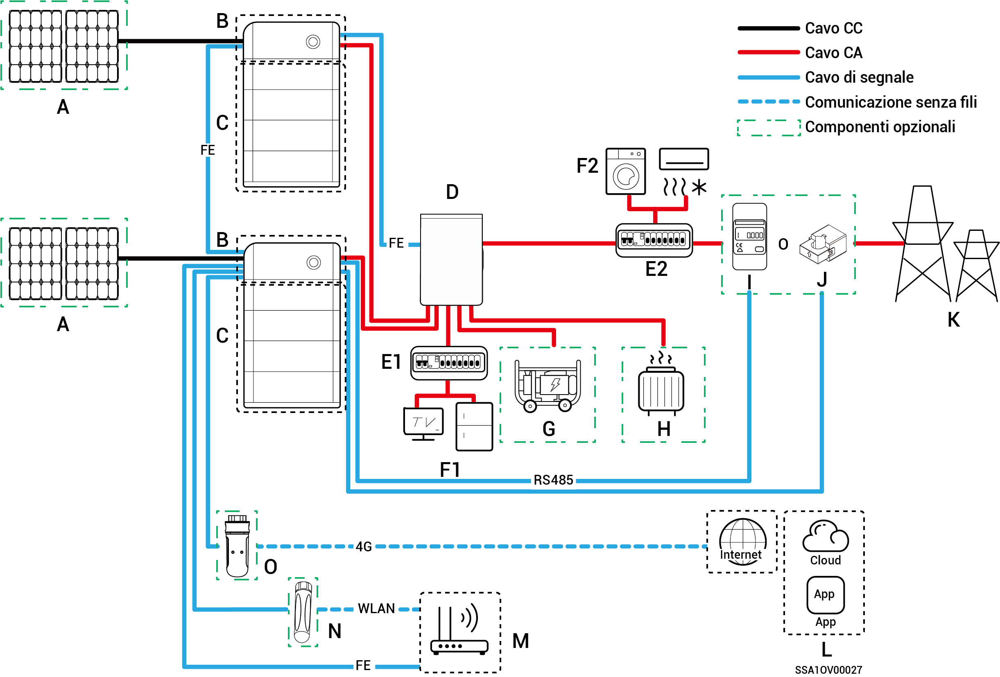
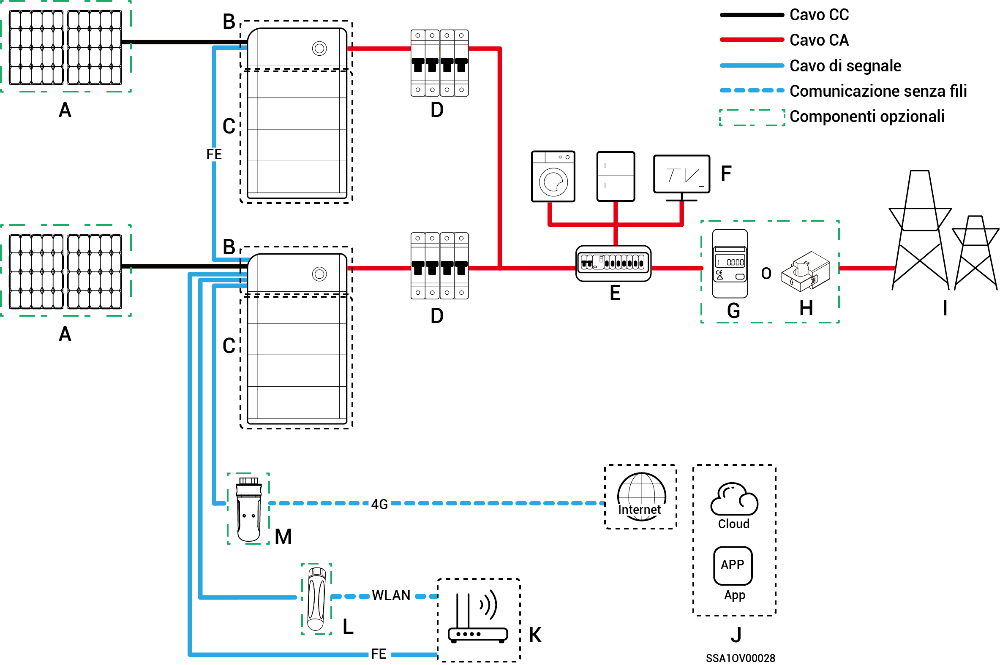

# Introduzione al cablaggio del sistema

* I prodotti della nostra azienda possono essere utilizzati per i sistemi di accumulo di energia domestici. Un sistema di accumulo di energia domestico è composto da pannelli fotovoltaici, inverter, pacchi batteria, interruttori di controllo principali, gateway, carichi, rete elettrica, ecc.
* La funzione principale del sistema di accumulo di energia domestico è quella di immagazzinare la corrente continua generata dai pannelli fotovoltaici nei pacchi batteria. Oppure, in alternativa, l'elettricità del sistema fotovoltaico e del pacco batteria può essere convertita in corrente alternata per essere utilizzata dal carico o immessa nella rete.



* <mark style="color:blue;">Quando è attivo il collegamento alla rete di alimentazione di backup, la durata del funzionamento off-grid del carico di backup è legata alla capacità di alimentazione del sistema di accumulo fotovoltaico. Se si verifica un'anomalia nell'alimentazione del sistema di accumulo fotovoltaico durante il funzionamento off-grid (ad esempio un'anormale generazione di energia fotovoltaica, carica della batteria non sufficiente e un'alimentazione del generatore diesel non normale), il carico di backup non sarà comunque in grado di funzionare.</mark>
* I prodotti per uso domestico del sistema trifase a bassa tensione non supportano gli scenari di alimentazione di backup e supportano soltanto i diagrammi di rete senza alimentazione di backup.

## **Scheda di cablaggio del sistema di backup per l'intera casa**

<figure><figcaption></figcaption></figure>

<table><thead><tr><th width="61.111083984375" align="center">N.</th><th width="133.66668701171875">Descrizione</th><th width="60.33331298828125" align="center">N.</th><th>Descrizione</th><th width="61.2222900390625" align="center">N.</th><th>Descrizione</th></tr></thead><tbody><tr><td align="center"><strong>A</strong></td><td>Pannello fotovoltaico</td><td align="center"><strong>B</strong></td><td>SigenStor EC /Sigen Hybrid</td><td align="center"><strong>C</strong></td><td>SigenStor BAT</td></tr><tr><td align="center"><strong>D</strong></td><td>Gateway</td><td align="center"><strong>E</strong></td><td>Quadro di distribuzione di backup</td><td align="center"><strong>F</strong></td><td>Carichi domestici che necessitano del backup</td></tr><tr><td align="center"><strong>G</strong></td><td>Generatore diesel</td><td align="center"><strong>H</strong></td><td>Carichi intelligenti</td><td align="center"><strong>I</strong></td><td>Rete elettrica</td></tr><tr><td align="center"><strong>J</strong></td><td>mySigen</td><td align="center"><strong>K</strong></td><td>Router</td><td align="center"><strong>L</strong></td><td>Antenna</td></tr><tr><td align="center"><strong>M</strong></td><td>CommMod</td><td align="center"></td><td></td><td align="center"></td><td></td></tr></tbody></table>



* <mark style="color:blue;">Non è possibile collegare in cascata più di 20 unità SigenStor.</mark>
* <mark style="color:blue;">Quando B è Sigen Hybrid, C è opzionale.</mark>
* <mark style="color:blue;">Se F (carico domestico che necessita del backup) è soggetto a dispersioni, sussiste un rischio di folgorazione. Per evitare questo rischio, si deve installare un interruttore differenziale (RCD) tra D (gateway) ed F (carico domestico che necessita del backup).</mark>
* <mark style="color:blue;">In quanto fonte di energia di backup per applicazioni off-grid a lungo termine, il generatore diesel può lavorare in tandem con il gateway per offrire un passaggio agevole tra fotovoltaico, accumulo e generazione diesel.</mark>
* <mark style="color:blue;">Tutte le apparecchiature elettriche presenti nella casa del proprietario possono essere collegate come carichi intelligenti. Per garantire che gli utenti possano ricevere i massimi vantaggi da questo prodotto, si consiglia di collegare le apparecchiature ad elevata potenza come carichi intelligenti (pompe di calore, riscaldatori per piscine, asciugatrici, ecc.) che possono essere interrotti quando il sistema di accumulo dell'energia ha poca energia a disposizione. Le altre apparecchiature a bassa potenza sono collegate come carichi domestici (lampade, router, ecc.).</mark> La potenza massima del riscaldatore ad immersione deve essere ≤ 17,6 kW / 80 A.
* <mark style="color:blue;">Si consiglia di utilizzare Fast Ethernet e una WLAN per la comunicazione con gli inverter. Quando il traffico 4G gratuito di CommMod si esaurisce, l'utente deve ricaricare il proprio account o sostituire la scheda SIM.</mark>

## **Schema di cablaggio del sistema di backup parziale per la casa**

<figure><figcaption></figcaption></figure>

<table><thead><tr><th width="60.22216796875" align="center">N.</th><th width="142">Descrizione</th><th width="60.22222900390625" align="center">N.</th><th width="151">Descrizione</th><th width="78" align="center">N.</th><th>Descrizione</th></tr></thead><tbody><tr><td align="center"><strong>A</strong></td><td>Pannello fotovoltaico</td><td align="center"><strong>B</strong></td><td>SigenStor EC / Sigen Hybrid</td><td align="center"><strong>C</strong></td><td>SigenStor BAT</td></tr><tr><td align="center"><strong>D</strong></td><td>Gateway</td><td align="center"><strong>E1</strong></td><td>Quadro di distribuzione di backup</td><td align="center"><strong>E2</strong></td><td>Quadro di distribuzione senza backup</td></tr><tr><td align="center"><strong>F1</strong></td><td>Carichi domestici che necessitano del backup</td><td align="center"><strong>F2</strong></td><td>Carichi domestici che non necessitano del backup</td><td align="center"><strong>G</strong></td><td>Generatore diesel</td></tr><tr><td align="center"><strong>H</strong></td><td>Carichi intelligenti</td><td align="center"><strong>I</strong></td><td>Sensore di potenza</td><td align="center"><strong>J</strong></td><td>il sensore CT</td></tr><tr><td align="center"><strong>K</strong></td><td>Rete elettrica</td><td align="center"><strong>L</strong></td><td>mySigen</td><td align="center"><strong>M</strong></td><td>Router</td></tr><tr><td align="center"><strong>N</strong></td><td>Antenna</td><td align="center"><strong>O</strong></td><td>CommMod</td><td align="center"></td><td></td></tr></tbody></table>



* <mark style="color:blue;">Non è possibile collegare in cascata più di 20 unità SigenStor.</mark>
* <mark style="color:blue;">Quando B è Sigen Hybrid, C è opzionale.</mark>
* <mark style="color:blue;">Se E2 (quadro di distribuzione senza backup) è dotato di protezione contro le dispersioni, si raccomanda che la corrente operativa residua nominale sia maggiore o uguale al numero di inverter × 100 mA.</mark>
* <mark style="color:blue;">Se F1 (carico domestico che necessita del backup) è soggetto a dispersioni, sussiste un rischio di folgorazione. Per evitare questo rischio, si deve installare un interruttore differenziale (RCD) tra D (gateway) ed F1 (carico domestico che necessita del backup).</mark>
* <mark style="color:blue;">Il generatore diesel, come fonte di energia di backup per applicazioni off-grid a lungo termine, può lavorare in tandem con il gateway per offrire un passaggio agevole tra fotovoltaico, accumulo e generazione diesel.</mark>
* <mark style="color:blue;">Tutte le apparecchiature elettriche presenti nella casa del proprietario possono essere collegate come carichi intelligenti. Per garantire che gli utenti possano ricevere i massimi vantaggi da questo prodotto, si consiglia di collegare le apparecchiature ad elevata potenza come carichi intelligenti (pompe di calore, riscaldatori per piscine, asciugatrici, ecc.) che possono essere interrotti quando il sistema di accumulo dell'energia ha poca energia a disposizione. Le altre apparecchiature a bassa potenza sono collegate come carichi domestici (lampade, router, ecc.)</mark>
* <mark style="color:blue;">Il sensore di potenza svolge la funzione di acquisire dati per i punti di collegamento alla rete e consente il collegamento senza trasferimento di energia. Per il cablaggio del sistema di backup parziale per la casa, il sensore di potenza non necessita di essere configurato. Per l'alimentazione di backup parziale e il collegamento alla rete senza trasferimento di energia, il sensore di potenza è configurato.</mark>
* <mark style="color:blue;">Solo il sistema a doppia tensione utilizza i sensori CT. Il sensore CT supporta la raccolta dei dati nel punto di collegamento alla rete per ottenere la funzionalità di collegamento alla rete a potenza zero. Il suo utilizzo può non essere necessario in caso di alimentazione di backup parziale. Quando si combina l'alimentazione di backup parziale con il controllo del collegamento alla rete a potenza zero, bisogna configurare il sensore CT.</mark>
* <mark style="color:blue;">Si consiglia di utilizzare Fast Ethernet e una WLAN per la comunicazione con gli inverter. Quando il traffico 4G gratuito di CommMod si esaurisce, l'utente deve ricaricare il proprio account o sostituire la scheda SIM.</mark>

### **Schema di cablaggio del sistema senza backup**

<figure><figcaption></figcaption></figure>

<table><thead><tr><th width="91">N.</th><th width="149">Descrizione</th><th width="74">N.</th><th>Descrizione</th><th width="82">N.</th><th>Descrizione</th></tr></thead><tbody><tr><td><strong>A</strong></td><td>Pannello fotovoltaico</td><td><strong>B</strong></td><td>SigenStor EC / SigenStor AC / Sigen Hybrid</td><td><strong>C</strong></td><td>SigenStor BAT</td></tr><tr><td><strong>D</strong></td><td>Interruttore CA</td><td><strong>E</strong></td><td>Quadro di distribuzione</td><td><strong>F</strong></td><td>Carichi domestici</td></tr><tr><td><strong>G</strong></td><td>Sensore di potenza</td><td><strong>H</strong></td><td>Rete elettrica</td><td><strong>I</strong></td><td>Rete elettrica</td></tr><tr><td><strong>J</strong></td><td>mySigen</td><td><strong>K</strong></td><td>Router</td><td><strong>L</strong></td><td>Antenna</td></tr><tr><td><strong>M</strong></td><td>CommMod</td><td></td><td></td><td></td><td></td></tr></tbody></table>



* <mark style="color:blue;">Non è possibile collegare in cascata più di 20 unità SigenStor.</mark>
* <mark style="color:blue;">Quando B è Sigen Hybrid, C è opzionale.</mark>
* <mark style="color:blue;">La tensione nominale dell'interruttore CA collegato a ciascun inverter del sistema monofase deve essere ≥ 240 Vc.a., e le specifiche della corrente nominale raccomandate sono:</mark>
  * <mark style="color:blue;">SigenStor EC/Sigen Hybrid (3.0-4.0) MF: La corrente nominale è 25 A.</mark>
  * <mark style="color:blue;">SigenStor EC/Sigen Hybrid (4.6-6.0) MF: La corrente nominale è 40 A.</mark>
  * <mark style="color:blue;">SigenStor EC/ Sigen Hybrid 8.0 MF: La corrente nominale è 50 A.</mark>
  * <mark style="color:blue;">SigenStor EC/ Sigen Hybrid (10.0-12.0) MF: La corrente nominale è 60 A.</mark>
* <mark style="color:blue;">La tensione nominale dell'interruttore CA collegato a ciascun inverter del sistema trifase deve essere ≥ 380 Vc.a., e le specifiche della corrente nominale raccomandate sono:</mark>
  * <mark style="color:blue;">SigenStor EC/Sigen Hybrid (5.0-8.0) TF: La corrente nominale è 25 A.</mark>
  * <mark style="color:blue;">SigenStor EC/Sigen Hybrid (10.0-15.0) TF: La corrente nominale è 32 A.</mark>
  * <mark style="color:blue;">SigenStor EC/Sigen Hybrid (17.0-20.0) TF: La corrente nominale è 40 A.</mark>
  * <mark style="color:blue;">SigenStor EC/Sigen Hybrid 25.0 TF: La corrente nominale è 50 A.</mark>
  * <mark style="color:blue;">SigenStor EC/Sigen Hybrid 30.0 TF: La corrente nominale è 63 A.</mark>
* <mark style="color:blue;">La tensione nominale dell'interruttore CA collegato a ciascun inverter del sistema trifase a bassa tensione deve essere ≥ 230 Vc.a., e le specifiche della corrente nominale raccomandate sono:</mark>
  * <mark style="color:blue;">SigenStor EC/Sigen Hybrid (5.0, 6.0) TFBT: La corrente nominale è 25 A.</mark>
  * <mark style="color:blue;">SigenStor EC/Sigen Hybrid 8.0 TFBT: La corrente nominale è 32 A.</mark>
  * <mark style="color:blue;">SigenStor EC/Sigen Hybrid 10.0 TFBT: La corrente nominale è 40 A.</mark>
  * <mark style="color:blue;">SigenStor EC/Sigen Hybrid 12.0 TFBT: La corrente nominale è 50 A.</mark>
* <mark style="color:blue;">La tensione nominale dell'interruttore CA collegato a ciascun inverter del sistema a doppia tensione deve essere ≥ 240 Vc.a., e le specifiche della corrente nominale raccomandate sono:</mark>
  * <mark style="color:blue;">SigenStor EC/Sigen Hybrid 4.8 DT: La corrente nominale è 25 A.</mark>
  * <mark style="color:blue;">SigenStor EC/Sigen Hybrid 7.6 DT: La corrente nominale è 40 A.</mark>
  * <mark style="color:blue;">SigenStor EC/Sigen Hybrid 11.4 DT: La corrente nominale è 63 A.</mark>
* <mark style="color:blue;">Se E (quadro di distribuzione) è dotato di protezione contro le dispersioni, si raccomanda che la corrente operativa residua nominale sia maggiore o uguale al numero di inverter × 100 mA.</mark>
* <mark style="color:blue;">La tensione nominale dell'interruttore CA del quadro di distribuzione dell'inverter del sistema monofase deve essere ≥ 240 Vc.a.; la tensione nominale dell'interruttore CA del quadro di distribuzione dell'inverter del sistema trifase deve essere ≥ 380 Vc.a.; la tensione nominale dell'interruttore CA del quadro di distribuzione dell'inverter del sistema trifase a bassa tensione deve essere ≥ 230 Vc.a.; la tensione nominale dell'interruttore CA del quadro di distribuzione dell'inverter del sistema a doppia tensione deve essere ≥ 240 Vc.a.; la corrente nominale deve essere: ≥ alla corrente di uscita massima di un inverter × il numero di inverter collegati in parallelo × 1,25</mark><mark style="color:blue;">\[1]<mark style="color:blue;">
* <mark style="color:blue;">Il sensore di potenza consente di raccogliere i dati nel punto di collegamento alla rete per ottenere un collegamento alla rete a potenza zero. Quando l'alimentazione di backup è disponibile solo per una parte dei carichi, il sensore di potenza non è necessario. Quando si combina l'alimentazione di backup parziale con il collegamento alla rete a potenza zero, bisogna configurare il sensore di potenza.</mark>
* <mark style="color:blue;">Solo il sistema a doppia tensione utilizza i sensori CT. Il sensore CT supporta la raccolta dei dati nel punto di collegamento alla rete per ottenere la funzionalità di collegamento alla rete a potenza zero. Il suo utilizzo può non essere necessario in caso di alimentazione di backup parziale. Quando si combina l'alimentazione di backup parziale con il controllo del collegamento alla rete a potenza zero, bisogna configurare il sensore CT.</mark>
* <mark style="color:blue;">La tensione nominale dell'interruttore CA del quadro di distribuzione non deve essere inferiore a 380 Vc.a., e la corrente nominale raccomandata non deve essere inferiore alla corrente di uscita massima di un inverter × il numero di inverter collegati in parallelo × 1,25</mark><mark style="color:blue;">\[1]<mark style="color:blue;"><mark style="color:blue;">.</mark>
* <mark style="color:blue;">Si consiglia di utilizzare Fast Ethernet e una WLAN per la comunicazione con gli inverter. Quando il traffico 4G gratuito di CommMod si esaurisce, l'utente deve ricaricare il proprio account o sostituire la scheda SIM.</mark>

Nota \[1]: La corrente di uscita massima di un inverter può essere ricavata dalla corrispondente scheda tecnica.
