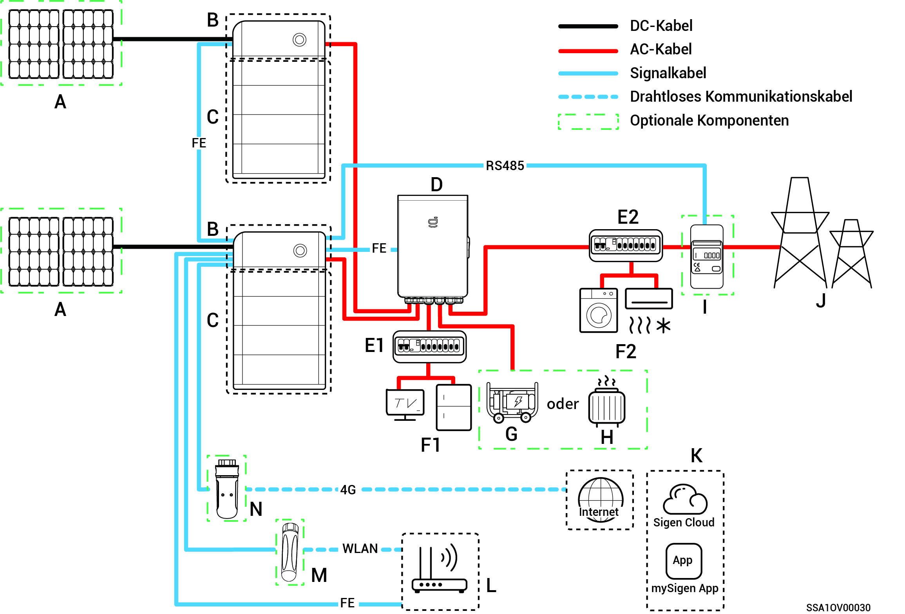
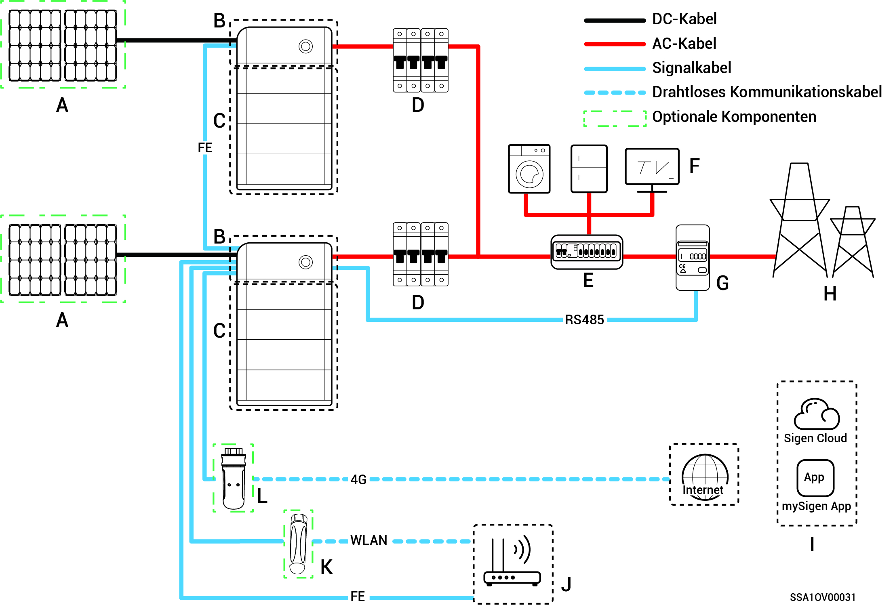

# Einführung in die Systemverdrahtung

* Unsere Produkte können für Heim-Energiespeichersysteme verwendet werden. Ein Heim-Energiespeichersystem besteht aus Photovoltaik-Modulen, Wechselrichtern, Akkus/Batterien, Hauptschaltern, Gateway, Verbrauchern, Stromnetzen usw.
* Die Hauptfunktion des Heim-Energiespeichersystems besteht darin, den von den Photovoltaik-Modulen erzeugten Gleichstrom in Batterien zu speichern. Alternativ kann der Strom der Photovoltaikanlage und der Batterien in Wechselstrom umgewandelt werden, der dann von den Verbrauchern genutzt oder in das Stromnetz eingespeist werden kann.



<mark style="color:blue;">**Während der Notstromversorgung ist die Dauer des netzunabhängigen Betriebs unter Reservestromlast abhängig von der Netzleistung des PV-Speichersystems. Bei Anomalien in der Stromversorgung des PV-Speichersystems während des netzunabhängigen Betriebs (unter anderem abnormale PV-Stromerzeugung, unzureichende Batterieleistung und anomale Stromversorgung des Dieselgenerators) kann kein Reservestrom genutzt werden.**</mark>

### **Verdrahtungsplan für die vollständige Notstromversorgung**

<figure><figcaption></figcaption></figure>

<figure><figcaption></figcaption></figure>

<table><thead><tr><th width="90" align="center" valign="middle">Nr.</th><th width="167">Beschreibung</th><th width="67" align="center">Nr.</th><th>Beschreibung</th><th width="69" align="center">Nr.</th><th>Beschreibung</th></tr></thead><tbody><tr><td align="center" valign="middle"><strong>A</strong></td><td>PV-Modul</td><td align="center"><strong>B</strong></td><td>SigenStor EC/Sigen Hybrid</td><td align="center"><strong>C</strong></td><td>SigenStor BAT</td></tr><tr><td align="center" valign="middle"><strong>D</strong></td><td>Gateway</td><td align="center"><strong>E</strong></td><td>Notstrom-Verteilertafel</td><td align="center"><strong>F</strong></td><td>Haushaltslasten mit Notstrom</td></tr><tr><td align="center" valign="middle"><strong>G</strong></td><td>Dieselgenerator</td><td align="center"><strong>H</strong></td><td>Intelligente Verbraucher</td><td align="center"><strong>I</strong></td><td>Stromnetz</td></tr><tr><td align="center" valign="middle"><strong>J</strong></td><td>mySigen</td><td align="center"><strong>K</strong></td><td>Router</td><td align="center"><strong>L</strong></td><td>Antenne</td></tr><tr><td align="center" valign="middle"><strong>M</strong></td><td>CommMod</td><td align="center"></td><td></td><td align="center"></td><td></td></tr></tbody></table>



* <mark style="color:blue;">Es können maximal 20 SigenStor-Einheiten kaskadiert werden.</mark>
* <mark style="color:blue;">Wenn B = Sigen Hybrid ist C optional.</mark>
* <mark style="color:blue;">Wenn F (Notstromverbraucher) ein Leck aufweist, besteht Stromschlaggefahr. Um diese Gefahr zu vermeiden, muss zwischen D (Gateway) und F (Notstromverbraucher) ein Fehlerstromschutzschalter (RCD) installiert werden.</mark>
* <mark style="color:blue;">Als Reserveenergiequelle für langfristige netzunabhängige Anwendungen kann der Dieselgenerator zusammen mit dem Gateway einen reibungslosen Übergang zwischen Photovoltaik, Speicherung und Dieselgenerierung gewährleisten.</mark>
* <mark style="color:blue;">Alle Stromgeräte im Heim des Eigentümers können als intelligente Verbraucher angeschlossen werden. Um sicherzustellen, dass dieses Produkt den größtmöglichen Nutzen für die Benutzer bringt, wird empfohlen, die Hochleistungsgeräte als intelligente Lasten (Wärmepumpen, Poolheizungen, Wäschetrockner usw.) anzuschließen, die abgeschaltet werden können, wenn das Energiespeichersystem nur noch über eine geringe Leistung verfügt. Andere Geräte mit niedrigem Leistungsbedarf sind als Haushaltslasten (Lampen, Router usw.) angeschlossen.</mark>
* <mark style="color:blue;">Es wird empfohlen, schnelles Ethernet und WLAN zur Kommunikation mit Wechselrichtern zu verwenden. Wenn der kostenlose 4G-Datenverkehr von CommMod aufgebraucht ist, muss der Nutzer sein Konto aufladen oder die SIM-Karte austauschen.</mark>

### **Verdrahtungsplan für die partielle Notstromversorgung**

<figure><figcaption></figcaption></figure>

<figure><figcaption></figcaption></figure>

<table><thead><tr><th width="60" align="center">Nr.</th><th width="177">Beschreibung</th><th width="60" align="center">Nr.</th><th width="191">Beschreibung</th><th width="60" align="center">Nr.</th><th>Beschreibung</th></tr></thead><tbody><tr><td align="center"><strong>A</strong></td><td>PV-Modul</td><td align="center"><strong>B</strong></td><td>SigenStor EC/Sigen Hybrid</td><td align="center"><strong>C</strong></td><td>SigenStor BAT</td></tr><tr><td align="center"><strong>D</strong></td><td>Gateway</td><td align="center"><strong>E1</strong></td><td>Notstrom-Verteilertafel</td><td align="center"><strong>E2</strong></td><td>Nicht-Notstrom-Verteilertafel</td></tr><tr><td align="center"><strong>F1</strong></td><td>Haushaltslasten mit Notstrom</td><td align="center"><strong>F2</strong></td><td>Haushaltslasten ohne Notstrom</td><td align="center"><strong>G</strong></td><td>Dieselgenerator</td></tr><tr><td align="center"><strong>H</strong></td><td>Intelligente Verbraucher</td><td align="center"><strong>I</strong></td><td>Leistungssensor</td><td align="center"><strong>J</strong></td><td>Leistungssensor</td></tr><tr><td align="center"><strong>K</strong></td><td>mySigen</td><td align="center"><strong>L</strong></td><td>Router</td><td align="center"><strong>M</strong></td><td>Antenne</td></tr><tr><td align="center"><strong>N</strong></td><td>CommMod</td><td align="center"></td><td></td><td align="center"></td><td></td></tr></tbody></table>



* <mark style="color:blue;">Es können maximal 20 SigenStor-Einheiten kaskadiert werden.</mark>
* <mark style="color:blue;">Wenn B = Sigen Hybrid ist C optional.</mark>
* <mark style="color:blue;">Wenn E2 (Verteilertafel) ohne Rückspeisung über Leckstromschutz verfügt, wird empfohlen, dass der Nenn-Restbetriebsstrom größer oder gleich der Anzahl der Wechselrichter × 100 mA ist.</mark>
* <mark style="color:blue;">Wenn F1 (Notstromverbraucher) ein Leck aufweist, besteht Stromschlaggefahr. Um diese Gefahr zu vermeiden, muss zwischen D (Gateway) und F1 (Notstromverbraucher) ein Fehlerstromschutzschalter (RCD) installiert werden.</mark>
* <mark style="color:blue;">Als Reserveenergiequelle für langfristige netzunabhängige Anwendungen kann der Dieselgenerator zusammen mit dem Gateway einen reibungslosen Übergang zwischen Photovoltaik, Speicherung und Dieselstromerzeugung gewährleisten.</mark>
* <mark style="color:blue;">Alle Stromgeräte im Heim des Eigentümers können als intelligente Verbraucher angeschlossen werden. Um sicherzustellen, dass dieses Produkt den größtmöglichen Nutzen für die Benutzer bringt, wird empfohlen, die Hochleistungsgeräte als intelligente Lasten (Wärmepumpen, Poolheizungen, Wäschetrockner usw.) anzuschließen, die abgeschaltet werden können, wenn das Energiespeichersystem nur noch über eine geringe Leistung verfügt. Andere Geräte mit niedrigem Leistungsbedarf sind als Haushaltslasten (Lampen, Router usw.) angeschlossen.</mark>
* <mark style="color:blue;">Der Leistungssensor verfügt über Datenerfassung am Netzanschlusspunkt, um einen Nullstrom-Netzanschluss zu erreichen. Für die partielle Notstrom-Systemverdrahtung: der Leistungssensor muss nicht konfiguriert werden. Für die Verdrahtung der partiellen Notstromversorgung und der Nullstrom-Netzanschlusssteuerung: der Leistungssensor ist konfiguriert.</mark>
* <mark style="color:blue;">CT-Sensoren werden nur im Split-Phase-System verwendet. Der Stromwandler-Sensor unterstützt die Datenerfassung am Netzanschlusspunkt, um eine Null-Strom-Netzanschlussfunktionalität zu erreichen. Der Stromwandler-Sensor ist möglicherweise nicht erforderlich, wenn eine teilweise Notstromversorgung vorhanden ist. Bei partieller Notstromversorgung + Nullstrom-Netzanschlusssteuerung muss der CT-Sensor konfiguriert werden.</mark>
* <mark style="color:blue;">Es wird empfohlen, schnelles Ethernet und WLAN zur Kommunikation mit Wechselrichtern zu verwenden. Wenn der kostenlose 4G-Datenverkehr von CommMod aufgebraucht ist, muss der Nutzer sein Konto aufladen oder die SIM-Karte austauschen.</mark>

### **Verdrahtungsplan für das System ohne Notstrom**

<figure><figcaption></figcaption></figure>

<figure><figcaption></figcaption></figure>

<table><thead><tr><th width="60" align="center">Nr.</th><th width="153">Beschreibung</th><th width="60" align="center">Nr.</th><th width="227">Beschreibung</th><th width="60" align="center">Nr.</th><th>Beschreibung</th></tr></thead><tbody><tr><td align="center"><strong>A</strong></td><td>PV-Modul</td><td align="center"><strong>B</strong></td><td>SigenStor EC/Sigen Hybrid</td><td align="center"><strong>C</strong></td><td>SigenStor BAT</td></tr><tr><td align="center"><strong>D</strong></td><td>AC-Schalter</td><td align="center"><strong>E</strong></td><td>Verteilertafel</td><td align="center"><strong>F</strong></td><td>Haushaltslasten</td></tr><tr><td align="center"><strong>G</strong></td><td>Leistungssensor</td><td align="center"><strong>H</strong></td><td>Stromnetz</td><td align="center"><strong>I</strong></td><td>mySigen</td></tr><tr><td align="center"><strong>J</strong></td><td>Router</td><td align="center"><strong>K</strong></td><td>Antenne</td><td align="center"><strong>L</strong></td><td>CommMod</td></tr></tbody></table>



* <mark style="color:blue;">Es können maximal 20 SigenStor-Einheiten kaskadiert werden.</mark>
* <mark style="color:blue;">Wenn B = Sigen Hybrid C ist optional.</mark>
* <mark style="color:blue;">Die Nennspannung des an jeden Wechselstrom-Systemwechselrichter angeschlossenen Wechselstromschalters muss ≥240 V AC betragen. Die empfohlenen Nennstromspezifikationen sind:</mark>
  * <mark style="color:blue;">SigenStor EC/Sigen Hybrid (3.0-4.0) SP: Nennstrom 25 A.</mark>
  * <mark style="color:blue;">SigenStor EC/Sigen Hybrid (4.6-6.0) SP: Nennstrom 40 A.</mark>
  * <mark style="color:blue;">SigenStor EC/ Sigen Hybrid 8.0 SP: Nennstrom 50 A.</mark>
  * <mark style="color:blue;">SigenStor EC/ Sigen Hybrid (10.0-12.0) SP: Nennstrom 60 A.</mark>
* <mark style="color:blue;">Die Nennspannung des an jeden Dreiphasen-Systemwechselrichter angeschlossenen Wechselstromschalters muss ≥380 V AC betragen. Die empfohlenen Nennstromspezifikationen sind:</mark>
  * <mark style="color:blue;">SigenStor EC/Sigen Hybrid (5.0-8.0) TP: Nennstrom 25 A.</mark>
  * <mark style="color:blue;">SigenStor EC/Sigen Hybrid (10.0-15.0) TP: Nennstrom 32 A.</mark>
  * <mark style="color:blue;">SigenStor EC/Sigen Hybrid (17.0-20.0) TP: Nennstrom 40 A.</mark>
  * <mark style="color:blue;">SigenStor EC/Sigen Hybrid 25.0 TP: Nennstrom 50 A.</mark>
  * <mark style="color:blue;">SigenStor EC/Sigen Hybrid 30.0 TP: Nennstrom 63 A.</mark>
* <mark style="color:blue;">Die Nennspannung des an jeden Niederspannungs-Dreiphasen-Systemwechselrichter angeschlossenen Wechselstromschalters muss ≥230 V AC. betragen. Die empfohlenen Nennstromspezifikationen sind:</mark>
  * <mark style="color:blue;">SigenStor EC/Sigen Hybrid (5.0, 6.0) TPLV: Nennstrom 25 A.</mark>
  * <mark style="color:blue;">SigenStor EC/Sigen Hybrid 8.0 TPLV: Nennstrom 32 A.</mark>
  * <mark style="color:blue;">SigenStor EC/Sigen Hybrid 10.0 TPLV: Nennstrom 40 A.</mark>
  * <mark style="color:blue;">SigenStor EC/Sigen Hybrid 12.0 TPLV: Nennstrom 50 A.</mark>
* <mark style="color:blue;">Die Nennspannung des Wechselstromschalters, der an jeden Wechselrichter des Split-Phase-Systems angeschlossen ist, muss ≥240 V AC betragen. Die empfohlenen Nennstromspezifikationen sind:</mark>
  * <mark style="color:blue;">SigenStor EC/Sigen Hybrid 4.8 SP: Nennstrom 25 A.</mark>
  * <mark style="color:blue;">SigenStor EC/Sigen Hybrid 7.6 SP: Nennstrom 40 A.</mark>
  * <mark style="color:blue;">SigenStor EC/Sigen Hybrid 11.4 SP: Nennstrom 63 A.</mark>
* <mark style="color:blue;">Wenn E (Verteilertafel) über einen Auslaufschutz verfügt, wird empfohlen, dass der Bemessungsfehlerstrom größer oder gleich der Anzahl der Wechselrichter × 100 mA ist.</mark>
* <mark style="color:blue;">Die Nennspannung des Wechselstromschalters des Wechselrichter-Verteilerkastens für einphasige Systeme muss ≥240 V AC sein. Die Nennspannung des Wechselstromschalters des Wechselrichter-Verteilerkastens für dreiphasige Systeme muss ≥380 V AC sein. Die Nennspannung des Wechselstromschalters des Wechselrichter-Verteilerkastens für dreiphasige Niederspannungssysteme muss ≥230 V AC. Die Nennspannung des Wechselstromschalters des Wechselrichter-Verteilerschranks für das Split-Phase-System muss ≥240 V AC sein. Für den Nennstrom gilt: ≥ der maximale Ausgangsstrom eines Wechselrichters × die Anzahl der parallel geschalteten Wechselrichter × 1,25</mark><mark style="color:blue;">\[1]<mark style="color:blue;">
* <mark style="color:blue;">Der Leistungssensor verfügt über Datenerfassung am Netzanschlusspunkt, um einen Nullstrom-Netzanschluss zu erreichen. Wenn nur für einen Teil der Last Notstrom verfügbar ist, wird der Leistungssensor nicht benötigt. Wenn eine teilweise Notstromversorgung mit einem stromlosen Netzanschluss kombiniert wird, muss der Stromsensor konfiguriert werden.</mark>
* <mark style="color:blue;">CT-Sensoren werden nur im Split-Phase-System verwendet. Der Stromwandler-Sensor unterstützt die Datenerfassung am Netzanschlusspunkt, um eine Nullstrom-Netzanschlussfunktionalität zu erreichen. Der Stromwandler-Sensor ist möglicherweise nicht erforderlich, wenn eine partielle Notstromversorgung vorhanden ist. Bei partieller Notstromversorgung + Nullstrom-Netzanschlusssteuerung muss der CT-Sensor konfiguriert werden.</mark>
* <mark style="color:blue;">Die Nennspannung des Wechselstromschalters des Verteilerschranks sollte nicht weniger als 380 V AC. betragen, und der Nennstrom wird empfohlen, d. h. nicht weniger als der maximale Ausgangsstrom eines Wechselrichters × die Anzahl der parallel geschalteten Wechselrichter × 1,25</mark><mark style="color:blue;">\[1]<mark style="color:blue;"><mark style="color:blue;">.</mark>
* <mark style="color:blue;">Es wird empfohlen, schnelles Ethernet und WLAN zur Kommunikation mit Wechselrichtern zu verwenden. Wenn der kostenlose 4G-Datenverkehr von CommMod aufgebraucht ist, muss der Nutzer sein Konto aufladen oder die SIM-Karte austauschen.</mark>

Hinweis \[1]: Der maximale Ausgangsstrom eines Wechselrichters kann dem jeweiligen Datenblatt entnommen werden.
