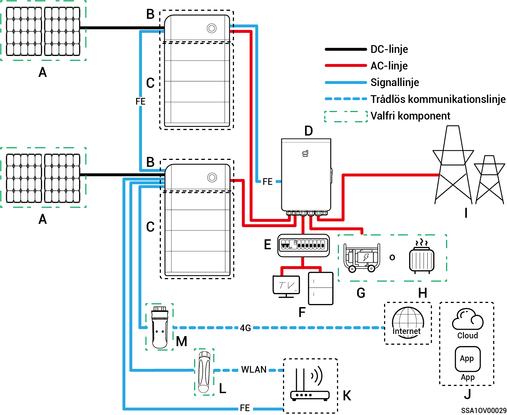
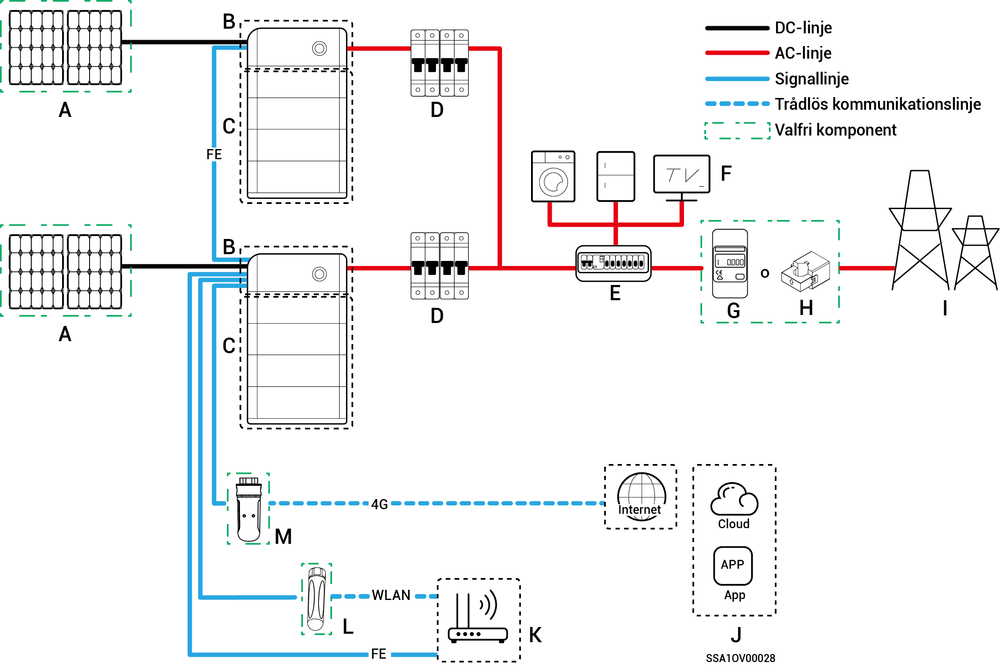

# Systemkoppling

* Du kan använda våra produkter för energilagringssystem för hushåll. Energilagringssystemet för hushåll består av solpaneler, växelriktare, batteripaket, huvudströmställare, Gateway, laster, elnät m.m.
* Huvudfunktionen med energilagringssystemet för hushåll är att lagra likström som genereras av solpaneler i batteripaket. Alternativ kan elen i det fotovoltaiska systemet och batteripaketet omvandlas till växelström för att användas av laster eller införlivas i elnätet.



<mark style="color:blue;">**Vid koppling av reservkraftsystemet är varaktigheten för off grid-drift av reserveffektlasten relaterad till solcellslagringssystemets strömförsörjningskapacitet. Vid avvikelse i solcellslagringssystemets strömförsörjning under off grid-drift (inklusive men inte begränsat till onormal strömgenerering från solpaneler, otillräcklig batterieffekt och onormal strömförsörjning till dieselgeneratorn) kommer reserveffektlasten inte att kunna fungera.**</mark>

### **Kopplingsschema för komplett hushållsreservsystem**

<figure><figcaption></figcaption></figure>

<table><thead><tr><th width="60" align="center">Nr</th><th width="167">Beskrivning</th><th width="61.4444580078125" align="center">Nr</th><th>Beskrivning</th><th width="57.8887939453125" align="center">Nr</th><th>Beskrivning</th></tr></thead><tbody><tr><td align="center"><strong>A</strong></td><td>Solpanel</td><td align="center"><strong>B</strong></td><td>SigenStor EC/Sigen Hybrid</td><td align="center"><strong>C</strong></td><td>SigenStor BAT</td></tr><tr><td align="center"><strong>D</strong></td><td>Gateway</td><td align="center"><strong>E</strong></td><td>Strömfördelningspanel för reservkraft</td><td align="center"><strong>F</strong></td><td>Hushållslaster, reserv</td></tr><tr><td align="center"><strong>G</strong></td><td>Dieselgenerator</td><td align="center"><strong>H</strong></td><td>Smarta laster</td><td align="center"><strong>I</strong></td><td>Elnät</td></tr><tr><td align="center"><strong>J</strong></td><td>mySigen</td><td align="center"><strong>K</strong></td><td>Router</td><td align="center"><strong>L</strong></td><td>Antenn</td></tr><tr><td align="center"><strong>M</strong></td><td>CommMod</td><td align="center"></td><td></td><td align="center"></td><td></td></tr></tbody></table>



* <mark style="color:blue;">Högst 20 SigenStor-enheter kan kaskadkopplas.</mark>
* <mark style="color:blue;">Om B är Sigen Hybrid är C tillval.</mark>
* <mark style="color:blue;">Om F (hushållets reservlast) utsätts för läckage kan det innebära risk för elektriska stötar. För att undvika denna fara måste en jordfelsbrytare (RCD) installeras mellan D (Gateway) och F (hushållets reservlast).</mark>
* <mark style="color:blue;">Som reservkraftkälla för långvarig drift utan elnät kan dieselgeneratorn arbeta tillsammans med Gateway, för att ge mjuka övergångar mellan solceller, lagrad energi och dieselgeneratorn.</mark>
* <mark style="color:blue;">All elutrustning i ägarens hem kan anslutas som smarta laster. För att säkerställa att denna produkt maximerar nyttan för användarna rekommenderas att högeffektsutrustning ansluts som smarta laster (värmepumpar, poolvärmare, torktumlare etc.), som kan stängas av när energilagringssystemet har låg effekt. Annan lågeffektsutrustning ansluts som hushållslaster (lampor, routrar osv.).</mark>
* <mark style="color:blue;">Vi rekommenderar att du använder snabbt Ethernet och trådlöst nätverk för kommunikation med växelriktarna. När ingen 4G-surf eller CommMod finns måste användaren fylla på sitt konto eller ersätta ett SIM-kort.</mark>

### **Kopplingsschema för partiellt hushållsreservsystem**

<figure><figcaption></figcaption></figure>

<table><thead><tr><th width="88">Nr</th><th width="142">Beskrivning</th><th width="88">Nr</th><th width="151">Beskrivning</th><th width="88">Nr</th><th>Beskrivning</th></tr></thead><tbody><tr><td><strong>A</strong></td><td>Solpanel</td><td><strong>B</strong></td><td>SigenStor EC/Sigen Hybrid</td><td><strong>C</strong></td><td>SigenStor BAT</td></tr><tr><td><strong>D</strong></td><td>Gateway</td><td><strong>E1</strong></td><td>Strömfördelningspanel för reservkraft</td><td><strong>E2</strong></td><td>Strömfördelningspanel för delar som inte har reservkraft</td></tr><tr><td><strong>F1</strong></td><td>Hushållslaster, reserv</td><td><strong>F2</strong></td><td>Hushållslaster, ej reserv</td><td><strong>G</strong></td><td>Dieselgenerator</td></tr><tr><td><strong>H</strong></td><td>Smarta laster</td><td><strong>I</strong></td><td>Effektsensor</td><td><strong>J</strong></td><td>Effektsensor</td></tr><tr><td><strong>K</strong></td><td>mySigen</td><td><strong>L</strong></td><td>Router</td><td><strong>M</strong></td><td>Antenn</td></tr><tr><td><strong>N</strong></td><td>CommMod</td><td><strong>O</strong></td><td></td><td></td><td></td></tr></tbody></table>



* <mark style="color:blue;">Högst 20 SigenStor-enheter kan kaskadkopplas.</mark>
* <mark style="color:blue;">Om B är Sigen Hybrid är C tillval.</mark>
* <mark style="color:blue;">Om E2 (strömfördelningspanelen som ej är reserv) är försedd med läckageskydd rekommenderas att använda en jordfelsbrytare för nominell restström vid drift större än eller lika med antalet växelriktare gånger 100 mA.</mark>
* <mark style="color:blue;">Om F1 (hushållets reservlast) utsätts för läckage kan det innebära risk för elektriska stötar. För att undvika denna fara måste en jordfelsbrytare (RCD) installeras mellan D (Gateway) och F1 (hushållets reservlast).</mark>
* <mark style="color:blue;">Som reservkraftkälla för långvarig drift utan elnät kan dieselgeneratorn arbeta tillsammans med Gateway, för att ge mjuka övergångar mellan solceller, lagrad energi och kraft från dieselgeneratorn.</mark>
* <mark style="color:blue;">All elutrustning i ägarens hem kan anslutas som smarta laster. För att säkerställa att denna produkt maximerar nyttan för användarna rekommenderas att högeffektsutrustning ansluts som smarta laster (värmepumpar, poolvärmare, torktumlare etc.), som kan stängas av när energilagringssystemet har låg effekt. Annan lågeffektsutrustning ansluts som hushållslaster (lampor, routrar osv.).</mark>
* <mark style="color:blue;">Effektsensorn används för datainsamling vid anslutningspunkten till elnätet och möjliggör anslutning till elnätet utan kraftleverans. Det inte nödvändigt att använda effektsensorn vid koppling av partiellt hushållsreservsystem. Effektsensorn används vid koppling av styrsystemet för partiell reservkraft och anslutning till elnätet utan kraftleverans.</mark>
* <mark style="color:blue;">Endast enfassystemet med hjälpfas använder sig av CT-sensorer. CT-sensorn stöder datainsamling vid anslutningspunkten till elnätet för att möjliggöra elnätsanslutning utan kraftleverans. CT-sensorn behövs eventuellt inte vid partiell reservkraft. CT-sensorn måste konfigureras när både styrning av partiell reservkraft och anslutning till elnätet utan kraftleverans används.</mark>
* <mark style="color:blue;">Vi rekommenderar att du använder snabbt Ethernet och trådlöst nätverk för kommunikation med växelriktarna. När ingen 4G-surf eller CommMod finns måste användaren fylla på sitt konto eller ersätta ett SIM-kort.</mark>

### **Kopplingsschema för system som ej är reserv**

<figure><figcaption></figcaption></figure>

<table><thead><tr><th width="59.88885498046875" align="center">Nr</th><th width="149">Beskrivning</th><th width="59.5555419921875" align="center">Nr</th><th>Beskrivning</th><th width="59.77783203125" align="center">Nr</th><th>Beskrivning</th></tr></thead><tbody><tr><td align="center"><strong>A</strong></td><td>Solpanel</td><td align="center"><strong>B</strong></td><td>SigenStor EC/SigenStor AC/Sigen Hybrid</td><td align="center"><strong>C</strong></td><td>SigenStor BAT</td></tr><tr><td align="center"><strong>D</strong></td><td>AC-brytare</td><td align="center"><strong>E</strong></td><td>Strömfördelningspanel</td><td align="center"><strong>F</strong></td><td>Hushållslaster</td></tr><tr><td align="center"><strong>G</strong></td><td>Effektsensor</td><td align="center"><strong>H</strong></td><td>Elnät</td><td align="center"><strong>I</strong></td><td>mySigen</td></tr><tr><td align="center"><strong>J</strong></td><td>Router</td><td align="center"><strong>K</strong></td><td>Antenn</td><td align="center"><strong>L</strong></td><td>CommMod</td></tr></tbody></table>



* <mark style="color:blue;">Högst 20 SigenStor-enheter kan kaskadkopplas.</mark>
* <mark style="color:blue;">Om B är Sigen Hybrid är C tillval.</mark>
* <mark style="color:blue;">Märkspänningen för AC-brytaren ansluten till varje växelriktare i enfassystem är ≥ 240 V AC. Rekommenderade specifikationer för märkström är som följer:</mark>
  * <mark style="color:blue;">SigenStor EC/Sigen Hybrid (3.0–4.0) SP: märkström 25 A.</mark>
  * <mark style="color:blue;">SigenStor EC/Sigen Hybrid (4.6–6.0) SP: märkström 40 A.</mark>
  * <mark style="color:blue;">SigenStor EC/Sigen Hybrid 8.0 SP: märkström 50 A.</mark>
  * <mark style="color:blue;">SigenStor EC/Sigen Hybrid (10.0–12.0) SP: märkström 60 A.</mark>
* <mark style="color:blue;">Märkspänningen för AC-brytaren ansluten till varje växelriktare i trefassystem är ≥ 380 V AC. Rekommenderade specifikationer för märkström är som följer:</mark>
  * <mark style="color:blue;">SigenStor EC/Sigen Hybrid (5.0–8.0) TP: märkström 25 A.</mark>
  * <mark style="color:blue;">SigenStor EC/Sigen Hybrid (10.0–15.0) TP: märkström 32 A.</mark>
  * <mark style="color:blue;">SigenStor EC/Sigen Hybrid (17.0–20.0) TP: märkström 40 A.</mark>
  * <mark style="color:blue;">SigenStor EC/Sigen Hybrid 25.0 TP: märkström 50 A.</mark>
  * <mark style="color:blue;">SigenStor EC/Sigen Hybrid 30.0 TP: märkström 63 A.</mark>
* <mark style="color:blue;">Märkspänningen för AC-brytaren ansluten till varje växelriktare i trefas lågspänningssystem är ≥ 230 V AC. Rekommenderade specifikationer för märkström är som följer:</mark>
  * <mark style="color:blue;">SigenStor EC/Sigen Hybrid (5.0, 6.0) TPLV: märkström 25 A.</mark>
  * <mark style="color:blue;">SigenStor EC/Sigen Hybrid 8.0 TPLV: märkström 32 A.</mark>
  * <mark style="color:blue;">SigenStor EC/Sigen Hybrid 10.0 TPLV: märkström 40 A.</mark>
  * <mark style="color:blue;">SigenStor EC/Sigen Hybrid 12.0 TPLV: märkström 50 A.</mark>
* <mark style="color:blue;">Märkspänningen för AC-brytaren ansluten till varje växelriktare i enfassystem med hjälpfas är ≥ 240 V AC. Rekommenderade specifikationer för märkström är som följer:</mark>
  * <mark style="color:blue;">SigenStor EC/Sigen Hybrid 4.8 SP: märkström 25 A.</mark>
  * <mark style="color:blue;">SigenStor EC/Sigen Hybrid 7.6 SP: märkström 40 A.</mark>
  * <mark style="color:blue;">SigenStor EC/Sigen Hybrid 11.4 SP: märkström 63 A.</mark>
* <mark style="color:blue;">Om E (strömfördelningspanel) räknar med läckageskydd rekommenderas att använda en jordfelsbrytare för nominell restström vid drift större än eller lika med antalet växelriktare ggr 100 mA.</mark>
* <mark style="color:blue;">Märkspänningen för AC-brytaren ansluten till växelriktarens strömfördelningspanel i enfassystem är ≥ 240 V AC. Märkspänningen för AC-brytaren ansluten till växelriktarens strömfördelningspanel i trefassystem är ≥ 380 V AC. Märkspänningen för AC-brytaren ansluten till växelriktarens strömfördelningspanel i trefas lågspänningssystem är ≥ 230 V AC. Märkspänningen för AC-brytaren ansluten till växelriktarens strömfördelningspanel i enfassystem med hjälpfas är ≥ 240 V AC. Märkströmmen ska vara som följer: ≥ maximal utgångsström för en växelriktare × antalet parallellkopplade växelriktare × 1,25</mark><mark style="color:blue;">\[1]<mark style="color:blue;">
* <mark style="color:blue;">Kraftsensorn räknar med datainsamling vid anslutningspunkten till elnätet för att möjliggöra anslutning till elnätet utan kraftleverans. När reservkraften endast är tillgänglig för en del av lasterna krävs ingen effektsensor. När partiell reservkraft kombineras med anslutning till elnätet utan kraftleverans måste effektsensorn konfigureras.</mark>
* <mark style="color:blue;">Endast enfassystemet med hjälpfas använder sig av CT-sensorer. CT-sensorn stöder datainsamling vid anslutningspunkten till elnätet för att möjliggöra funktionen för anslutning till elnätet utan kraftleverans. Eventuellt krävs ingen CT-sensor om partiell reservkraft används. CT-sensorn måste konfigureras när både styrning av partiell reservkraft och anslutning till elnätet utan kraftleverans används.</mark>
* <mark style="color:blue;">Märkspänningen för AC-brytaren ansluten till strömfördelningspanelen får inte vara lägre än 380 V AC och märkströmmen rekommenderas inte vara lägre än max. utmatad ström från en växelriktare × antalet parallellkopplade växelriktare × 1,25</mark><mark style="color:blue;">\[1]<mark style="color:blue;"><mark style="color:blue;">.</mark>
* <mark style="color:blue;">Vi rekommenderar att du använder snabbt Ethernet och trådlöst nätverk för kommunikation med växelriktarna. När ingen 4G-surf eller CommMod finns måste användaren fylla på sitt konto eller ersätta ett SIM-kort.</mark>

Obs! \[1]: Maximal utgångsström från en växelriktare finns beskriven i dess datablad.
