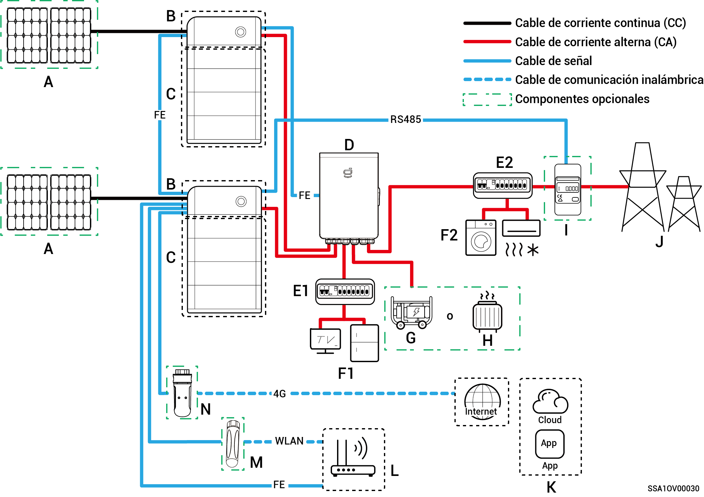
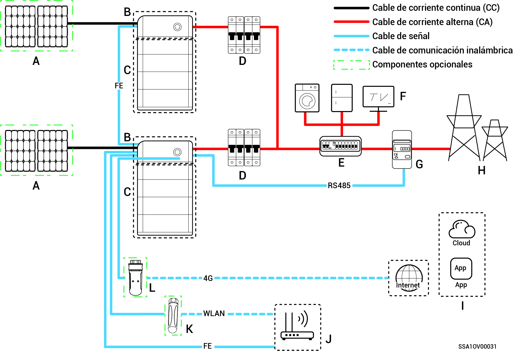

# Introducción al cableado del sistema

* Los productos de nuestra empresa se pueden usar para un sistema doméstico de almacenamiento de energía. El sistema doméstico de almacenamiento de energía está formado por paneles fotovoltaicos, inversores, paquetes de baterías, interruptores de control maestro, Gateway, cargas, redes eléctricas, etc.
* La función principal del sistema doméstico de almacenamiento de energía es almacenar la corriente continua generada por los paneles fotovoltaicos en paquetes de baterías. O, alternativamente, la electricidad del sistema fotovoltaico y el paquete de baterías puede convertirse en corriente alterna para que lo use la carga o bien incorporarse a la red.



<mark style="color:blue;">**En cableado del sistema de corriente de emergencia, la duración del funcionamiento aislada de la red de la carga de corriente de emergencia depende de la capacidad de suministro de energía del sistema de almacenamiento fotovoltaico. Si durante el funcionamiento aislado de la red el suministro de energía del sistema de almacenamiento fotovoltaico presenta alguna anomalía (incluidas, entre otras, generación anómala de energía fotovoltaica, carga insuficiente de la batería o suministros de energía del generador diésel anómalos), la carga de corriente de emergencia no podrá funcionar.**</mark>

### **Diagrama de cableado de un sistema de reserva doméstico total**

<figure><figcaption></figcaption></figure>

<table><thead><tr><th width="60" align="center">N.º</th><th width="156">Descripción</th><th width="60" align="center" valign="middle">N.º</th><th width="224">Descripción</th><th width="60" align="center">N.º</th><th width="178">Descripción</th></tr></thead><tbody><tr><td align="center"><strong>A</strong></td><td>Panel FV</td><td align="center" valign="middle"><strong>B</strong></td><td>SigenStor EC/Sigen Hybrid</td><td align="center"><strong>C</strong></td><td>SigenStor BAT</td></tr><tr><td align="center"><strong>D</strong></td><td>Gateway</td><td align="center" valign="middle"><strong>E</strong></td><td>Panel de distribución de reserva</td><td align="center"><strong>F</strong></td><td>Cargas domésticas de reserva</td></tr><tr><td align="center"><strong>G</strong></td><td>Generador diésel</td><td align="center" valign="middle"><strong>H</strong></td><td>Cargas inteligentes</td><td align="center"><strong>I</strong></td><td>Red eléctrica</td></tr><tr><td align="center"><strong>J</strong></td><td>mySigen</td><td align="center" valign="middle"><strong>K</strong></td><td>Enrutador</td><td align="center"><strong>L</strong></td><td>Antena</td></tr><tr><td align="center"><strong>M</strong></td><td>CommMod</td><td align="center" valign="middle"></td><td></td><td align="center"></td><td></td></tr></tbody></table>



* <mark style="color:blue;">No pueden utilizarse más de 20 unidades SigenStor en cascada.</mark>
* <mark style="color:blue;">Si B es Sigen Hybrid, C es opcional.</mark>
* <mark style="color:blue;">Si F (carga doméstica de reserva) sufre una fuga, puede comportar un riesgo de descarga eléctrica. Para evitar este peligro, debe instalarse un dispositivo de corriente residual (RCD) entre D (Gateway) y F (carga doméstica de reserva).</mark>
* <mark style="color:blue;">Como generador de energía de reserva para aplicaciones sin conexión a la red de largo plazo, el generador diésel puede trabajar en tándem con la Gateway para proporcionar una transición suave entre FV, almacenamiento y generación diésel.</mark>
* <mark style="color:blue;">Todos los equipos eléctricos del hogar del propietario pueden conectarse como cargas inteligentes. Para asegurar que este producto maximiza los beneficios a los usuarios, se recomienda conectar como cargas inteligentes los equipos de alta potencia (bombas de calor, calentadores de piscina, secadoras, etc.) que pueden desconectarse si el sistema de almacenamiento de energía tiene poca energía. Otros equipos de baja potencia (luces, enrutadores, etc.) se conectan como cargas domésticas.</mark>
* <mark style="color:blue;">Se recomienda utilizar Fast Ethernet y WLAN para la comunicación con los inversores. Cuando el tráfico 4G gratuito de CommMod se agote, los usuarios deben ampliar sus cuentas o sustituir la tarjeta SIM.</mark>

### **Diagrama de cableado de un sistema de reserva doméstico parcial**

<figure><figcaption></figcaption></figure>

<figure><figcaption></figcaption></figure>

<table><thead><tr><th width="60" align="center">N.º</th><th width="180">Descripción</th><th width="60" align="center">N.º</th><th width="190">Descripción</th><th width="60" align="center">N.º</th><th width="189">Descripción</th></tr></thead><tbody><tr><td align="center"><strong>A</strong></td><td>Panel FV</td><td align="center"><strong>B</strong></td><td>SigenStor EC / Sigen Hybrid</td><td align="center"><strong>C</strong></td><td>SigenStor BAT</td></tr><tr><td align="center"><strong>D</strong></td><td>Gateway</td><td align="center"><strong>E1</strong></td><td>Panel de distribución de reserva</td><td align="center"><strong>E2</strong></td><td>Panel de distribución de energía sin reserva</td></tr><tr><td align="center"><strong>F1</strong></td><td>Cargas domésticas de reserva</td><td align="center"><strong>F2</strong></td><td>Cargas domésticas sin reserva</td><td align="center"><strong>G</strong></td><td>Generador diésel</td></tr><tr><td align="center"><strong>H</strong></td><td>Cargas inteligentes</td><td align="center"><strong>I</strong></td><td>Sensor de energía</td><td align="center"><strong>J</strong></td><td>Sensor de energía</td></tr><tr><td align="center"><strong>K</strong></td><td>mySigen</td><td align="center"><strong>L</strong></td><td>Enrutador</td><td align="center"><strong>M</strong></td><td>Antena</td></tr><tr><td align="center"><strong>N</strong></td><td>CommMod</td><td align="center"></td><td></td><td align="center"></td><td></td></tr></tbody></table>



* <mark style="color:blue;">No pueden utilizarse más de 20 unidades SigenStor en cascada.</mark>
* <mark style="color:blue;">Si B es Sigen Hybrid, C es opcional.</mark>
* <mark style="color:blue;">Si E2 (panel de distribución de energía sin reserva) cuenta con protección contra fugas, se recomienda que la corriente de funcionamiento residual nominal sea mayor o igual al número de inversores x 100 mA.</mark>
* <mark style="color:blue;">Si F1 (carga doméstica de reserva) sufre una fuga, puede comportar un riesgo de descarga eléctrica. Para evitar este peligro, debe instalarse un dispositivo de corriente residual (RCD) entre D (Gateway) y F1 (carga doméstica de reserva).</mark>
* <mark style="color:blue;">Como generador de energía de reserva para aplicaciones sin conexión a la red de largo plazo, el generador diésel puede trabajar en tándem con la Gateway para proporcionar una transición suave entre FV, almacenamiento y generación eléctrica diésel.</mark>
* <mark style="color:blue;">Todos los equipos eléctricos del hogar del propietario pueden conectarse como cargas inteligentes. Para asegurar que este producto maximiza los beneficios a los usuarios, se recomienda conectar como cargas inteligentes los equipos de alta potencia (bombas de calor, calentadores de piscina, secadoras, etc.) que pueden desconectarse si el sistema de almacenamiento de energía tiene poca energía. Otros equipos de baja potencia (luces, enrutadores, etc.) se conectan como cargas domésticas.</mark>
* <mark style="color:blue;">El sensor de energía tiene la función de adquisición de datos para los puntos de conexión a la red que permiten la conexión a la red de suministro cero. Para cablear un sistema de reserva doméstica parcial no es necesario configurar el sensor de energía. Al cablear un sistema de red de reserva parcial y conexión a la red con conexión a la red eléctrica con potencia cero, se configura el sensor de energía.</mark>
* <mark style="color:blue;">Solo el sistema de fase dividida utiliza sensores de CT. El sensor de CT admite la recogida de datos en el punto de conexión a la red para lograr una conexión a la red de energía cero. El sensor de CT puede no ser necesario en caso de energía de reserva parcial. Cuando se aplica un control de conexión a la red eléctrica de reserva parcial y de potencia cero, debe configurarse el sensor de CT.</mark>
* <mark style="color:blue;">Se recomienda utilizar Fast Ethernet y WLAN para la comunicación con los inversores. Cuando el tráfico 4G gratuito de CommMod se agote, los usuarios deben ampliar sus cuentas o sustituir la tarjeta SIM.</mark>

### **Diagrama de cableado de un sistema sin reserva**

<figure><figcaption></figcaption></figure>

<table><thead><tr><th width="60" align="center">N.º</th><th width="190">Descripción</th><th width="60" align="center">N.º</th><th width="190">Descripción</th><th width="60" align="center">N.º</th><th width="188">Descripción</th></tr></thead><tbody><tr><td align="center"><strong>A</strong></td><td>Panel FV</td><td align="center"><strong>B</strong></td><td>SigenStor EC/Sigen Hybrid</td><td align="center"><strong>C</strong></td><td>SigenStor BAT</td></tr><tr><td align="center"><strong>D</strong></td><td>Interruptor de CA</td><td align="center"><strong>E</strong></td><td>Panel de distribución</td><td align="center"><strong>F</strong></td><td>Cargas domésticas</td></tr><tr><td align="center"><strong>G</strong></td><td>Sensor de energía</td><td align="center"><strong>H</strong></td><td>Red eléctrica</td><td align="center"><strong>I</strong></td><td>mySigen</td></tr><tr><td align="center"><strong>J</strong></td><td>Enrutador</td><td align="center"><strong>K</strong></td><td>Antena</td><td align="center"><strong>L</strong></td><td>CommMod</td></tr></tbody></table>



* <mark style="color:blue;">No pueden utilizarse más de 20 unidades SigenStor en cascada.</mark>
* <mark style="color:blue;">Si B es Sigen Hybrid, C es opcional.</mark>
* <mark style="color:blue;">El voltaje nominal del conmutador de CA conectado a cada inversor debe ser ≥ 240 Vca y se recomienda la siguiente corriente nominal:</mark>
  * <mark style="color:blue;">SigenStor EC / Sigen Hybrid (3.0-4.0) SP: La corriente nominal es de 25 A.</mark>
  * <mark style="color:blue;">SigenStor EC / Sigen Hybrid (4.6-6.0) SP: La corriente nominal es de 40 A.</mark>
  * <mark style="color:blue;">SigenStor EC / Sigen Hybrid 8.0 SP: La corriente nominal es de 50 A.</mark>
  * <mark style="color:blue;">SigenStor EC / Sigen Hybrid (10.0-12.0) SP: La corriente nominal es de 60 A.</mark>
* <mark style="color:blue;">El voltaje nominal del conmutador de CA conectado a cada inversor de sistema trifásico debe ser ≥ 380 Vca y se recomienda la siguiente corriente nominal:</mark>
  * <mark style="color:blue;">SigenStor EC / Sigen Hybrid (5.0-8.0) TP: La corriente nominal es de 25 A.</mark>
  * <mark style="color:blue;">SigenStor EC / Sigen Hybrid (10.0-15.0) TP: La corriente nominal es de 32 A.</mark>
  * <mark style="color:blue;">SigenStor EC / Sigen Hybrid (17.0-20.0) TP: La corriente nominal es de 40 A.</mark>
  * <mark style="color:blue;">SigenStor EC / Sigen Hybrid 25.0 TP: La corriente nominal es de 50 A.</mark>
  * <mark style="color:blue;">SigenStor EC / Sigen Hybrid 30.0 TP: La corriente nominal es de 63 A.</mark>
* <mark style="color:blue;">El voltaje nominal del conmutador de CA conectado a cada inversor de sistema trifásico de baja tensión debe ser ≥ 230 Vca y se recomienda la siguiente corriente nominal:</mark>
  * <mark style="color:blue;">SigenStor EC / Sigen Hybrid (5.0, 6.0) TPLV: La corriente nominal es de 25 A.</mark>
  * <mark style="color:blue;">SigenStor EC / Sigen Hybrid 8.0 TPLV: La corriente nominal es de 32 A.</mark>
  * <mark style="color:blue;">SigenStor EC / Sigen Hybrid 10.0 TPLV: La corriente nominal es de 40 A.</mark>
  * <mark style="color:blue;">SigenStor EC / Sigen Hybrid 12.0 TPLV: La corriente nominal es de 50 A.</mark>
* <mark style="color:blue;">El voltaje nominal del conmutador de CA conectado a cada inversor de sistema de fase dividida debe ser ≥ 240 Vca y se recomienda la siguiente corriente nominal:</mark>
  * <mark style="color:blue;">SigenStor EC / Sigen Hybrid 4.8 SP: La corriente nominal es de 25 A.</mark>
  * <mark style="color:blue;">SigenStor EC / Sigen Hybrid 7.6 SP: La corriente nominal es de 40 A.</mark>
  * <mark style="color:blue;">SigenStor EC / Sigen Hybrid 11.4 SP: La corriente nominal es de 63 A.</mark>
* <mark style="color:blue;">Si E (panel de distribución) cuenta con protección contra fugas, se recomienda que la corriente de funcionamiento residual nominal sea mayor o igual al número de inversores x 100 mA.</mark>
* <mark style="color:blue;">El voltaje nominal del conmutador de CA del panel de distribución del inversor del sistema monofásico debe ser ≥ 240 Vca; el voltaje nominal del conmutador de CA del panel de distribución del inversor del sistema trifásico debe ser ≥ 380 Vca; el voltaje nominal del conmutador de CA del panel de distribución del inversor del sistema trifásico de baja tensión debe ser ≥ 230 Vca; el voltaje nominal del conmutador de CA del panel de distribución del inversor del sistema de fase dividida debe ser ≥ 240 Vca; la corriente nominal debe ser: ≥ la corriente de salida máxima de un inversor × el número de inversores en conexión en paralelo × 1,25</mark><mark style="color:blue;">\[1]<mark style="color:blue;">
* <mark style="color:blue;">El sensor de energía realiza la recopilación de datos en el punto de conexión a la red para lograr una conexión a la red de energía cero. Cuando la corriente de reserva solo está disponible para parte de las cargas, no es necesario el sensor de energía. Cuando hay una corriente de reserva parcial combinada con la conexión a la red de energía cero, debe configurarse el sensor de energía.</mark>
* <mark style="color:blue;">Solo el sistema de fase dividida utiliza sensores de CT. El sensor de CT admite la recogida de datos del punto de conexión a la red para conseguir la funcionalidad de conexión a la red de energía cero. El sensor de CT puede no ser necesario en caso de potencia de reserva parcial. Cuando se aplica un control de conexión a la red eléctrica de reserva parcial y de potencia cero, debe configurarse el sensor de CT.</mark>
* <mark style="color:blue;">El voltaje nominal del conmutador de CA del panel de distribución debe ser no inferior a 380 Vca, y la corriente nominal recomendada: no inferior a la corriente máxima de salida de un inversor × el número máximo de inversores conectados en paralelo × 1,25</mark><mark style="color:blue;">\[1]<mark style="color:blue;"><mark style="color:blue;">.</mark>
* <mark style="color:blue;">Se recomienda utilizar Fast Ethernet y WLAN para la comunicación con los inversores. Cuando el tráfico 4G gratuito de CommMod se agote, los usuarios deben ampliar sus cuentas o sustituir la tarjeta SIM.</mark>

Nota \[1]: La corriente máxima de salida de un inversor se indica en la correspondiente ficha técnica.
