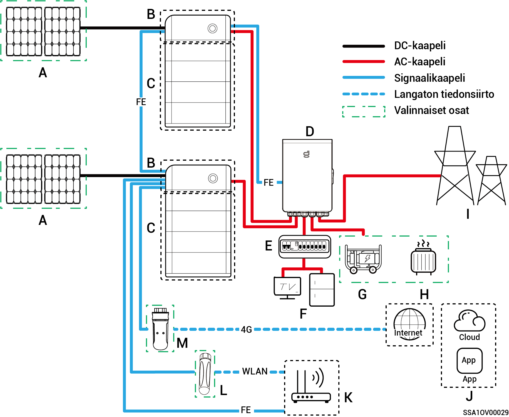
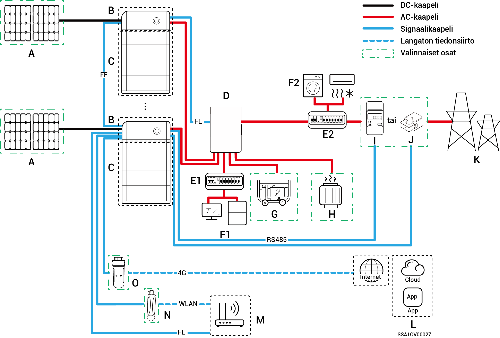
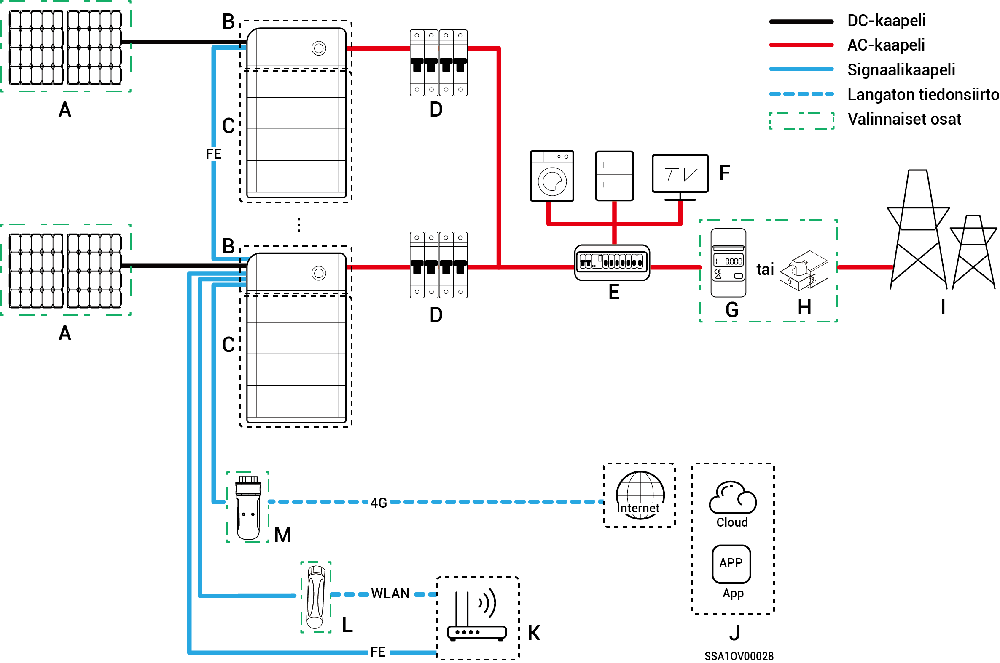

# Järjestelmän johdotuksen esittely

* yrityksemme tuotteita voidaan käyttää kotien energian varastointijärjestelmissä. Kotien energian varastointijärjestelmä koostuu aurinkopaneeleista, inverttereistä, akkuyksiköistä, pääkytkimistä, Gateway-laitteesta, kuormista, sähköverkoista jne.
* Kotien energian varastointijärjestelmän päätehtävänä on varastoida aurinkopaneelien tuottama tasavirta akkuyksiköihin. Vaihtoehtoisesti aurinkopaneelijärjestelmän ja akkujen sähkö voidaan muuntaa vaihtovirraksi kuormien käyttöön tai syöttää sähköverkkoon.



* <mark style="color:blue;">Varavoimajärjestelmän johdotuksessa varavoiman poissa verkosta -käytön kesto on suhteessa aurinkopaneelijärjestelmän virransyöttökapasiteettiin. Jos aurinkopaneelijärjestelmän virransyötössä ilmenee poikkeama poissa verkosta -tilassa (mukaan lukien, mutta ei rajoittuen, poikkeava aurinkosähkön tuotanto, akkujen virran riittämättömyys ja dieselgeneraattorin virransyötön poikkeama), varavoimakuorma ei silti voi toimia.</mark>
* <mark style="color:blue;">Home-sarjan matalajännitteiset kolmivaihejärjestelmät eivät tue varavoimakäyttöä ja saatavilla on vain ei-varavoimajärjestelmän johdotuskaavio.</mark>

### **Koko kodin varavoimajärjestelmän johdotuskaavio**

<figure><figcaption></figcaption></figure>

<table data-header-hidden><thead><tr><th width="61.11114501953125" align="center">Nro</th><th width="114.77777099609375">Kuvaus</th><th width="60.33331298828125" align="center">Nro</th><th>Kuvaus</th><th width="59" align="center" valign="middle">Nro</th><th>Kuvaus</th></tr></thead><tbody><tr><td align="center"><strong>A</strong></td><td>Aurinkopaneeli</td><td align="center"><strong>B</strong></td><td>SigenStor EC/ Sigen Hybrid</td><td align="center" valign="middle"><strong>C</strong></td><td>SigenStor BAT</td></tr><tr><td align="center"><strong>D</strong></td><td>Gateway</td><td align="center"><strong>E</strong></td><td>Varavoiman jakelupaneeli</td><td align="center" valign="middle"><strong>F</strong></td><td>Kotitalouskuormien varavoima</td></tr><tr><td align="center"><strong>G</strong></td><td>Dieselgeneraattori</td><td align="center"><strong>H</strong></td><td>Älykkäät kuormat</td><td align="center" valign="middle"><strong>I</strong></td><td>Sähköverkko</td></tr><tr><td align="center"><strong>J</strong></td><td>mySigen</td><td align="center"><strong>K</strong></td><td>Reititin</td><td align="center" valign="middle"><strong>L</strong></td><td>Antenni</td></tr><tr><td align="center"><strong>M</strong></td><td>CommMod</td><td align="center"></td><td></td><td align="center" valign="middle"></td><td></td></tr></tbody></table>



* <mark style="color:blue;">Enintään 20 SigenStor-yksikköä voidaan kytkeä sarjaan.</mark>
* <mark style="color:blue;">Kun B on Sigen Hybrid, C on valinnainen.</mark>
* <mark style="color:blue;">Jos F (kotitalouskuorman varavoima) vuotaa, se voi aiheuttaa sähköiskuvaaran. Tämän vaaran välttämiseksi on asennettava vikavirtasuojakytkin (RCD) D:n (Gateway) ja F:n (kotitalouskuorman varavoiman) väliin.</mark>
* <mark style="color:blue;">Varaenergialähteenä pitkäaikaisessa poissa verkosta -käytössä dieselgeneraattori voi toimia yhdessä Gatewayn kanssa ja tarjota sujuvan siirtymisen aurinkosähkön, varastoinnin ja dieselvoiman tuotannon välillä.</mark>
* <mark style="color:blue;">Kaikki kodin sähkölaitteet voidaan kytkeä älykkäinä kuormina. Jotta tämä tuote tarjoaisi käyttäjille mahdollisimman suuren hyödyn, on suositeltavaa kytkeä suuritehoiset laitteet älykkäiksi kuormiksi (lämpöpumput, uima-altaan lämmittimet, kuivausrummut jne.), jotka voidaan katkaista, kun energian varastointijärjestelmän teho on alhainen. Muut pienitehoiset laitteet kytketään kotitalouskuormana (valaisimet, reitittimet jne.)</mark>
* <mark style="color:blue;">On suositeltavaa käyttää Fast Ethernet- ja WLAN-verkkoja inverttereiden kanssa tapahtuvaan tiedonsiirtoon. Kun CommModin vapaa 4G-liikenne loppuu, käyttäjien on lisättävä saldoa tileilleen tai vaihdettava SIM-kortti.</mark>

### **Osittaisen kodin varavoimajärjestelmän johdotuskaavio**

<figure><figcaption></figcaption></figure>

<table data-header-hidden><thead><tr><th width="59.11114501953125" align="center">Nro</th><th width="142">Kuvaus</th><th width="60.22216796875" align="center">Nro</th><th width="151">Kuvaus</th><th width="60.22216796875" align="center">Nro</th><th>Kuvaus</th></tr></thead><tbody><tr><td align="center"><strong>A</strong></td><td>Aurinkopaneeli</td><td align="center"><strong>B</strong></td><td>SigenStor EC/ Sigen Hybrid</td><td align="center"><strong>C</strong></td><td>SigenStor BAT</td></tr><tr><td align="center"><strong>D</strong></td><td>Gateway</td><td align="center"><strong>E1</strong></td><td>Varavoiman jakelupaneeli</td><td align="center"><strong>E2</strong></td><td>Varavoimajärjestelmään kuulumaton jakelupaneeli</td></tr><tr><td align="center"><strong>F1</strong></td><td>Kotitalouskuormien varavoima</td><td align="center"><strong>F2</strong></td><td>Varavoimajärjestelmään kuulumattomat kotitalouskuormat</td><td align="center"><strong>G</strong></td><td>Dieselgeneraattori</td></tr><tr><td align="center"><strong>H</strong></td><td>Älykkäät kuormat</td><td align="center"><strong>I</strong></td><td>Tehoanturi</td><td align="center"><strong>J</strong></td><td>Tehoanturi</td></tr><tr><td align="center"><strong>K</strong></td><td>mySigen</td><td align="center"><strong>L</strong></td><td>Reititin</td><td align="center"><strong>M</strong></td><td>Antenni</td></tr><tr><td align="center"><strong>N</strong></td><td>CommMod</td><td align="center"><strong>O</strong></td><td>CommMod</td><td align="center"></td><td></td></tr></tbody></table>



* <mark style="color:blue;">Enintään 20 SigenStor-yksikköä voidaan kytkeä sarjaan.</mark>
* <mark style="color:blue;">Kun B on Sigen Hybrid, C on valinnainen.</mark>
* <mark style="color:blue;">Jos E2:ssa (varavoimajärjestelmään kuulumattomassa jakelupaneelissa) on vuotosuojaus, on suositeltavaa, että nimellinen jäännösvirta on suurempi tai yhtä suuri kuin invertterien lukumäärä × 100 mA.</mark>
* <mark style="color:blue;">Jos F1:ssä (kotitalouskuorman varavoimassa) on vuoto, se voi aiheuttaa sähköiskuvaaran. Tämän vaaran välttämiseksi on asennettava vikavirtasuojakytkin (RCD) D:n (Gateway) ja F1:n (kotitalouskuorman varavoiman) väliin.</mark>
* <mark style="color:blue;">Varaenergialähteenä pitkäaikaisessa poissa verkosta -käytössä dieselgeneraattori voi toimia yhdessä Gatewayn kanssa ja tarjota sujuvan siirtymisen aurinkosähkön, varastoinnin ja dieselsähköntuotannon välillä.</mark>
* <mark style="color:blue;">Kaikki kodin sähkölaitteet voidaan kytkeä älykkäinä kuormina. Jotta tämä tuote tarjoaisi käyttäjille mahdollisimman suuren hyödyn, on suositeltavaa kytkeä suuritehoiset laitteet älykkäiksi kuormiksi (lämpöpumput, uima-altaan lämmittimet, kuivausrummut jne.), jotka voidaan katkaista, kun energian varastointijärjestelmän teho on alhainen. Muut pienitehoiset laitteet kytketään kotitalouskuormana (valaisimet, reitittimet jne.)</mark>
* <mark style="color:blue;">Tehoanturi kerää tietoja verkon liitäntäpisteistä ja mahdollistaa nollatehoisen verkkoliitännän. Tehoanturia ei tarvitse määrittää osittaisen kodin varavoimajärjestelmän johdotusta varten. Osittaisen varavoiman ja nollatehoisen verkkoliitännän ohjausjärjestelmän johdotuksessa tehoanturi on määritettävä.</mark>
* <mark style="color:blue;">Vain jaetun vaiheen järjestelmä käyttää CT-antureita. CT-anturi tukee verkon liitäntäpisteiden tietojen keräämistä nollatehoisen verkkoliitännän toiminnallisuuden saavuttamiseksi. CT-anturia ei välttämättä tarvita osittaisen varavoiman tapauksessa. Kun käytetään osittaista varavoimaa + nollatehoisen verkkoliitännän ohjausta, CT-anturi on määritettävä.</mark>
* <mark style="color:blue;">On suositeltavaa käyttää Fast Ethernet- ja WLAN-verkkoja inverttereiden kanssa tapahtuvaan tiedonsiirtoon. Kun CommModin vapaa 4G-liikenne loppuu, käyttäjien on lisättävä saldoa tileilleen tai vaihdettava SIM-kortti.</mark>

### **Ei-varajärjestelmän johdotuskaavio**

<figure><figcaption></figcaption></figure>

<table><thead><tr><th width="91">Nro</th><th width="149">Kuvaus</th><th width="74">Nro</th><th>Kuvaus</th><th width="82">Nro</th><th>Kuvaus</th></tr></thead><tbody><tr><td><strong>A</strong></td><td>Aurinkopaneeli</td><td><strong>B</strong></td><td>SigenStor EC/ Sigen Hybrid</td><td><strong>C</strong></td><td>SigenStor BAT</td></tr><tr><td><strong>D</strong></td><td>AC-kytkin</td><td><strong>E</strong></td><td>Jakelupaneeli</td><td><strong>F</strong></td><td>Kotitalouskuormat</td></tr><tr><td><strong>G</strong></td><td>Tehoanturi</td><td><strong>H</strong></td><td>Sähköverkko</td><td><strong>I</strong></td><td>mySigen</td></tr><tr><td><strong>J</strong></td><td>Reititin</td><td><strong>K</strong></td><td>Antenni</td><td><strong>L</strong></td><td>CommMod</td></tr></tbody></table>



* <mark style="color:blue;">Enintään 20 SigenStor-yksikköä voidaan kytkeä sarjaan.</mark>
* <mark style="color:blue;">Kun B on Sigen Hybrid, C on valinnainen.</mark>
* <mark style="color:blue;">Kuhunkin yksivaiheisen järjestelmän invertteriin kytketyn AC-kytkimen nimellisjännitteen on oltava ≥ 240 V AC, ja suositellut nimellisvirta-arvot ovat:</mark>
  * <mark style="color:blue;">SigenStor EC / Sigen Hybrid (3.0–4.0) SP: nimellisvirta on 25 A.</mark>
  * <mark style="color:blue;">SigenStor EC / Sigen Hybrid (4.6–6.0) SP: nimellisvirta on 40 A.</mark>
  * <mark style="color:blue;">SigenStor EC / Sigen Hybrid 8.0 SP: nimellisvirta on 50 A.</mark>
  * <mark style="color:blue;">SigenStor EC / Sigen Hybrid (10.0–12.0) SP: nimellisvirta on 60 A.</mark>
* <mark style="color:blue;">Kuhunkin kolmivaiheisen järjestelmän invertteriin kytketyn AC-kytkimen nimellisjännitteen on oltava ≥ 380 V AC, ja suositellut nimellisvirta-arvot ovat:</mark>
  * <mark style="color:blue;">SigenStor EC / Sigen Hybrid (5.0–8.0) TP: nimellisvirta on 25 A.</mark>
  * <mark style="color:blue;">SigenStor EC / Sigen Hybrid (10.0–15.0) TP: nimellisvirta on 32 A.</mark>
  * <mark style="color:blue;">SigenStor EC / Sigen Hybrid (17.0–20.0) TP: nimellisvirta on 40 A.</mark>
  * <mark style="color:blue;">SigenStor EC / Sigen Hybrid 25.0 TP: nimellisvirta on 50 A.</mark>
  * <mark style="color:blue;">SigenStor EC / Sigen Hybrid 30.0 TP: nimellisvirta on 63 A.</mark>
* <mark style="color:blue;">Kuhunkin matalajännitteisen kolmivaiheisen järjestelmän invertteriin kytketyn AC-kytkimen nimellisjännitteen on oltava ≥ 230 V AC, ja suositellut nimellisvirta-arvot ovat:</mark>
  * <mark style="color:blue;">SigenStor EC / Sigen Hybrid (5.0, 6.0) TPLV: nimellisvirta on 25 A.</mark>
  * <mark style="color:blue;">SigenStor EC / Sigen Hybrid 8.0 TPLV: nimellisvirta on 32 A.</mark>
  * <mark style="color:blue;">SigenStor EC / Sigen Hybrid 10.0 TPLV: nimellisvirta on 40 A.</mark>
  * <mark style="color:blue;">SigenStor EC / Sigen Hybrid 12.0 TPLV: nimellisvirta on 50 A.</mark>
* <mark style="color:blue;">Kuhunkin jaetun vaiheen järjestelmän invertteriin kytketyn AC-kytkimen nimellisjännitteen on oltava ≥ 240 V AC, ja suositellut nimellisvirta-arvot ovat:</mark>
  * <mark style="color:blue;">SigenStor EC / Sigen Hybrid 4.8 SP: nimellisvirta on 25 A.</mark>
  * <mark style="color:blue;">SigenStor EC / Sigen Hybrid 7.6 SP: nimellisvirta on 40 A.</mark>
  * <mark style="color:blue;">SigenStor EC / Sigen Hybrid 11.4 SP: nimellisvirta on 63 A.</mark>
* <mark style="color:blue;">Jos E:ssä (jakelupaneelissa) on vuotosuojaus, on suositeltavaa, että nimellinen jäännösvirta on suurempi tai yhtä suuri kuin invertterien lukumäärä × 100 mA.</mark>
* <mark style="color:blue;">Yksivaiheisen järjestelmän invertterin jakelupaneelin AC-kytkimen nimellisjännitteen on oltava ≥ 240 V AC.; kolmivaiheisen järjestelmän invertterin jakelupaneelin AC-kytkimen nimellisjännitteen on oltava ≥ 380 V AC.; matalajännitteisen kolmivaiheisen järjestelmän invertterin jakelupaneelin AC-kytkimen nimellisjännitteen on oltava ≥ 230 V AC.; jaetun vaiheen järjestelmän invertterin jakelupaneelin AC-kytkimen nimellisjännitteen on oltava ≥ 240 V AC.; nimellisvirta-arvojen on oltava: ≥ invertterin suurin lähtövirta × rinnakkain kytkettyjen invertterien lukumäärä × 1,25</mark><mark style="color:blue;">\[1]<mark style="color:blue;">
* <mark style="color:blue;">Tehoanturi kerää tietoja verkon liitäntäpisteestä nollatehoisen verkkoliitännän mahdollistamiseksi. Kun varavoima on käytettävissä vain osalle kuormista, tehoanturia ei tarvita. Kun osittainen varavoima yhdistetään nollatehoiseen verkkoliitäntään, tehoanturi on määritettävä.</mark>
* <mark style="color:blue;">Vain jaetun vaiheen järjestelmä käyttää CT-antureita. CT-anturi tukee verkon liitäntäpisteen tietojen keräämistä nollatehoisen verkkoliitännän toiminnallisuuden saavuttamiseksi. CT-anturia ei välttämättä tarvita osittaisen varavoiman tapauksessa. Kun käytetään osittaista varavoimaa + nollatehoisen verkkoliitännän ohjausta, CT-anturi on määritettävä.</mark>
* <mark style="color:blue;">On suositeltavaa käyttää Fast Ethernet- ja WLAN-verkkoja inverttereiden kanssa tapahtuvaan tiedonsiirtoon. Kun CommModin vapaa 4G-liikenne loppuu, käyttäjien on lisättävä saldoa tileilleen tai vaihdettava SIM-kortti.</mark>

Huomaa \[1]: Invertterin suurin lähtövirta löytyy sen tietolehdeltä.
