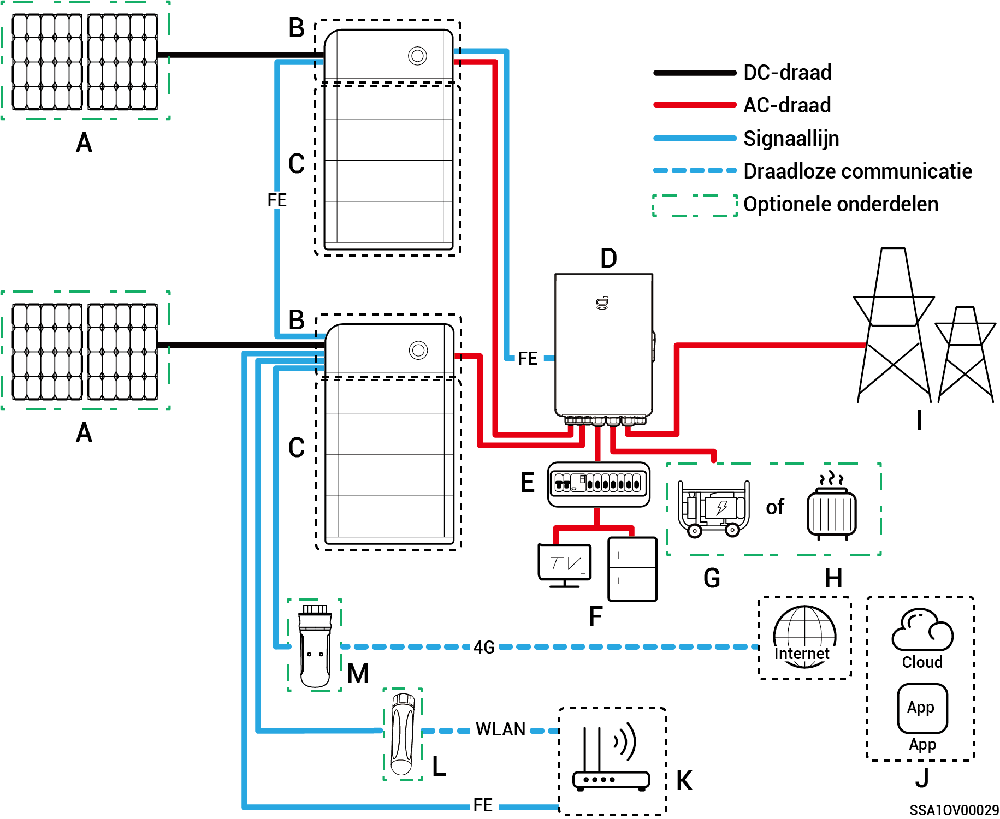
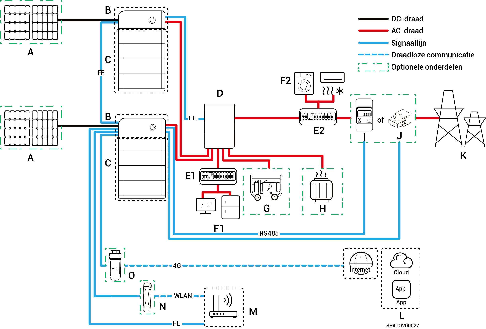
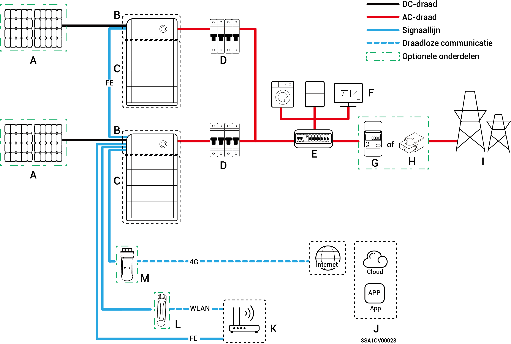

# Introductie tot systeembedrading

* De producten van ons bedrijf kunnen worden gebruikt voor het thuisenergieopslagsysteem. Het thuisenergieopslagsysteem bestaat uit fotovoltaïsche panelen, omvormers, batterijpakketten, hoofdschakelaars, Gateway, belastingen, elektriciteitsnetten, enz.
* De belangrijkste functie van het thuisenergieopslagsysteem is het opslaan van de gelijkstroom die door de fotovoltaïsche panelen wordt gegenereerd in de batterijpakketten. Alternatief kan de elektriciteit in het fotovoltaïsche systeem en het batterijpakket worden omgezet in wisselstroom voor gebruik door de belasting of geïntegreerd worden in het elektriciteitsnet.



<mark style="color:blue;">**Bij het bedraden van het back-upstroomsysteem is de duur van de off-grid werking van de back-upstroombelasting afhankelijk van de stroomvoorzieningscapaciteit van het PV-opslagsysteem. Als er zich een abnormaliteit voordoet in de voedingscapaciteit van het PV-opslagsysteem tijdens werking buiten het elektriciteitsnet (inclusief maar niet beperkt tot abnormale PV-stroomopwekking, onvoldoende batterijvermogen en abnormale stroomvoorziening naar de dieselgenerator) zal de back-upvoeding niet gebruikt kunnen worden.**</mark>

### **Schema voor het back-upsysteem van het hele huis**

<figure><figcaption></figcaption></figure>

<table><thead><tr><th width="86.66668701171875" align="center">Nummer.</th><th width="141.4444580078125">Beschrijving</th><th width="88.1112060546875" align="center">Nummer.</th><th width="170.2222900390625">Beschrijving</th><th width="87.888916015625" align="center">Nummer.</th><th>Beschrijving</th></tr></thead><tbody><tr><td align="center"><strong>A</strong></td><td>PV-paneel</td><td align="center"><strong>B</strong></td><td>SigenStor EC/Sigen Hybrid</td><td align="center"><strong>C</strong></td><td>SigenStor BAT</td></tr><tr><td align="center"><strong>D</strong></td><td>Gateway</td><td align="center"><strong>E</strong></td><td>Back-updistributiepaneel</td><td align="center"><strong>F</strong></td><td>Back-up huishoudelijke belasting</td></tr><tr><td align="center"><strong>G</strong></td><td>Dieselgenerator</td><td align="center"><strong>H</strong></td><td>Slimme belasting</td><td align="center"><strong>I</strong></td><td>Elektriciteitsnet</td></tr><tr><td align="center"><strong>J</strong></td><td>mySigen</td><td align="center"><strong>K</strong></td><td>Router</td><td align="center"><strong>L</strong></td><td>Antenna</td></tr><tr><td align="center"><strong>M</strong></td><td>CommMod</td><td align="center"></td><td></td><td align="center"></td><td></td></tr></tbody></table>



* <mark style="color:blue;">Er kunnen niet meer dan 20 SigenStor units in cascade worden geschakeld.</mark>
* <mark style="color:blue;">Wanneer B Sigen Hybrid is, is C is optioneel.</mark>
* <mark style="color:blue;">Als F (back-up huishoudelijke belasting) lekstroom vertoont, kan dit een elektrische schok veroorzaken. Om dit risico te voorkomen, moet er een aardlekschakelaar (RCD) worden geïnstalleerd tussen D (Gateway) en F (back-up huishoudelijke belasting).</mark>
* <mark style="color:blue;">De dieselgenerator kan samenwerken met de gateway als back-up-energiebron voor langdurige off-grid-toepassingen om een soepele overgang te bieden tussen PV, opslag en dieselgeneratie.</mark>
* <mark style="color:blue;">Alle elektronische apparaten in het huis van de eigenaar kunnen worden aangesloten als slimme belasting. Om ervoor te zorgen dat de gebruiker zo veel mogelijk voordeel heeft van dit product, wordt aangeraden om apparaten met een hoog stroomverbruik aan te sluiten als slimme verbruikers (warmtepompen, zwembadverwarmers, wasdrogers, enz.), zodat deze kunnen worden uitgeschakeld als het energieopslagsysteem bijna leeg is. Andere apparatuur met een laag vermogen wordt aangesloten als huishoudelijke belasting (verlichting, routers, enz.)</mark>
* <mark style="color:blue;">Het wordt aanbevolen om snel Ethernet en WLAN te gebruiken voor communicatie met omvormers. Als het gratis 4G-verkeer van CommMod verbruikt is, dienen gebruikers hun account op te waarderen of een SIM-kaart te vervangen.</mark>

### **Bedradingsschema voor gedeeltelijk back-upsysteem van het huis.**

<figure><figcaption></figcaption></figure>

<table><thead><tr><th width="88">Nummer.</th><th width="142">Beschrijving</th><th width="88">Nummer.</th><th width="151">Beschrijving</th><th width="88">Nummer.</th><th>Beschrijving</th></tr></thead><tbody><tr><td><strong>A</strong></td><td>PV-paneel</td><td><strong>B</strong></td><td>SigenStor EC/Sigen Hybrid</td><td><strong>C</strong></td><td>SigenStor BAT</td></tr><tr><td><strong>D</strong></td><td>Gateway</td><td><strong>E1</strong></td><td>Back-updistributiepaneel</td><td><strong>E2</strong></td><td>Niet-back-updistributiepaneel</td></tr><tr><td><strong>F1</strong></td><td>Back-up huishoudelijke belasting</td><td><strong>F2</strong></td><td>Niet-back-up huishoudelijke belastingen</td><td><strong>G</strong></td><td>Dieselgenerator</td></tr><tr><td><strong>H</strong></td><td>Slimme belasting</td><td><strong>I</strong></td><td>Vermogenssensor</td><td><strong>J</strong></td><td>Vermogenssensor</td></tr><tr><td><strong>K</strong></td><td>mySigen</td><td><strong>L</strong></td><td>Router</td><td><strong>M</strong></td><td>Antenna</td></tr><tr><td><strong>N</strong></td><td>CommMod</td><td><strong>O</strong></td><td></td><td></td><td></td></tr></tbody></table>



* <mark style="color:blue;">Er kunnen niet meer dan 20 SigenStor units in cascade worden geschakeld.</mark>
* <mark style="color:blue;">Wanneer B Sigen Hybrid is, is C is optioneel.</mark>
* <mark style="color:blue;">Als E2 (niet-back-up distributiepaneel) lekstroombeveiliging heeft, wordt aanbevolen dat de nominale reststroom gelijk aan of groter is dan het aantal omvormers × 100 mA.</mark>
* <mark style="color:blue;">Als F1 (back-up huishoudelijke belasting) lekstroom vertoont, kan dit een elektrische schok veroorzaken. Om dit risico te voorkomen, moet er een aardlekschakelaar (RCD) worden geïnstalleerd tussen D (Gateway) en F1 (back-up huishoudelijke belasting).</mark>
* <mark style="color:blue;">De dieselgenerator kan samenwerken met de Gateway als back-up-energiebron voor langdurige off-grid-toepassingen om een soepele overgang te bieden tussen PV, opslag en opwekking van dieselenergie.</mark>
* <mark style="color:blue;">Alle elektronische apparaten in het huis van de eigenaar kunnen worden aangesloten als slimme belasting. Om ervoor te zorgen dat de gebruiker zo veel mogelijk voordeel heeft van dit product, wordt aangeraden om apparaten met een hoog stroomverbruik aan te sluiten als slimme verbruikers (warmtepompen, zwembadverwarmers, wasdrogers, enz.), zodat deze kunnen worden uitgeschakeld als het energieopslagsysteem bijna leeg is. Andere apparatuur met een laag vermogen wordt aangesloten als huishoudelijke belasting (verlichting, routers, enz.)</mark>
* <mark style="color:blue;">De stroomsensor heeft de functie dat gegevensverwerving voor netverbindingspunten, wat netverbinding zonder vermogen mogelijk maakt. Voor het schema van een gedeeltelijk back-upsysteem van het huis hoeft de stroomsensor niet te worden geconfigureerd. Voor het schema van gedeeltelijke back-upstroom en zero-power netaansluitingcontrolesysteem is de stroomsensor geconfigureerd.</mark>
* <mark style="color:blue;">Alleen het split-phase systeem gebruikt CT-sensoren. De CT-sensor ondersteunt de gegevensverzameling van netaansluitpunten om netaansluitfunctionaliteit met nul vermogen te bereiken. De CT-sensor is mogelijk niet nodig in het geval van gedeeltelijke back-upvoeding. Wanneer gedeeltelijke back-upvoeding + nulvermogenregeling voor netaansluiting wordt toegepast, moet de CT-sensor worden geconfigureerd.</mark>
* <mark style="color:blue;">Het wordt aanbevolen om snel Ethernet en WLAN te gebruiken voor communicatie met omvormers. Als het gratis 4G-verkeer van CommMod verbruikt is, dienen gebruikers hun account op te waarderen of een SIM-kaart te vervangen.</mark>

### **Bedradingsschema voor niet-back-upsysteem**

<figure><figcaption></figcaption></figure>

<table><thead><tr><th width="81" align="center">Nummer.</th><th width="149">Beschrijving</th><th width="74" align="center">Nummer.</th><th>Beschrijving</th><th width="82" align="center">Nummer.</th><th>Beschrijving</th></tr></thead><tbody><tr><td align="center"><strong>A</strong></td><td>PV-paneel</td><td align="center"><strong>B</strong></td><td>SigenStor EC/SigenStor AC/Sigen Hybrid</td><td align="center"><strong>C</strong></td><td>SigenStor BAT</td></tr><tr><td align="center"><strong>D</strong></td><td>AC-schakelaar</td><td align="center"><strong>E</strong></td><td>Distributiepaneel</td><td align="center"><strong>F</strong></td><td>Huishoudelijke belasting</td></tr><tr><td align="center"><strong>G</strong></td><td>Vermogenssensor</td><td align="center"><strong>H</strong></td><td>Elektriciteitsnet</td><td align="center"><strong>I</strong></td><td>mySigen</td></tr><tr><td align="center"><strong>J</strong></td><td>Router</td><td align="center"><strong>K</strong></td><td>Antenna</td><td align="center"><strong>L</strong></td><td>CommMod</td></tr></tbody></table>



* <mark style="color:blue;">Er kunnen niet meer dan 20 SigenStor units in cascade worden geschakeld.</mark>
* <mark style="color:blue;">Wanneer B Sigen Hybrid is, is C is optioneel.</mark>
* <mark style="color:blue;">De nominale spanning van de AC-schakelaar die is aangesloten op elke eenfasige systeemomvormer moet ≥ 240 Va.c. zijn en de aanbevolen nominale stroomspecificaties zijn:</mark>
  * <mark style="color:blue;">SigenStor EC/Sigen Hybrid (3.0-4.0) SP: De nominale stroom is 25 A.</mark>
  * <mark style="color:blue;">SigenStor EC/Sigen Hybrid (4.6-6.0) SP: De nominale stroom is 40 A.</mark>
  * <mark style="color:blue;">SigenStor EC/ Sigen Hybrid 8.0 SP: De nominale stroom is 50 A.</mark>
  * <mark style="color:blue;">SigenStor EC/ Sigen Hybrid (10.0-12.0) SP: De nominale stroom is 60 A.</mark>
* <mark style="color:blue;">De nominale spanning van de AC-schakelaar die is aangesloten op elke driefasige systeemomvormer moet ≥ 380 Va.c. zijn en de aanbevolen specificaties voor de nominale stroom zijn:</mark>
  * <mark style="color:blue;">SigenStor EC/Sigen Hybrid (5.0-8.0) TP: De nominale stroom is 25 A.</mark>
  * <mark style="color:blue;">SigenStor EC/Sigen Hybrid (10.0-15.0) TP: De nominale stroom is 32 A.</mark>
  * <mark style="color:blue;">SigenStor EC/Sigen Hybrid (17.0-20.0) TP: De nominale stroom is 40 A.</mark>
  * <mark style="color:blue;">SigenStor EC/Sigen Hybrid 25.0 TP: De nominale stroom is 50 A.</mark>
  * <mark style="color:blue;">SigenStor EC/Sigen Hybrid 30.0 TP: De nominale stroom is 63 A.</mark>
* <mark style="color:blue;">De nominale spanning van de AC-schakelaar die is aangesloten op elke driefasige systeemomvormer voor laagspanning moet ≥ 230 Va.c. zijn en de aanbevolen specificaties voor de nominale stroom zijn:</mark>
  * <mark style="color:blue;">SigenStor EC/Sigen Hybrid (5.0, 6.0) TPLV: De nominale stroom is 25 A.</mark>
  * <mark style="color:blue;">SigenStor EC/Sigen Hybrid 8.0 TPLV: De nominale stroom is 32 A.</mark>
  * <mark style="color:blue;">SigenStor EC/Sigen Hybrid 10.0 TPLV: De nominale stroom is 40 A.</mark>
  * <mark style="color:blue;">SigenStor EC/Sigen Hybrid 12.0 TPLV: De nominale stroom is 50 A.</mark>
* <mark style="color:blue;">De nominale spanning van de AC-schakelaar die is aangesloten op elke omvormer van een split-fasesysteem moet ≥ 240 Va.c. zijn en de aanbevolen specificaties voor de nominale stroom zijn:</mark>
  * <mark style="color:blue;">SigenStor EC/Sigen Hybrid 4.8 SP: De nominale stroom is 25 A.</mark>
  * <mark style="color:blue;">SigenStor EC/Sigen Hybrid 7.6 SP: De nominale stroom is 40 A.</mark>
  * <mark style="color:blue;">SigenStor EC/Sigen Hybrid 11.4 SP: De nominale stroom is 63 A.</mark>
* <mark style="color:blue;">Als E (distributiepaneel) is voorzien van lekstroombeveiliging, wordt aanbevolen dat de nominale reststroom groter is dan of gelijk is aan het aantal omvormers × 100 mA.</mark>
* <mark style="color:blue;">De nominale spanning van de AC-schakelaar van het distributiepaneel van de enkelfasige systeemomvormer moet ≥ 240 Va.c. zijn; de nominale spanning van de AC-schakelaar van het distributiepaneel van de driefasige systeemomvormer moet ≥ 380 Va.c. zijn; de nominale spanning van de AC-schakelaar van het distributiepaneel van de driefasige systeemomvormer voor laagspanning moet ≥ 230 Va.c. zijn; de nominale spanning van de AC-schakelaar van het distributiepaneel van de tweefasige systeemomvormer moet ≥ 240 Va.c. zijn; de nominale stroom moet zijn: ≥ de maximale uitgangsstroom van een omvormer × het aantal omvormers in parallelschakeling × 1,25</mark><mark style="color:blue;">\[1]<mark style="color:blue;">
* <mark style="color:blue;">De vermogenssensor beschikt over gegevensverzameling op het netaansluitpunt om een netaansluiting zonder vermogen te bereiken. Wanneer back-upstroom alleen beschikbaar is voor een deel van de belastingen, is de vermogenssensor niet vereist. Wanneer gedeeltelijke back-upvoeding wordt gecombineerd met een netaansluiting zonder vermogen, moet de vermogenssensor worden geconfigureerd.</mark>
* <mark style="color:blue;">Alleen het split-phase systeem gebruikt CT-sensoren. De CT-sensor ondersteunt gegevensverzameling van netaansluitpunten om functionaliteit voor netaansluiting zonder vermogen te bereiken. De CT-sensor is mogelijk niet vereist in het geval van gedeeltelijke back-upvoeding. Wanneer gedeeltelijke back-upvoeding + nulvermogenregeling voor netaansluiting wordt toegepast, moet de CT-sensor worden geconfigureerd.</mark>
* <mark style="color:blue;">De nominale spanning van de AC-schakelaar van het distributiepaneel mag niet lager zijn dan 380 Va.c., en de nominale stroom wordt aanbevolen, dat wil zeggen niet lager dan de maximale uitgangsstroom van een omvormer × het aantal omvormers in parallelle aansluiting × 1,25</mark><mark style="color:blue;">\[1]<mark style="color:blue;"><mark style="color:blue;">.</mark>
* <mark style="color:blue;">Het wordt aanbevolen om snel Ethernet en WLAN te gebruiken voor communicatie met omvormers. Als het gratis 4G-verkeer van CommMod verbruikt is, dienen gebruikers hun account op te waarderen of een SIM-kaart te vervangen.</mark>

Opmerking \[1]: De maximale uitgangsstroom van een omvormer kan worden gevonden in het desbetreffende gegevensblad.
