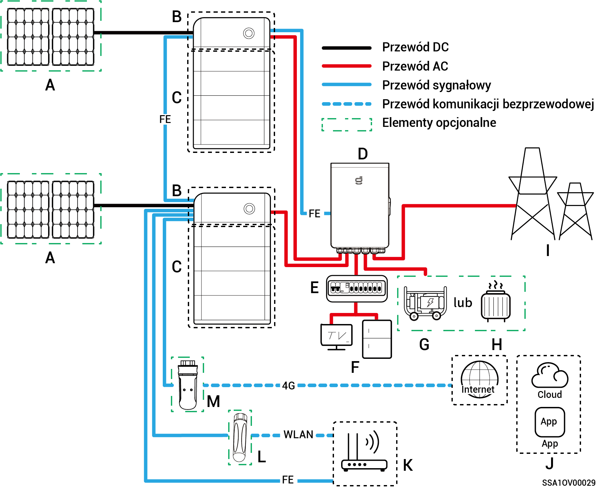
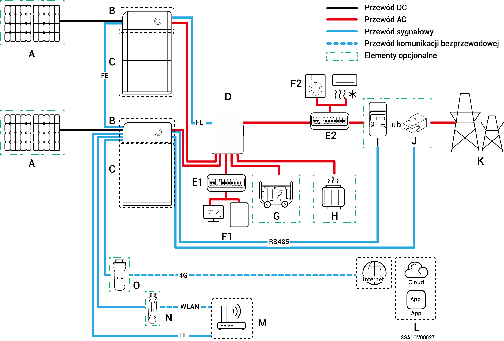
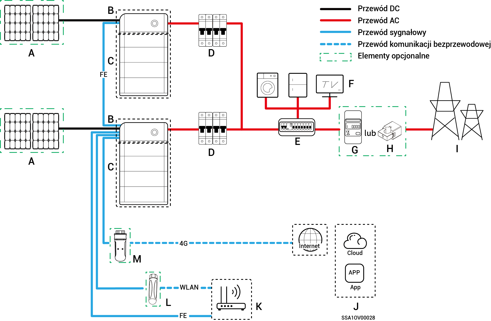

# Wprowadzenie do okablowania instalacji

* Produkty naszej firmy mogą być wykorzystywane w systemie magazynowania energii Home. Elementami systemu do magazynowania energii Home są: panele fotowoltaiczne, falowniki, akumulatory, główne przełączniki sterujące, bramy, odbiorniki, sieci energetyczne itp.
* Główną funkcją systemu do magazynowania energii Home jest magazynowanie w akumulatorach prądu stałego generowanego przez panele fotowoltaiczne. Prąd wytworzony w instalacji fotowoltaicznej i zgromadzony w akumulatorach może również zostać przekonwertowany na prąd przemienny do wykorzystania przez odbiorniki domowe bądź też w celu przesłania do sieci energetycznej.



<mark style="color:blue;">**Przy okablowaniu instalacji z zasilaniem zapasowym czas działania poza siecią dla obciążenia na zasilaniu zapasowym jest związany z pojemnością źródła zasilania instalacji magazynującej PV. W razie usterki źródła zasilania instalacji magazynującej PV podczas pracy poza siecią (w tym, między innymi, nieprawidłowe generowanie energii PV, niewystarczająca energia w akumulatorze oraz nieprawidłowe zasilanie generatora wysokoprężnego) obciążenie na zasilaniu zapasowym nie będzie działać.**</mark>

### **Schemat okablowania instalacji zapasowej dla całego domu**

<figure><figcaption></figcaption></figure>

<table><thead><tr><th width="62.22222900390625" align="center">Nr</th><th width="139.22216796875">Opis</th><th width="61.4444580078125" align="center">Nr</th><th>Opis</th><th width="61.2222900390625" align="center">Nr</th><th>Opis</th></tr></thead><tbody><tr><td align="center"><strong>A</strong></td><td>Panel fotowoltaiczny</td><td align="center"><strong>B</strong></td><td>SigenStor EC/Sigen Hybrid</td><td align="center"><strong>C</strong></td><td>SigenStor BAT</td></tr><tr><td align="center"><strong>D</strong></td><td>Gateway</td><td align="center"><strong>E</strong></td><td>Tablica rozdzielcza sieci zapasowej</td><td align="center"><strong>F</strong></td><td>Obciążenia domowe z zasilaniem zapasowym</td></tr><tr><td align="center"><strong>G</strong></td><td>Generator wysokoprężny</td><td align="center"><strong>H</strong></td><td>Obciążenia inteligentne</td><td align="center"><strong>I</strong></td><td>Sieć energetyczna</td></tr><tr><td align="center"><strong>J</strong></td><td>mySigen</td><td align="center"><strong>K</strong></td><td>Router</td><td align="center"><strong>L</strong></td><td>Antena</td></tr><tr><td align="center"><strong>M</strong></td><td>CommMod</td><td align="center"></td><td></td><td align="center"></td><td></td></tr></tbody></table>



* <mark style="color:blue;">Kaskadowo można podłączyć nie więcej niż 20 jednostek SigenStor.</mark>
* <mark style="color:blue;">Gdy B to Sigen Hybrid, element C jest opcjonalny.</mark>
* <mark style="color:blue;">Jeżeli w F (obciążenia domowe z zasilaniem zapasowym) występuje upływ prądu, może to stanowić zagrożenie porażeniem elektrycznym. Aby uniknąć tego zagrożenia należy zastosować wyłącznik różnicowoprądowy (RCD) pomiędzy D (brama) a F (obciążenia domowe z zasilaniem zapasowym).</mark>
* <mark style="color:blue;">Zapasowe źródło energii (generator wysokoprężny) w długotrwałych zastosowaniach bez dostępu do sieci energetycznej może działać we współpracy z bramą energetyczną, zapewniając bezproblemowe przechodzenie pomiędzy fotowoltaiką, magazynowaniem i generatorem wysokoprężnym.</mark>
* <mark style="color:blue;">Wszystkie urządzenia elektryczne w domu inwestora mogą być podłączone jako obciążenia inteligentne. Aby zapewnić maksymalne korzyści dla użytkowników, zaleca się podłączyć urządzenia dużej mocy jako obciążenia inteligentne (pompy ciepła, podgrzewacze do basenów, suszarki do odzieży itp.), aby można je było odłączyć, gdy w magazynie energii pozostało mało energii. Pozostałe urządzenia niskiej mocy podłącza się jako obciążenia domowe (oświetlenie, routery, itp.)</mark>
* <mark style="color:blue;">Do komunikacji z falownikami zaleca się korzystanie z sieci Fast Ethernet oraz WLAN. Gdy wyczerpie się bezpłatny limit danych 4G CommMod, użytkownik musi doładować konto lub wymienić kartę SIM.</mark>

### **Schemat okablowania instalacji zapasowej dla części domu**

<figure><figcaption></figcaption></figure>

<table><thead><tr><th width="61.33331298828125" align="center">Nr</th><th width="142">Opis</th><th width="60.22216796875" align="center">Nr</th><th width="151">Opis</th><th width="60.22216796875" align="center">Nr</th><th>Opis</th></tr></thead><tbody><tr><td align="center"><strong>A</strong></td><td>Panel fotowoltaiczny</td><td align="center"><strong>B</strong></td><td>SigenStor EC/ Sigen Hybrid</td><td align="center"><strong>C</strong></td><td>SigenStor BAT</td></tr><tr><td align="center"><strong>D</strong></td><td>Brama</td><td align="center"><strong>E1</strong></td><td>Tablica rozdzielcza sieci zapasowej</td><td align="center"><strong>E2</strong></td><td>Panel rozdzielczy instalacji bez zasilania zapasowego</td></tr><tr><td align="center"><strong>F1</strong></td><td>Obciążenia domowe z zasilaniem zapasowym</td><td align="center"><strong>F2</strong></td><td>Obciążenia domowe bez zasilania zapasowego</td><td align="center"><strong>G</strong></td><td>Generator wysokoprężny</td></tr><tr><td align="center"><strong>H</strong></td><td>Obciążenia inteligentne</td><td align="center"><strong>I</strong></td><td>Miernik prądu</td><td align="center"><strong>J</strong></td><td>Miernik prądu</td></tr><tr><td align="center"><strong>K</strong></td><td>mySigen</td><td align="center"><strong>L</strong></td><td>Router</td><td align="center"><strong>M</strong></td><td>Antena</td></tr><tr><td align="center"><strong>N</strong></td><td>CommMod</td><td align="center"><strong>O</strong></td><td></td><td align="center"></td><td></td></tr></tbody></table>



* <mark style="color:blue;">Kaskadowo można podłączyć nie więcej niż 20 jednostek SigenStor.</mark>
* <mark style="color:blue;">Gdy B to Sigen Hybrid, element C jest opcjonalny.</mark>
* <mark style="color:blue;">Jeżeli E2 (tablica rozdzielcza instalacji zasilania niezapasowego) posiada zabezpieczenie przeciwupływowe, zalecane jest zapewnienie parametru znamionowego prądu resztkowego o wartości większej lub równej liczbie falowników × 100 mA.</mark>
* <mark style="color:blue;">Jeżeli w F1 (obciążenia domowe z zasilaniem zapasowym) występuje upływ prądu, może to stanowić zagrożenie porażeniem elektrycznym. Aby uniknąć tego zagrożenia należy zastosować wyłącznik różnicowoprądowy (RCD) pomiędzy D (brama) a F1 (obciążenia domowe z zasilaniem zapasowym).</mark>
* <mark style="color:blue;">Zapasowe źródło energii (generator wysokoprężny) w długotrwałych zastosowaniach bez dostępu do sieci energetycznej może działać we współpracy z bramą energetyczną, zapewniając bezproblemowe przechodzenie pomiędzy fotowoltaiką, magazynowaniem i wysokoprężnym generatorem prądu.</mark>
* <mark style="color:blue;">Wszystkie urządzenia elektryczne w domu inwestora mogą być podłączone jako obciążenia inteligentne. Aby zapewnić maksymalne korzyści dla użytkowników, zaleca się podłączyć urządzenia dużej mocy jako obciążenia inteligentne (pompy ciepła, podgrzewacze do basenów, suszarki do odzieży itp.), aby można je było odłączyć, gdy w magazynie energii pozostało mało energii. Pozostałe urządzenia niskiej mocy podłącza się jako obciążenia domowe (oświetlenie, routery, itp.)</mark>
* <mark style="color:blue;">Miernik prądu realizuje zadanie pobieranie danych z punktów połączenia z siecią elektryczną umożliwia połączenie z siecią elektryczną w trybie zerowej mocy. W przypadku okablowania instalacji zasilania zapasowego dla części domu nie ma konieczności konfigurowania miernika prądu. W przypadku okablowania instalacji częściowego zasilania zapasowego i instalacji połączonej z siecią elektryczną w trybie kontroli zerowego eksportu miernik prądu należy skonfigurować.</mark>
* <mark style="color:blue;">Czujniki CT stosowane są wyłącznie w instalacjach z rozdzieloną fazą. Czujnik CT obsługuje zbieranie danych w punkcie połączenia z siecią elektryczną w celu zapewnienia zerowego eksportu mocy do sieci. Czujnik CT może nie być wymagany w przypadku częściowego zasilania zapasowego. W przypadku zastosowania częściowego zasilania zapasowego + kontroli zerowego eksportu mocy do sieci, czujnik CT musi zostać skonfigurowany.</mark>
* <mark style="color:blue;">Do komunikacji z falownikami zaleca się korzystanie z sieci Fast Ethernet oraz WLAN. Gdy wyczerpie się bezpłatny limit danych 4G CommMod, użytkownik musi doładować konto lub wymienić kartę SIM.</mark>

### **Schemat okablowania instalacji bez zasilania zapasowego**

<figure><figcaption></figcaption></figure>

<table><thead><tr><th width="61" align="center">Nr</th><th width="149">Opis</th><th width="60.6666259765625" align="center">Nr</th><th>Opis</th><th width="58.6666259765625" align="center">Nr</th><th>Opis</th></tr></thead><tbody><tr><td align="center"><strong>A</strong></td><td>Panel fotowoltaiczny</td><td align="center"><strong>B</strong></td><td>SigenStor EC/ SigenStor AC/Sigen Hybrid</td><td align="center"><strong>C</strong></td><td>SigenStor BAT</td></tr><tr><td align="center"><strong>D</strong></td><td>Przełącznik AC</td><td align="center"><strong>E</strong></td><td>Panel rozdzielczy</td><td align="center"><strong>F</strong></td><td>Obciążenie domowe</td></tr><tr><td align="center"><strong>G</strong></td><td>Miernik prądu</td><td align="center"><strong>H</strong></td><td>Sieć energetyczna</td><td align="center"><strong>I</strong></td><td>mySigen</td></tr><tr><td align="center"><strong>J</strong></td><td>Router</td><td align="center"><strong>K</strong></td><td>Antena</td><td align="center"><strong>L</strong></td><td>CommMod</td></tr></tbody></table>



* <mark style="color:blue;">Kaskadowo można podłączyć nie więcej niż 20 jednostek SigenStor.</mark>
* <mark style="color:blue;">Gdy B to Sigen Hybrid, element C jest opcjonalny.</mark>
* <mark style="color:blue;">Napięcie znamionowe dla przełącznika AC połączonego z każdym z falowników w instalacji jednofazowej powinno wynosić ≥240 V AC, a zalecane natężenie znamionowe:</mark>
  * <mark style="color:blue;">SigenStor EC/Sigen Hybrid (3.0-4.0) SP: natężenie znamionowe wynosi 25 A.</mark>
  * <mark style="color:blue;">SigenStor EC/Sigen Hybrid (4.6-6.0) SP: natężenie znamionowe wynosi 40 A.</mark>
  * <mark style="color:blue;">SigenStor EC/ Sigen Hybrid 8.0 SP: natężenie znamionowe wynosi 50 A.</mark>
  * <mark style="color:blue;">SigenStor EC/ Sigen Hybrid (10.0-12.0) SP: natężenie znamionowe wynosi 60 A.</mark>
* <mark style="color:blue;">Napięcie znamionowe dla przełącznika AC połączonego z każdym z falowników w instalacji trójfazowej powinno wynosić ≥380 V AC, a zalecane natężenie znamionowe:</mark>
  * <mark style="color:blue;">SigenStor EC/igen Hybrid (5.0-8.0) TP: natężenie znamionowe wynosi 25 A.</mark>
  * <mark style="color:blue;">SigenStor EC/Sigen Hybrid (10.0-15.0) TP: natężenie znamionowe wynosi 32 A.</mark>
  * <mark style="color:blue;">SigenStor EC//Sigen Hybrid (17.0-20.0) TP: natężenie znamionowe wynosi 40 A.</mark>
  * <mark style="color:blue;">SigenStor EC/Sigen Hybrid 25.0 TP: natężenie znamionowe wynosi 50 A.</mark>
  * <mark style="color:blue;">SigenStor EC/Sigen Hybrid 30.0 TP: natężenie znamionowe wynosi 63 A.</mark>
* <mark style="color:blue;">Napięcie znamionowe dla przełącznika AC połączonego z każdym z falowników w niskonapięciowej instalacji trójfazowej powinno wynosić ≥230 V AC, a zalecane natężenie znamionowe:</mark>
  * <mark style="color:blue;">SigenStor EC/Sigen Hybrid (5.0, 6.0) TPLV: natężenie znamionowe wynosi 25 A.</mark>
  * <mark style="color:blue;">SigenStor EC/Sigen Hybrid 8.0 TPLV: natężenie znamionowe wynosi 32 A.</mark>
  * <mark style="color:blue;">SigenStor EC/Sigen Hybrid 10.0 TPLV: natężenie znamionowe wynosi 40 A.</mark>
  * <mark style="color:blue;">SigenStor EC/Sigen Hybrid 12.0 TPLV: natężenie znamionowe wynosi 50 A.</mark>
* <mark style="color:blue;">Napięcie znamionowe dla przełącznika AC połączonego z każdym z falowników w instalacji z rozdzieloną fazą powinno wynosić ≥240 V AC, a zalecane natężenie znamionowe:</mark>
  * <mark style="color:blue;">SigenStor EC/Sigen Hybrid 4.8 SP: natężenie znamionowe wynosi 25 A.</mark>
  * <mark style="color:blue;">SigenStor EC/Sigen Hybrid 7.6 SP: natężenie znamionowe wynosi 40 A.</mark>
  * <mark style="color:blue;">SigenStor EC/Sigen Hybrid 11.4 SP: natężenie znamionowe wynosi 63 A.</mark>
* <mark style="color:blue;">Jeżeli E (tablica rozdzielcza) posiada zabezpieczenie przeciwupływowe, zalecane jest zapewnienie parametru znamionowego prądu resztkowego o wartości większej lub równej liczbie falowników × 100 mA.</mark>
* <mark style="color:blue;">Napięcie znamionowe dla przełącznika AC tablicy rozdzielczej falownika w instalacji jednofazowej powinno wynosić ≥ 240 Va.c.; napięcie znamionowe dla przełącznika AC tablicy rozdzielczej falownika w instalacji trójfazowej powinno wynosić ≥ 380 Va.c.; napięcie znamionowe dla przełącznika AC tablicy rozdzielczej falownika w niskonapięciowej instalacji trójfazowej powinno wynosić ≥ 230 Va.c.; napięcie znamionowe dla przełącznika AC tablicy rozdzielczej falownika w instalacji z rozdzieloną fazą powinno wynosić ≥ 240 Va.c.; a zalecane natężenie znamionowe: ≥ maksymalny prąd wyjściowy falownika × liczba falowników połączonych równolegle × 1,25</mark><mark style="color:blue;">\[1]<mark style="color:blue;">
* <mark style="color:blue;">Miernik prądu umożliwia zbieranie danych w punkcie połączenia z siecią w celu zapewnienia zerowego eksportu mocy do sieci. Gdy zasilanie awaryjne jest dostępne tylko dla części odbiorników, miernik prądu nie jest wymagany. Gdy częściowe zasilanie awaryjne jest połączone z siecią z zerowym eksportem mocy, miernik prądu musi zostać skonfigurowany.</mark>
* <mark style="color:blue;">Czujniki CT stosowane są wyłącznie w instalacjach z rozdzieloną fazą. Czujnik CT obsługuje zbieranie danych w punkcie połączenia z siecią w celu zapewnienia zerowego eksportu mocy do sieci. Czujnik CT może nie być wymagany w przypadku częściowego zasilania zapasowego. W przypadku zastosowania częściowego zasilania zapasowego + kontroli zerowego eksportu mocy do sieci, czujnik CT musi zostać skonfigurowany.</mark>
* <mark style="color:blue;">Napięcie znamionowe wyłącznika AC tablicy rozdzielczej powinno wynosić przynajmniej 380 V AC, zalecana jest również zgodność z natężeniem znamionowy, czyli nie mniejszym niż maksymalny prąd wyjściowy falownika × liczba falowników połączonych równolegle × 1,25</mark><mark style="color:blue;">\[1]<mark style="color:blue;"><mark style="color:blue;">.</mark>
* <mark style="color:blue;">Do komunikacji z falownikami zaleca się korzystanie z sieci Fast Ethernet oraz WLAN. Gdy wyczerpie się bezpłatny limit danych 4G CommMod, użytkownik musi doładować konto lub wymienić kartę SIM.</mark>

Uwaga \[1]: Maksymalny prąd wyjściowy falownika można znaleźć w jego arkuszu danych.
