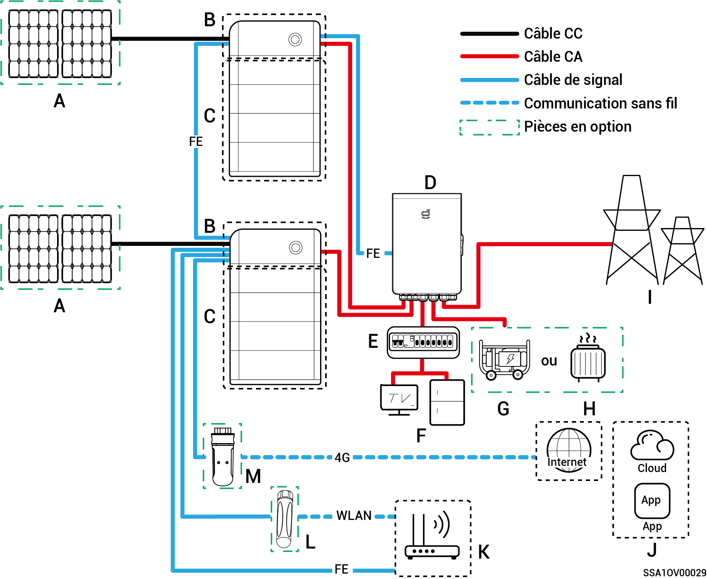
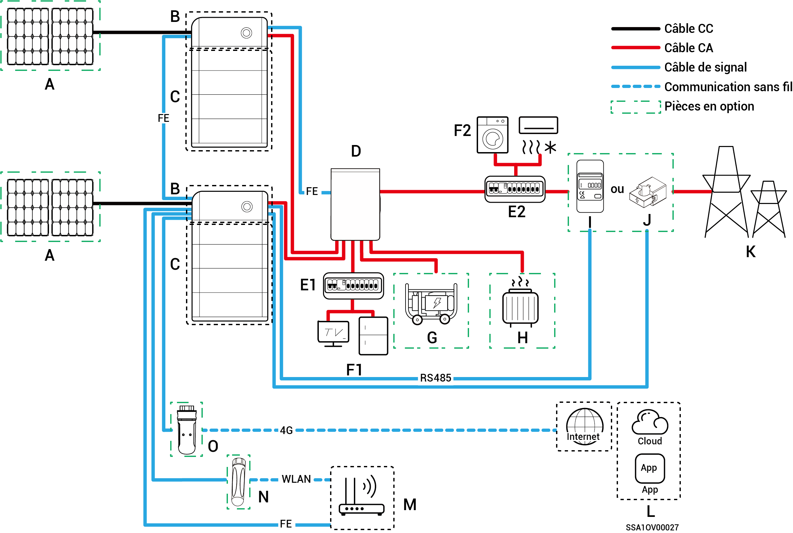
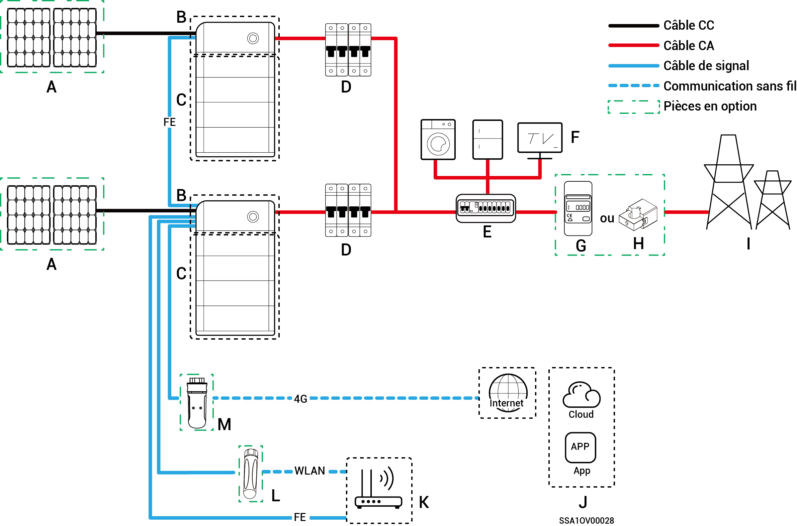

# Introduction au câblage du système

* Les produits de notre entreprise sont utilisables pour les systèmes de stockage d'énergie domestique. Un système de stockage d'énergie domestique se compose de panneaux photovoltaïques, d'onduleurs, de blocs-batteries, de commutateurs de commande principaux, d'un Gateway, de charges et de réseaux électriques.
* Le système de stockage d'énergie domestique permet principalement de stocker le courant continu généré par les panneaux photovoltaïques dans des blocs-batteries. Ou encore, l'électricité du système photovoltaïque et de la batterie peut être convertie en courant alternatif pour alimenter une charge ou être intégrée à un réseau.



<mark style="color:blue;">**Dans le cas du câblage du système de l'alimentation de secours, la durée du fonctionnement hors réseau de la charge de l'alimentation de secours dépend de la capacité d'alimentation du système de stockage photovoltaïque. En cas d'anomalie dans l'alimentation électrique du système de stockage photovoltaïque pendant le fonctionnement hors réseau (y compris, mais sans s'y limiter, une production anormale d'électricité photovoltaïque, une alimentation insuffisante de la batterie et une alimentation anormale du générateur diesel), la charge de l'alimentation de secours demeurera dans l'incapacité de fonctionner.**</mark>

### **Schéma de câblage complet d'un système de secours domestique**

<figure><figcaption></figcaption></figure>

<table><thead><tr><th width="58.88885498046875" align="center">N°</th><th width="167">Description</th><th width="60.3333740234375" align="center">N°</th><th>Description</th><th width="60.111083984375" align="center">N°</th><th>Description</th></tr></thead><tbody><tr><td align="center"><strong>A</strong></td><td>Panneau photovoltaïque</td><td align="center"><strong>B</strong></td><td>SigenStor EC/Sigen Hybrid</td><td align="center"><strong>C</strong></td><td>SigenStor BAT</td></tr><tr><td align="center"><strong>D</strong></td><td>Gateway</td><td align="center"><strong>E</strong></td><td>Tableau de distribution de secours</td><td align="center"><strong>F</strong></td><td>Circuit de secours pour électroménager</td></tr><tr><td align="center"><strong>G</strong></td><td>Générateur diesel</td><td align="center"><strong>H</strong></td><td>Charges intelligentes</td><td align="center"><strong>I</strong></td><td>Réseau électrique</td></tr><tr><td align="center"><strong>J</strong></td><td>mySigen</td><td align="center"><strong>K</strong></td><td>Routeur</td><td align="center"><strong>L</strong></td><td>Antenne</td></tr><tr><td align="center"><strong>M</strong></td><td>CommMod</td><td align="center"></td><td></td><td align="center"></td><td></td></tr></tbody></table>



* <mark style="color:blue;">Il n'est pas possible de mettre en cascade plus de 20 unités SigenStor.</mark>
* <mark style="color:blue;">Si B est Sigen Hybrid, C est facultatif.</mark>
* <mark style="color:blue;">Si F (circuit de secours pour électroménager) subit une fuite, un risque d'électrocution est possible. Afin d'éviter ce risque, un disjoncteur différentiel doit être installé entre D (Gateway) et F (circuit de secours pour électroménager).</mark>
* <mark style="color:blue;">En tant que source d'énergie de secours pour les applications hors réseau à long terme, le générateur diesel peut fonctionner conjointement au Gateway pour assurer une transition progressive entre le système photovoltaïque, le stockage et le générateur diesel.</mark>
* <mark style="color:blue;">Tous les équipements électriques de la maison du propriétaire peuvent être connectés en tant que charges intelligentes. Afin de garantir que ce produit offre un maximum d'avantages aux utilisateurs, nous recommandons que les équipements à forte consommation soient connectés en tant que charges intelligentes (pompes à chaleur, chauffe-piscines, sèche-linges, etc.), celles-ci pouvant être coupées lorsque le système de stockage d'énergie présente une faible charge. Les autres équipements à faible consommation sont connectés en tant que charges domestiques (lampes, routeurs, etc.).</mark>
* <mark style="color:blue;">Il est recommandé d'utiliser les communications Ethernet rapide et WLAN avec les onduleurs. Dès que le trafic 4G gratuit de CommMod est épuisé, les utilisateurs doivent recharger leur compte ou changer de carte SIM.</mark>

### **Schéma de câblage partiel du système de secours domestique**

<figure><figcaption></figcaption></figure>

<table><thead><tr><th width="88">N°</th><th width="142">Description</th><th width="88">N°</th><th width="151">Description</th><th width="88">N°</th><th>Description</th></tr></thead><tbody><tr><td><strong>A</strong></td><td>Panneau photovoltaïque</td><td><strong>B</strong></td><td>SigenStor EC/Sigen Hybrid</td><td><strong>C</strong></td><td>SigenStor BAT</td></tr><tr><td><strong>D</strong></td><td>Gateway</td><td><strong>E1</strong></td><td>Tableau de distribution de secours</td><td><strong>E2</strong></td><td>Tableau de distribution sans secours</td></tr><tr><td><strong>F1</strong></td><td>Circuit de secours pour électroménager</td><td><strong>F2</strong></td><td>Circuit sans secours pour électroménager</td><td><strong>G</strong></td><td>Générateur diesel</td></tr><tr><td><strong>H</strong></td><td>Charges intelligentes</td><td><strong>I</strong></td><td>Capteur de puissance</td><td><strong>J</strong></td><td>Capteur de puissance</td></tr><tr><td><strong>K</strong></td><td>mySigen</td><td><strong>L</strong></td><td>Routeur</td><td><strong>M</strong></td><td>Antenne</td></tr><tr><td><strong>N</strong></td><td>CommMod</td><td><strong>O</strong></td><td></td><td></td><td></td></tr></tbody></table>



* <mark style="color:blue;">Il n'est pas possible de mettre en cascade plus de 20 unités SigenStor.</mark>
* <mark style="color:blue;">Si B est Sigen Hybrid, C est facultatif.</mark>
* <mark style="color:blue;">Si le tableau de distribution sans secours (E2) est doté d'une protection contre les fuites, il est recommandé que le courant de fonctionnement résiduel nominal soit supérieur ou égal au nombre d'onduleurs × 100 mA.</mark>
* <mark style="color:blue;">Si F1 (circuit de secours pour électroménager) subit une fuite, un risque d'électrocution est possible. Afin d'éviter ce risque, un disjoncteur différentiel doit être installé entre D (Gateway) et F1 (circuit de secours pour électroménager).</mark>
* <mark style="color:blue;">En tant que source d'énergie de secours pour les applications hors réseau à long terme, le générateur diesel peut fonctionner conjointement au Gateway pour assurer une transition progressive entre le système photovoltaïque, le stockage et le générateur diesel.</mark>
* <mark style="color:blue;">Tous les équipements électriques de la maison du propriétaire peuvent être connectés en tant que charges intelligentes. Afin de garantir que ce produit offre un maximum d'avantages aux utilisateurs, nous recommandons que les équipements à forte consommation soient connectés en tant que charges intelligentes (pompes à chaleur, chauffe-piscines, sèche-linges, etc.), celles-ci pouvant être coupées lorsque le système de stockage d'énergie présente une faible charge. Les autres équipements à faible consommation sont connectés en tant que charges domestiques (lampes, routeurs, etc.).</mark>
* <mark style="color:blue;">Le capteur de puissance a une fonction d'acquisition de données pour les points de connexion au réseau, ce qui permet une connexion au réseau électrique sans consommation d'énergie. Pour le câblage partiel du système de secours, le capteur de puissance n'a pas besoin d'être configuré. Pour le câblage partiel de l'alimentation de secours et du système de contrôle de connexion au réseau électrique sans consommation d'énergie, le capteur de puissance est configuré.</mark>
* <mark style="color:blue;">Seul le système à phase divisée utilise des capteurs CT. Le capteur CT permet de collecter des données sur les points de connexion au réseau afin d'obtenir une connexion au réseau électrique sans consommation d'énergie. Le capteur CT peut ne pas être nécessaire en cas d'alimentation de secours partielle. Si l'alimentation de secours partielle et le contrôle de la connexion au réseau électrique sans consommation d'énergie sont appliqués, le capteur CT doit être configuré.</mark>
* <mark style="color:blue;">Il est recommandé d'utiliser les communications Ethernet rapide et WLAN avec les onduleurs. Dès que le trafic 4G gratuit de CommMod est épuisé, les utilisateurs doivent recharger leur compte ou changer de carte SIM.</mark>

### **Schéma de câblage d'un système de secours domestique**

<figure><figcaption></figcaption></figure>

<table><thead><tr><th width="58.77777099609375">N°</th><th width="149">Description</th><th width="59.55548095703125">N°</th><th>Description</th><th width="59.7777099609375" align="center">N°</th><th>Description</th></tr></thead><tbody><tr><td><strong>A</strong></td><td>Panneau photovoltaïque</td><td><strong>B</strong></td><td>SigenStor EC/Sigen Hybrid</td><td align="center"><strong>C</strong></td><td>SigenStor BAT</td></tr><tr><td><strong>D</strong></td><td>Interrupteur CA</td><td><strong>E</strong></td><td>Tableau de distribution</td><td align="center"><strong>F</strong></td><td>Charges domestiques</td></tr><tr><td><strong>G</strong></td><td>Capteur de puissance</td><td><strong>H</strong></td><td>Réseau électrique</td><td align="center"><strong>I</strong></td><td>mySigen</td></tr><tr><td><strong>J</strong></td><td>Routeur</td><td><strong>K</strong></td><td>Antenne</td><td align="center"><strong>L</strong></td><td>CommMod</td></tr></tbody></table>



* <mark style="color:blue;">Il n'est pas possible de mettre en cascade plus de 20 unités SigenStor.</mark>
* <mark style="color:blue;">Si B est Sigen Hybrid, C est facultatif.</mark>
* <mark style="color:blue;">La tension nominale de l'interrupteur CA connecté à chaque onduleur du système monophasé doit être ≥ 240 V CA, et les caractéristiques du courant nominal recommandé sont les suivantes :</mark>
  * <mark style="color:blue;">SigenStor EC/Sigen Hybrid (3.0 à 4.0) SP : le courant nominal est de 25 A.</mark>
  * <mark style="color:blue;">SigenStor EC/Sigen Hybrid (4.6 à 6.0) SP : le courant nominal est de 40 A.</mark>
  * <mark style="color:blue;">SigenStor EC/Sigen Hybrid 8.0 SP : le courant nominal est de 50 A.</mark>
  * <mark style="color:blue;">SigenStor EC/Sigen Hybrid (10.0 à 12.0) SP : le courant nominal est de 60 A.</mark>
* <mark style="color:blue;">La tension nominale de l'interrupteur CA connecté à chaque onduleur du système triphasé doit être ≥ 380 V CA, et les caractéristiques du courant nominal recommandé sont les suivantes :</mark>
  * <mark style="color:blue;">SigenStor EC/Sigen Hybrid (5.0 à 8.0) TP : le courant nominal est de 25 A.</mark>
  * <mark style="color:blue;">SigenStor EC/Sigen Hybrid (10.0 à 15.0) TP : le courant nominal est de 32 A.</mark>
  * <mark style="color:blue;">SigenStor EC/Sigen Hybrid (17.0 à 20.0) TP : le courant nominal est de 40 A.</mark>
  * <mark style="color:blue;">SigenStor EC/Sigen Hybrid 25.0 TP : le courant nominal est de 50 A.</mark>
  * <mark style="color:blue;">SigenStor EC/Sigen Hybrid 30.0 TP : le courant nominal est de 63 A.</mark>
* <mark style="color:blue;">La tension nominale de l'interrupteur CA connecté à chaque onduleur du système triphasé basse tension doit être ≥ 230 V CA, et les caractéristiques du courant nominal recommandé sont les suivantes :</mark>
  * <mark style="color:blue;">SigenStor EC/Sigen Hybrid (5.0, 6.0) TPLV : le courant nominal est de 25 A.</mark>
  * <mark style="color:blue;">SigenStor EC/Sigen Hybrid 8.0 TPLV : le courant nominal est de 32 A.</mark>
  * <mark style="color:blue;">SigenStor EC/Sigen Hybrid 10.0 TPLV : le courant nominal est de 40 A.</mark>
  * <mark style="color:blue;">SigenStor EC/Sigen Hybrid 12.0 TPLV : le courant nominal est de 50 A.</mark>
* <mark style="color:blue;">La tension nominale de l'interrupteur CA connecté à chaque onduleur du système à phase divisée doit être ≥ 240 V CA, et les caractéristiques du courant nominal recommandé sont les suivantes :</mark>
  * <mark style="color:blue;">SigenStor EC/Sigen Hybrid 4.8 SP : le courant nominal est de 25 A.</mark>
  * <mark style="color:blue;">SigenStor EC/Sigen Hybrid 7.6 SP : le courant nominal est de 40 A.</mark>
  * <mark style="color:blue;">SigenStor EC/Sigen Hybrid 11.4 SP : le courant nominal est de 63 A.</mark>
* <mark style="color:blue;">Si le tableau de distribution (E) est doté d'une protection contre les fuites, il est recommandé que le courant de fonctionnement résiduel nominal soit supérieur ou égal au nombre d'onduleurs × 100 mA.</mark>
* <mark style="color:blue;">La tension nominale de l'interrupteur CA du tableau de distribution de l'onduleur du système monophasé doit être ≥ 240 V CA. La tension nominale de l'interrupteur CA du tableau de distribution de l'onduleur du système triphasé doit être ≥ 380 V CA. La tension nominale de l'interrupteur CA du tableau de distribution de l'onduleur du système triphasé basse tension doit être ≥ 230 V CA. La tension nominale de l'interrupteur CA du tableau de distribution de l'onduleur du système à phase divisée doit être ≥ 240 V CA. L'intensité nominale doit être : ≥ au courant de sortie maximal d'un onduleur × le nombre d'onduleurs en connexion parallèle × 1,25</mark> <mark style="color:blue;">\[1]<mark style="color:blue;"><mark style="color:blue;">.</mark>
* <mark style="color:blue;">Le capteur de puissance permet de collecter des données au point de connexion au réseau afin d'obtenir une connexion au réseau électrique sans consommation d'énergie. Lorsque l'alimentation de secours n'est disponible que pour quelques charges, le capteur de puissance n'est pas nécessaire. Lorsque l'alimentation de secours partielle est combinée à une connexion au réseau sans consommation d'énergie, le capteur de puissance doit être configuré.</mark>
* <mark style="color:blue;">Seul le système à phase divisée utilise des capteurs CT. Le capteur CT permet de collecter les données sur les points de connexion au réseau afin d'obtenir une connexion au réseau sans consommation d'énergie. Le capteur CT peut ne pas être nécessaire dans le cas d'une alimentation de secours partielle. Si l'alimentation de secours partielle et le contrôle de la connexion au réseau électrique sans consommation d'énergie sont appliqués, le capteur CT doit être configuré.</mark>
* <mark style="color:blue;">La tension nominale de l'interrupteur CA du tableau de distribution ne doit pas être inférieure à 380 V CA. Il est également recommandé que le courant nominal ne soit pas inférieur au courant de sortie maximal d'un onduleur × le nombre d'onduleurs en connexion parallèle × 1,25</mark> <mark style="color:blue;">\[1]<mark style="color:blue;"><mark style="color:blue;">.</mark>
* <mark style="color:blue;">Il est recommandé d'utiliser les communications Ethernet rapide et WLAN avec les onduleurs. Dès que le trafic 4G gratuit de CommMod est épuisé, les utilisateurs doivent recharger leur compte ou changer de carte SIM.</mark>

Remarque \[1] : Le courant de sortie maximal d'un onduleur est indiqué dans sa fiche technique.
