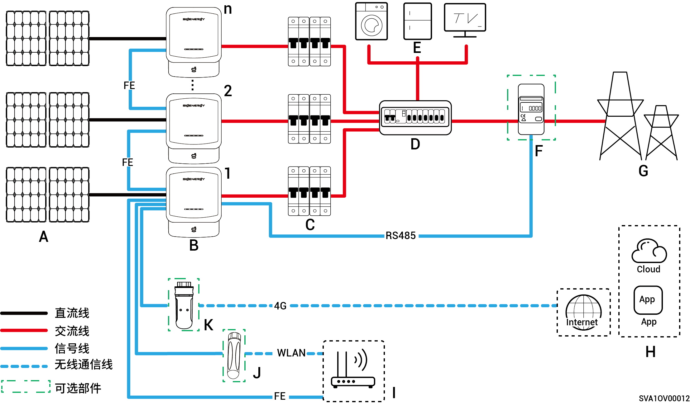

# 纯光组网

Sigen Hybrid适用于家庭屋顶光伏并网系统。并网系统由光伏组串、逆变器、配电单元等组成。

<figure><figcaption></figcaption></figure>

<table><thead><tr><th width="59.5555419921875" align="center">序号</th><th width="128">说明</th><th width="61.111083984375" align="center">序号</th><th>说明</th><th width="60.333251953125" align="center">序号</th><th>说明</th></tr></thead><tbody><tr><td align="center"><strong>A</strong></td><td>光伏板</td><td align="center"><strong>B</strong></td><td>Sigen Hybrid</td><td align="center"><strong>C</strong></td><td>交流开关</td></tr><tr><td align="center"><strong>D</strong></td><td>交流配电单元</td><td align="center"><strong>E</strong></td><td>家用负载</td><td align="center"><strong>F</strong></td><td>Power sensor</td></tr><tr><td align="center"><strong>G</strong></td><td>电网</td><td align="center"><strong>H</strong></td><td>思格云</td><td align="center"><strong>I</strong></td><td>路由器</td></tr><tr><td align="center"><strong>J</strong></td><td>天线</td><td align="center"><strong>K</strong></td><td>CommMod</td><td align="center"></td><td></td></tr></tbody></table>



* <mark style="color:blue;">Sigen Hybrid支持级联台数≤20。</mark>
* <mark style="color:blue;">Sigen Hybrid (2.0-6.0) SP2系列：与每一台逆变器连接的交流开关额定电压均需≥240Va.c.，额定电流推荐规格：</mark>
  * <mark style="color:blue;">Sigen Hybrid (2.0-4.0) SP2系列：额定电流为25A。</mark>
  * <mark style="color:blue;">Sigen Hybrid (4.6-6.0) SP2系列：额定电流为40A。</mark>
* <mark style="color:blue;">Sigen Hybrid (3.0-12.0) TP2系列：与每一台逆变器连接的交流开关额定电压均需≥415 Va.c.，额定电流推荐规格：</mark>
  * <mark style="color:blue;">Sigen Hybrid (3.0, 4.0) TP2系列：额定电流为10A。</mark>
  * <mark style="color:blue;">Sigen Hybrid (5.0, 6.0) TP2系列：额定电流为16A。</mark>
  * <mark style="color:blue;">Sigen Hybrid (7.5, 8.0) TP2系列：额定电流为25A。</mark>
  * <mark style="color:blue;">Sigen Hybrid (10.0, 12.0) TP2系列：额定电流为32A。</mark>
* <mark style="color:blue;">若D（交流配电单元）具有漏电保护功能，推荐额定剩余动作电流为≥逆变器数量×100mA。</mark>
* <mark style="color:blue;">配电单元的交流开关额定电压需 ≥240 Va.c., 额定电流需：≥ 逆变器最大输出电流 x 并机数量 x 1.25</mark><mark style="color:blue;">【1】<mark style="color:blue;">
* <mark style="color:blue;">通信方式推荐采用FE和WLAN。CommMod赠送4G流量用完后，需用户自行更换SIM卡。</mark>

<mark style="color:blue;">注【1】：逆变器最大输出电流可在产品</mark>《思格产品参数》<mark style="color:blue;">上获取。</mark>
