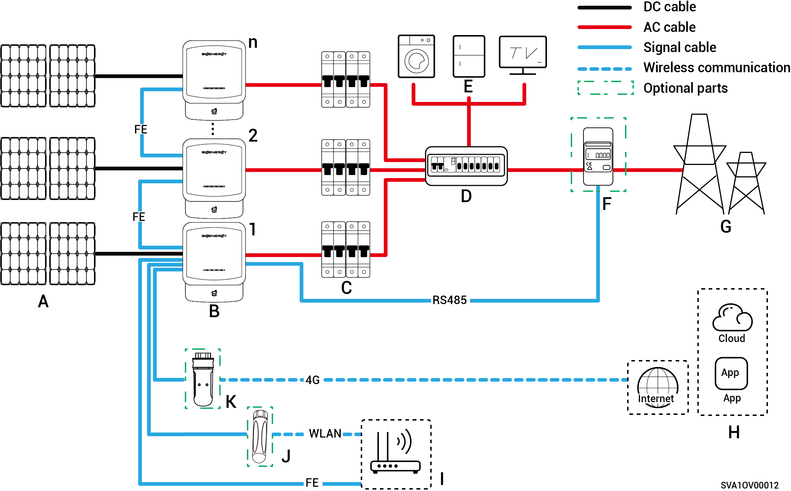

# 纯光组网

Sigen Hybrid适用于家庭屋顶光伏并网系统。并网系统由光伏组串、逆变器、配电单元等组成。

<figure><figcaption></figcaption></figure>

<table><thead><tr><th width="59.5555419921875" align="center">No.</th><th width="128">Description</th><th width="61.111083984375" align="center">No.</th><th>Description</th><th width="60.333251953125" align="center">No.</th><th>Description</th></tr></thead><tbody><tr><td align="center"><strong>A</strong></td><td>PV panel</td><td align="center"><strong>B</strong></td><td>Sigen Hybrid</td><td align="center"><strong>C</strong></td><td>AC switch</td></tr><tr><td align="center"><strong>D</strong></td><td>AC distribution panel</td><td align="center"><strong>E</strong></td><td>Household loads</td><td align="center"><strong>F</strong></td><td>Power sensor</td></tr><tr><td align="center"><strong>G</strong></td><td>Power grid</td><td align="center"><strong>H</strong></td><td>mySigen</td><td align="center"><strong>I</strong></td><td>Router</td></tr><tr><td align="center"><strong>J</strong></td><td>Antenna</td><td align="center"><strong>K</strong></td><td>CommMod</td><td align="center"></td><td></td></tr></tbody></table>



* <mark style="color:blue;">No more than 20 Sigen Hybrid units can be cascaded.</mark>
* <mark style="color:blue;">T</mark><mark style="color:blue;">he rated voltage of the AC switch connected to each</mark> <mark style="color:blue;">Sigen Hybrid (2.0-6.0) SP2 series</mark> <mark style="color:blue;">inverter must be ≥ 240 Va.c., and the recommended rated current specifications are:</mark>
  * <mark style="color:blue;">Sigen Hybrid (2.0-4.0) SP2 series</mark><mark style="color:blue;">: Rated current is 25 A.</mark>
  * <mark style="color:blue;">Sigen Hybrid (4.6-6.0) SP2 series</mark><mark style="color:blue;">: Rated current is 40 A.</mark>
* <mark style="color:blue;">The rated voltage of the AC switch connected to each</mark> <mark style="color:blue;">Sigen Hybrid (3.0-12.0) TP2 series inverter</mark> <mark style="color:blue;">must be ≥ 415 Va.c., and the recommended rated current specifications are:</mark>
  * <mark style="color:blue;">Sigen Hybrid (3.0, 4.0) TP2 series</mark><mark style="color:blue;">: Rated current is 10 A.</mark>
  * <mark style="color:blue;">Sigen Hybrid (5.0, 6.0) TP2 series: Rated current is 16 A.</mark>
  * <mark style="color:blue;">Sigen Hybrid (7.5, 8.0) TP2 series</mark><mark style="color:blue;">: Rated current is 25 A.</mark>
  * <mark style="color:blue;">Sigen Hybrid (10.0, 12.0) TP2 series</mark><mark style="color:blue;">: Rated current is 32 A.</mark>
* <mark style="color:blue;">If D (AC distribution panel) features leakage protection, it is recommended that the rated residual operating current be greater than or equal to the number of inverters × 100 mA.</mark>
* <mark style="color:blue;">配电单元的交流开关额定电压需 ≥240 Va.c., 额定电流需：≥ 逆变器最大输出电流 x 并机数量 x 1.25</mark><mark style="color:blue;">【1】<mark style="color:blue;">
* <mark style="color:blue;">It is recommended to use Fast Ethernet and WLAN for communication with inverters. When free 4G traffic of CommMod runs out, users must top up their accounts or replace an SIM card.</mark>

<mark style="color:blue;">Note \[1]: The maximum output current of an inverter can be found in its respective data sheet.</mark>
