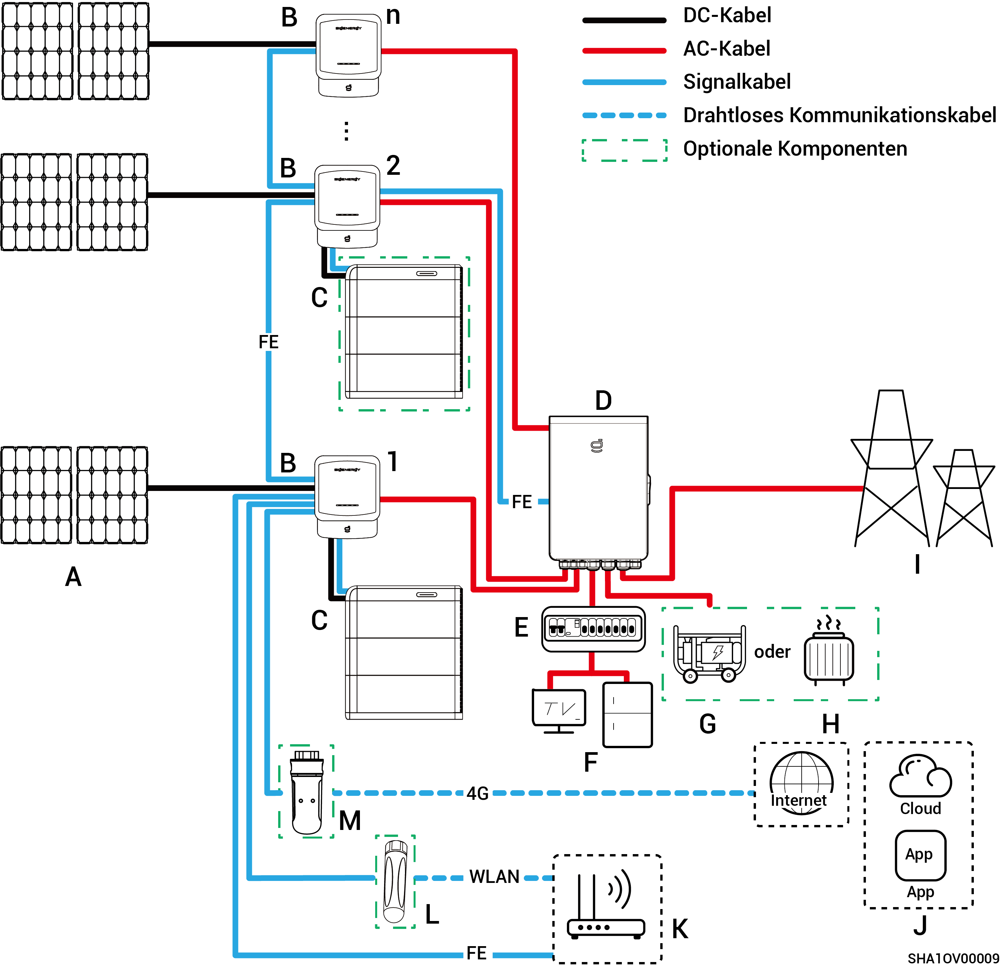
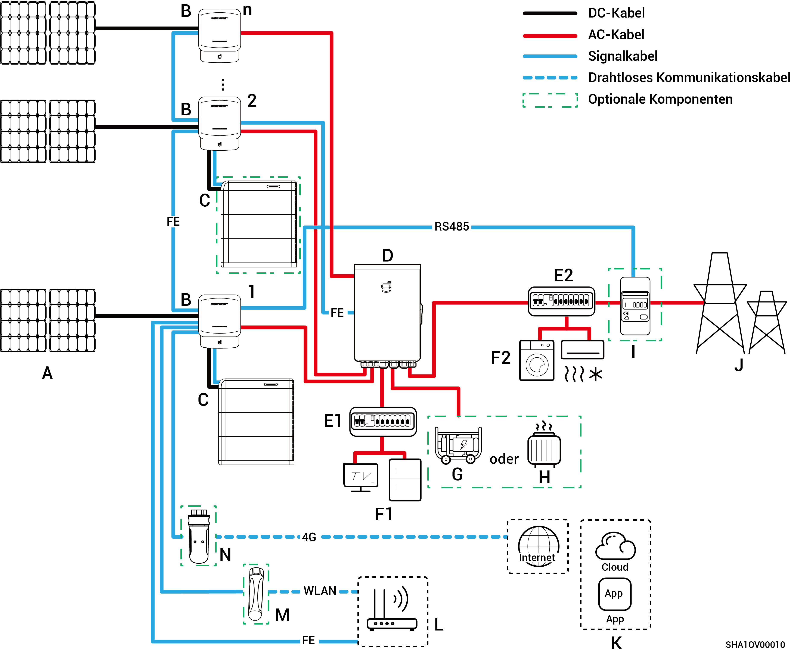
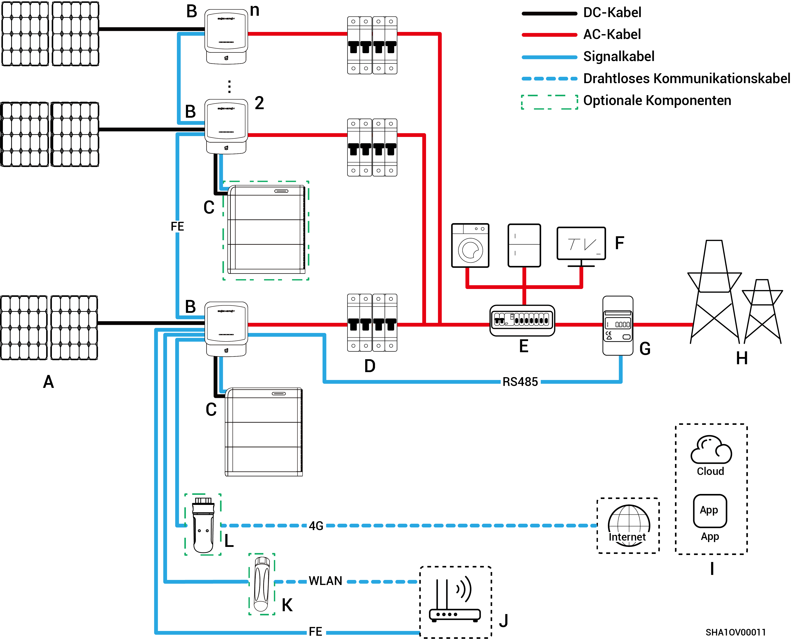

# Wechselrichter-Speichersystemverdrahtung

* Unsere Produkte können für Heim-Energiespeichersysteme verwendet werden. Ein Heim-Energiespeichersystem besteht aus Photovoltaik-Modulen, Wechselrichtern, Akkus/Batterien, Hauptschaltern, Gateway, Verbrauchern, Stromnetzen usw.
* Die Hauptfunktion des Heim-Energiespeichersystems besteht darin, den von den Photovoltaik-Modulen erzeugten Gleichstrom in Batterien zu speichern. Alternativ kann der Strom der Photovoltaikanlage und der Batterien in Wechselstrom umgewandelt werden, der dann von den Verbrauchern genutzt oder in das Stromnetz eingespeist werden kann.



<mark style="color:blue;">**Während der Notstromversorgung ist die Dauer des netzunabhängigen Betriebs unter Reservestromlast abhängig von der Netzleistung des PV-Speichersystems. Bei Anomalien in der Stromversorgung des PV-Speichersystems während des netzunabhängigen Betriebs (unter anderem abnormale PV-Stromerzeugung, unzureichende Batterieleistung und anomale Stromversorgung des Dieselgenerators) kann kein Reservestrom genutzt werden.**</mark>

### **Verdrahtungsplan für die vollständige Notstromversorgung**

<figure><figcaption></figcaption></figure>

<table><thead><tr><th width="61.11114501953125" align="center">Nr.</th><th width="114.77777099609375">Beschreibung</th><th width="60.33331298828125" align="center">Nr.</th><th>Beschreibung</th><th width="59" align="center" valign="middle">Nr.</th><th>Beschreibung</th></tr></thead><tbody><tr><td align="center"><strong>A</strong></td><td>PV-Modul</td><td align="center"><strong>B</strong></td><td>Sigen Hybrid</td><td align="center" valign="middle"><strong>C</strong></td><td>SigenStor-Energiespeichersystem (SigenStor BC + SigenStor BAT)</td></tr><tr><td align="center"><strong>D</strong></td><td>Gateway</td><td align="center"><strong>E</strong></td><td>Notstrom-Verteilertafel</td><td align="center" valign="middle"><strong>F</strong></td><td>Haushaltslasten mit Notstrom</td></tr><tr><td align="center"><strong>G</strong></td><td>Dieselgenerator</td><td align="center"><strong>H</strong></td><td>Intelligente Verbraucher</td><td align="center" valign="middle"><strong>I</strong></td><td>Stromnetz</td></tr><tr><td align="center"><strong>J</strong></td><td>mySigen</td><td align="center"><strong>K</strong></td><td>Router</td><td align="center" valign="middle"><strong>L</strong></td><td>Antenne</td></tr><tr><td align="center"><strong>M</strong></td><td>CommMod</td><td align="center"></td><td></td><td align="center" valign="middle"></td><td></td></tr></tbody></table>



* <mark style="color:blue;">Es können nicht mehr als 20 Sigen Hybrid-Einheiten kaskadiert werden.</mark>
* <mark style="color:blue;">Sigen Hybrid + SigenStor-Energiespeichersystem unterstützt den Anschluss sowohl an Sigen Hybrid + SigenStor-Energiespeichersystem-Konfigurationen als auch an eigenständige Sigen Hybrid-Systeme.</mark>
* <mark style="color:blue;">Wenn F (Notstromverbraucher) ein Leck aufweist, besteht Stromschlaggefahr. Um diese Gefahr zu vermeiden, muss zwischen D (Gateway) und F (Notstromverbraucher) ein Fehlerstromschutzschalter (RCD) installiert werden.</mark>
* <mark style="color:blue;">Als Reserveenergiequelle für langfristige netzunabhängige Anwendungen kann der Dieselgenerator zusammen mit dem Gateway einen reibungslosen Übergang zwischen Photovoltaik, Speicherung und Dieselgenerierung gewährleisten.</mark>
* <mark style="color:blue;">Alle Stromgeräte im Heim des Eigentümers können als intelligente Verbraucher angeschlossen werden. Um sicherzustellen, dass dieses Produkt den größtmöglichen Nutzen für die Benutzer bringt, wird empfohlen, die Hochleistungsgeräte als intelligente Lasten (Wärmepumpen, Poolheizungen, Wäschetrockner usw.) anzuschließen, die abgeschaltet werden können, wenn das Energiespeichersystem nur noch über eine geringe Leistung verfügt. Andere Geräte mit niedrigem Leistungsbedarf sind als Haushaltslasten (Lampen, Router usw.) angeschlossen.</mark>
* <mark style="color:blue;">Es wird empfohlen, schnelles Ethernet und WLAN zur Kommunikation mit Wechselrichtern zu verwenden. Wenn der kostenlose 4G-Datenverkehr von CommMod aufgebraucht ist, muss der Nutzer sein Konto aufladen oder die SIM-Karte austauschen.</mark>

### **Verdrahtungsplan für die partielle Notstromversorgung**

<figure><figcaption></figcaption></figure>

<table><thead><tr><th width="59.11114501953125" align="center">Nr.</th><th width="142">Beschreibung</th><th width="60.22216796875" align="center">Nr.</th><th width="151">Beschreibung</th><th width="60.22216796875" align="center">Nr.</th><th>Beschreibung</th></tr></thead><tbody><tr><td align="center"><strong>A</strong></td><td>PV-Modul</td><td align="center"><strong>B</strong></td><td>Sigen Hybrid</td><td align="center"><strong>C</strong></td><td>SigenStor-Energiespeichersystem (SigenStor BC + SigenStor BAT)</td></tr><tr><td align="center"><strong>D</strong></td><td>Gateway</td><td align="center"><strong>E1</strong></td><td>Notstrom-Verteilertafel</td><td align="center"><strong>E2</strong></td><td>Nicht-Notstrom-Verteilertafel</td></tr><tr><td align="center"><strong>F1</strong></td><td>Haushaltslasten mit Notstrom</td><td align="center"><strong>F2</strong></td><td>Haushaltslasten ohne Notstrom</td><td align="center"><strong>G</strong></td><td>Dieselgenerator</td></tr><tr><td align="center"><strong>H</strong></td><td>Intelligente Verbraucher</td><td align="center"><strong>I</strong></td><td>Leistungssensor</td><td align="center"><strong>J</strong></td><td>Leistungssensor</td></tr><tr><td align="center"><strong>K</strong></td><td>mySigen</td><td align="center"><strong>L</strong></td><td>Router</td><td align="center"><strong>M</strong></td><td>Antenne</td></tr><tr><td align="center"><strong>N</strong></td><td>CommMod</td><td align="center"></td><td></td><td align="center"></td><td></td></tr></tbody></table>



* <mark style="color:blue;">Es können nicht mehr als 20 Sigen Hybrid-Einheiten kaskadiert werden.</mark>
* <mark style="color:blue;">Sigen Hybrid + SigenStor-Energiespeichersystem unterstützt den Anschluss sowohl an Sigen Hybrid + SigenStor-Energiespeichersystem-Konfigurationen als auch an eigenständige Sigen Hybrid-Systeme.</mark>
* <mark style="color:blue;">Wenn E2 (Verteilertafel) ohne Rückspeisung über Leckstromschutz verfügt, wird empfohlen, dass der Nenn-Restbetriebsstrom größer oder gleich der Anzahl der Wechselrichter x 100 mA ist.</mark>
* <mark style="color:blue;">Wenn F1 (Notstromverbraucher) ein Leck aufweist, besteht Stromschlaggefahr. Um diese Gefahr zu vermeiden, muss zwischen D (Gateway) und F1 (Notstromverbraucher) ein Fehlerstromschutzschalter (RCD) installiert werden.</mark>
* <mark style="color:blue;">Als Reserveenergiequelle für langfristige netzunabhängige Anwendungen kann der Dieselgenerator zusammen mit dem Gateway einen reibungslosen Übergang zwischen Photovoltaik, Speicherung und Dieselstromerzeugung gewährleisten.</mark>
* <mark style="color:blue;">Alle Stromgeräte im Heim des Eigentümers können als intelligente Verbraucher angeschlossen werden. Um sicherzustellen, dass dieses Produkt den größtmöglichen Nutzen für die Benutzer bringt, wird empfohlen, die Hochleistungsgeräte als intelligente Lasten (Wärmepumpen, Poolheizungen, Wäschetrockner usw.) anzuschließen, die abgeschaltet werden können, wenn das Energiespeichersystem nur noch über eine geringe Leistung verfügt. Andere Geräte mit niedrigem Leistungsbedarf sind als Haushaltslasten (Lampen, Router usw.) angeschlossen.</mark>
* <mark style="color:blue;">Der Leistungssensor verfügt über Datenerfassung am Netzanschlusspunkt, um einen Nullstrom-Netzanschluss zu erreichen. Für die partielle Notstrom-Systemverdrahtung: der Leistungssensor muss nicht konfiguriert werden. Für die Verdrahtung der partiellen Notstromversorgung und der Nullstrom-Netzanschlusssteuerung: der Leistungssensor ist konfiguriert.</mark>
* <mark style="color:blue;">Es wird empfohlen, schnelles Ethernet und WLAN zur Kommunikation mit Wechselrichtern zu verwenden. Wenn der kostenlose 4G-Datenverkehr von CommMod aufgebraucht ist, muss der Nutzer sein Konto aufladen oder die SIM-Karte austauschen.</mark>

### **Verdrahtungsplan für das System ohne Notstrom**

<figure><figcaption></figcaption></figure>

<table><thead><tr><th width="91">Nr.</th><th width="149">Beschreibung</th><th width="74">Nr.</th><th>Beschreibung</th><th width="82">Nr.</th><th>Beschreibung</th></tr></thead><tbody><tr><td><strong>A</strong></td><td>PV-Modul</td><td><strong>B</strong></td><td>Sigen Hybrid</td><td><strong>C</strong></td><td>SigenStor-Energiespeichersystem (SigenStor BC + SigenStor BAT)</td></tr><tr><td><strong>D</strong></td><td>AC-Schalter</td><td><strong>E</strong></td><td>Verteilertafel</td><td><strong>F</strong></td><td>Haushaltslasten</td></tr><tr><td><strong>G</strong></td><td>Leistungssensor</td><td><strong>H</strong></td><td>Stromnetz</td><td><strong>I</strong></td><td>mySigen</td></tr><tr><td><strong>J</strong></td><td>Router</td><td><strong>K</strong></td><td>Antenne</td><td><strong>L</strong></td><td>CommMod</td></tr></tbody></table>



* <mark style="color:blue;">Es können maximal 20 SigenStor-Einheiten kaskadiert werden.</mark>
* <mark style="color:blue;">Sigen Hybrid + SigenStor-Energiespeichersystem unterstützt den Anschluss sowohl an Sigen Hybrid + SigenStor-Energiespeichersystem-Konfigurationen als auch an eigenständige Sigen Hybrid-Systeme.</mark>
* <mark style="color:blue;">Die Nennspannung des Wechselstromschalters, der an jeden Wechselrichter der</mark> <mark style="color:blue;">Sigen Hybrid (2.0-6.0) SP2-Baureihe</mark> <mark style="color:blue;">angeschlossen ist, muss ≥ 240 V AC sein, und die empfohlenen Nennstromspezifikationen sind:</mark>
  * <mark style="color:blue;">Sigen Hybrid (2.0-4.0) SP2-Baureihen: Nennstrom 25 A.</mark>
  * <mark style="color:blue;">Sigen Hybrid (4.6-6.0) SP2-Baureihen: Nennstrom 40 A.</mark>
* <mark style="color:blue;">Die Nennspannung des Wechselstromschalters, der an jeden Wechselrichter der Baureihe</mark> <mark style="color:blue;">Sigen Hybrid (3.0-12.0) TP2 angeschlossen ist,</mark> <mark style="color:blue;">muss ≥ 415 V AC sein, und die empfohlenen Nennstromspezifikationen sind:</mark>
  * <mark style="color:blue;">Sigen Hybrid (3.0, 4.0) TP2-Baureihen: Nennstrom 10 A.</mark>
  * <mark style="color:blue;">Sigen Hybrid (5.0, 6.0) TP2-Baureihen: Nennstrom 16 A.</mark>
  * <mark style="color:blue;">Sigen Hybrid (7.5, 8.0) TP2-Baureihes: Nennstrom 25 A.</mark>
  * <mark style="color:blue;">Sigen Hybrid (10.0, 12.0) TP2-Baureihen: Nennstrom 32 A.</mark>
* <mark style="color:blue;">Wenn E (Verteilertafel) über einen Auslaufschutz verfügt, wird empfohlen, dass der Bemessungsfehlerstrom größer oder gleich der Anzahl der Wechselrichter x 100 mA ist.</mark>
* <mark style="color:blue;">Der AC-Schalter der Schalttafel muss eine Nennspannung ≥ 240 V AC und einen Nennstrom ≥ (maximaler Ausgangsstrom des Wechselrichters x Anzahl der parallelen Geräte x 1,25) haben.</mark><mark style="color:blue;">\[1]<mark style="color:blue;">
* <mark style="color:blue;">Es wird empfohlen, schnelles Ethernet und WLAN zur Kommunikation mit Wechselrichtern zu verwenden. Wenn der kostenlose 4G-Datenverkehr von CommMod aufgebraucht ist, muss der Nutzer sein Konto aufladen oder die SIM-Karte austauschen.</mark>

<mark style="color:blue;">Hinweis \[1]: Der maximale Ausgangsstrom eines Wechselrichters kann dem jeweiligen Datenblatt entnommen werden.</mark>
