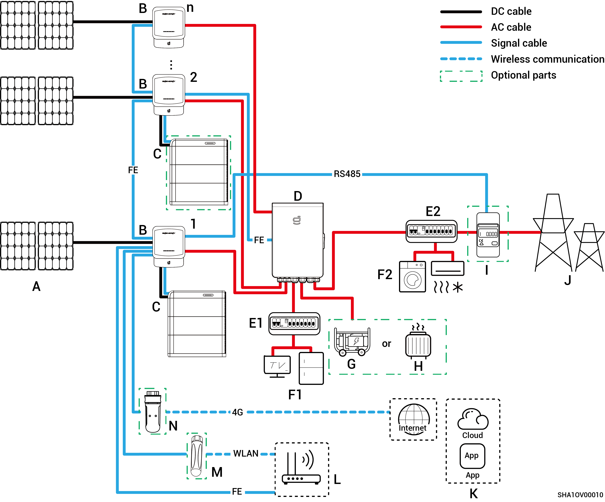
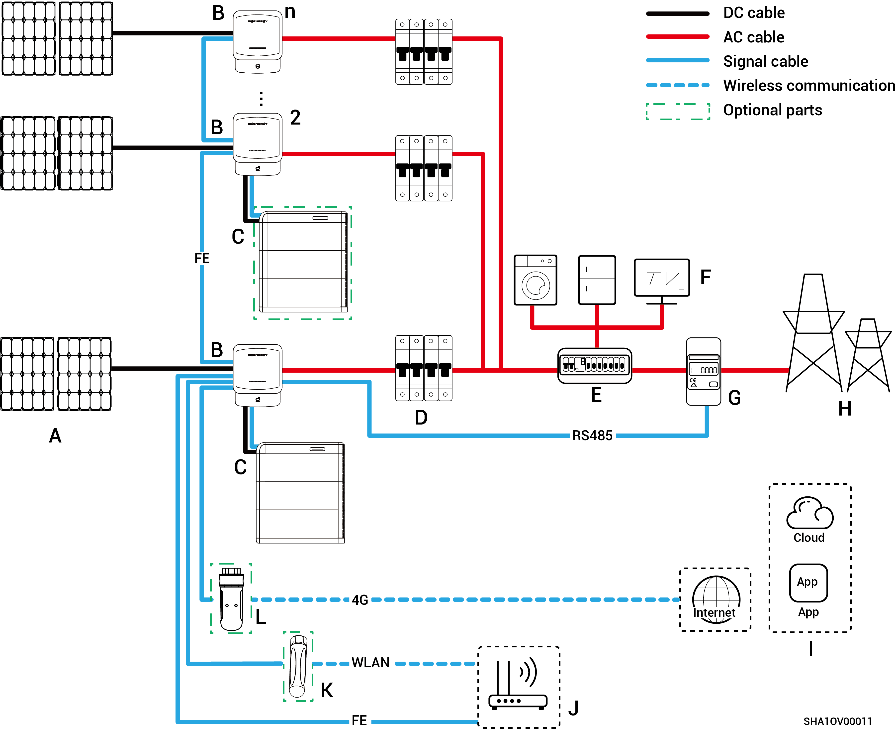

# PV Storage System Wiring

* Our company’s products can be used for Home energy storage system. The Home energy storage system consists of photovoltaic panels, inverters, battery packs, master control switches, Gateway, loads, power grids, etc.
* The main function of Home energy storage system is to store the direct current generated by photovoltaic panels into battery packs. Or alternatively, the electricity in the photovoltaic system and the battery pack can be converted into alternating current for use by the load or incorporated into the grid.



<mark style="color:blue;">**Under backup power system wiring, the duration of off-grid operation of the backup power load is related to the power supply capacity of the PV storage system. If there is an abnormality in the power supply of the PV storage system during off-grid operation (including but not limited to abnormal PV power generation, insufficient battery power, and abnormal power supplies to the diesel generator), the backup power load will still be unable to operate.**</mark>

### **Whole home backup system wiring diagram**

<figure><figcaption></figcaption></figure>

<table><thead><tr><th width="61.11114501953125" align="center">No.</th><th width="114.77777099609375">Description</th><th width="60.33331298828125" align="center">No.</th><th>Description</th><th width="59" align="center" valign="middle">No.</th><th>Description</th></tr></thead><tbody><tr><td align="center"><strong>A</strong></td><td>PV panel</td><td align="center"><strong>B</strong></td><td>Sigen Hybrid</td><td align="center" valign="middle"><strong>C</strong></td><td>SigenStor Energy Storage System (SigenStor BC+SigenStor BAT)</td></tr><tr><td align="center"><strong>D</strong></td><td>Gateway</td><td align="center"><strong>E</strong></td><td>Backup Distribution panel</td><td align="center" valign="middle"><strong>F</strong></td><td>Backup Household loads</td></tr><tr><td align="center"><strong>G</strong></td><td>Diesel generator</td><td align="center"><strong>H</strong></td><td>Smart loads</td><td align="center" valign="middle"><strong>I</strong></td><td>Power grid</td></tr><tr><td align="center"><strong>J</strong></td><td>mySigen</td><td align="center"><strong>K</strong></td><td>Router</td><td align="center" valign="middle"><strong>L</strong></td><td>Antenna</td></tr><tr><td align="center"><strong>M</strong></td><td>CommMod</td><td align="center"></td><td></td><td align="center" valign="middle"></td><td></td></tr></tbody></table>



* <mark style="color:blue;">No more than 20 Sigen Hybrid units can be cascaded.</mark>
* <mark style="color:blue;">The Sigen Hybrid + SigenStor energy storage system supports connection to both Sigen Hybrid + SigenStor energy storage system configurations and standalone Sigen Hybrid systems.</mark>
* <mark style="color:blue;">If F (backup household load) experiences leakage, it may pose a risk of electric shock. In order to avoid this hazard, a residual current device (RCD) must be installed between the D (Gateway) and the F (backup household load).</mark>
* <mark style="color:blue;">As a backup energy source for long-term off-grid applications, the diesel generator can work in tandem with the Gateway to provide a smooth transition between PV, storage and diesel generation.</mark>
* <mark style="color:blue;">All the power equipment in the owner's home can be connected as smart loads. To ensure that this product maximizes the benefits to users, it is recommended that the high-power equipment be connected as smart loads (heat pumps, pool heaters, clothes dryers, etc.), which can be cut off when the energy storage system has low power. Other low-power equipment are connected as household loads (lights, routers, etc.)</mark>
* <mark style="color:blue;">It is recommended to use Fast Ethernet and WLAN for communication with inverters. When free 4G traffic of CommMod runs out, users must top up their accounts or replace an SIM card.</mark>

### **Partial home backup system wiring diagram**

<figure><figcaption></figcaption></figure>

<table><thead><tr><th width="59.11114501953125" align="center">No.</th><th width="142">Description</th><th width="60.22216796875" align="center">No.</th><th width="151">Description</th><th width="60.22216796875" align="center">No.</th><th>Description</th></tr></thead><tbody><tr><td align="center"><strong>A</strong></td><td>PV panel</td><td align="center"><strong>B</strong></td><td>Sigen Hybrid</td><td align="center"><strong>C</strong></td><td>SigenStor Energy Storage System (SigenStor BC+SigenStor BAT)</td></tr><tr><td align="center"><strong>D</strong></td><td>Gateway</td><td align="center"><strong>E1</strong></td><td>Backup Distribution panel</td><td align="center"><strong>E2</strong></td><td>Non-Backup Distribution panel</td></tr><tr><td align="center"><strong>F1</strong></td><td>Backup Household loads</td><td align="center"><strong>F2</strong></td><td>Non-Backup Household loads</td><td align="center"><strong>G</strong></td><td>Diesel Generator</td></tr><tr><td align="center"><strong>H</strong></td><td>Smart loads</td><td align="center"><strong>I</strong></td><td>Power sensor</td><td align="center"><strong>J</strong></td><td>Power sensor</td></tr><tr><td align="center"><strong>K</strong></td><td>mySigen</td><td align="center"><strong>L</strong></td><td>Router</td><td align="center"><strong>M</strong></td><td>Antenna</td></tr><tr><td align="center"><strong>N</strong></td><td>CommMod</td><td align="center"></td><td></td><td align="center"></td><td></td></tr></tbody></table>



* <mark style="color:blue;">No more than 20 Sigen Hybrid units can be cascaded.</mark>
* <mark style="color:blue;">The Sigen Hybrid + SigenStor energy storage system supports connection to both Sigen Hybrid + SigenStor energy storage system configurations and standalone Sigen Hybrid systems.</mark>
* <mark style="color:blue;">If E2 (non-backup distribution panel) features leakage protection, it is recommended that the rated residual operating current be greater than or equal to the number of inverters × 100 mA.</mark>
* <mark style="color:blue;">If F1 (backup household load) experiences leakage, it may pose a risk of electric shock. In order to avoid this hazard, a residual current device (RCD) must be installed between the D (Gateway) and the F1 (backup household load).</mark>
* <mark style="color:blue;">As a backup energy source for long-term off-grid applications, the diesel generator can work in tandem with the Gateway to provide a smooth transition between PV, storage and diesel power generation.</mark>
* <mark style="color:blue;">All the power equipment in the owner's home can be connected as smart loads. To ensure that this product maximizes the benefits to users, it is recommended that the high-power equipment be connected as smart loads (heat pumps, pool heaters, clothes dryers, etc.), which can be cut off when the energy storage system has low power. Other low-power equipment are connected as household loads (lights, routers, etc.)</mark>
* <mark style="color:blue;">Power sensor has the function of data acquisition for grid connection points enables zero-power grid connection. For partial home backup system wiring, Power sensor does not need to be configured. For partial backup power and zero-power grid connection control system wiring, Power sensor is configured.</mark>
* <mark style="color:blue;">It is recommended to use Fast Ethernet and WLAN for communication with inverters. When free 4G traffic of CommMod runs out, users must top up their accounts or replace an SIM card.</mark>

### **Non-backup system wiring diagram**

<figure><figcaption></figcaption></figure>

<table><thead><tr><th width="91">No.</th><th width="149">Description</th><th width="74">No.</th><th>Description</th><th width="82">No.</th><th>Description</th></tr></thead><tbody><tr><td><strong>A</strong></td><td>PV panel</td><td><strong>B</strong></td><td>Sigen Hybrid</td><td><strong>C</strong></td><td>SigenStor Energy Storage System (SigenStor BC+SigenStor BAT)</td></tr><tr><td><strong>D</strong></td><td>AC switch</td><td><strong>E</strong></td><td>Distribution panel</td><td><strong>F</strong></td><td>Household loads</td></tr><tr><td><strong>G</strong></td><td>Power sensor</td><td><strong>H</strong></td><td>Power grid</td><td><strong>I</strong></td><td>mySigen</td></tr><tr><td><strong>J</strong></td><td>Router</td><td><strong>K</strong></td><td>Antenna</td><td><strong>L</strong></td><td>CommMod</td></tr></tbody></table>



* <mark style="color:blue;">No more than 20 SigenStor units can be cascaded.</mark>
* <mark style="color:blue;">The Sigen Hybrid + SigenStor energy storage system supports connection to both Sigen Hybrid + SigenStor energy storage system configurations and standalone Sigen Hybrid systems.</mark>
* <mark style="color:blue;">The rated voltage of the AC switch connected to each</mark> <mark style="color:blue;">Sigen Hybrid (2.0-6.0) SP2 series</mark> <mark style="color:blue;">inverter must be ≥ 240 Va.c., and the recommended rated current specifications are:</mark>
  * <mark style="color:blue;">Sigen Hybrid (2.0-4.0) SP2 series: Rated current is 25 A.</mark>
  * <mark style="color:blue;">Sigen Hybrid (4.6-6.0) SP2 series: Rated current is 40 A.</mark>
* <mark style="color:blue;">The rated voltage of the AC switch connected to each</mark> <mark style="color:blue;">Sigen Hybrid (3.0-12.0) TP2 series inverter</mark> <mark style="color:blue;">must be ≥ 415 Va.c., and the recommended rated current specifications are:</mark>
  * <mark style="color:blue;">Sigen Hybrid (3.0, 4.0) TP2 series: Rated current is 10 A.</mark>
  * <mark style="color:blue;">Sigen Hybrid (5.0, 6.0) TP2 series: Rated current is 16 A.</mark>
  * <mark style="color:blue;">Sigen Hybrid (7.5, 8.0) TP2 series: Rated current is 25 A.</mark>
  * <mark style="color:blue;">Sigen Hybrid (10.0, 12.0) TP2 series: Rated current is 32 A.</mark>
* <mark style="color:blue;">If E (distribution panel) features leakage protection, it is recommended that the rated residual operating current be greater than or equal to the number of inverters × 100 mA.</mark>
* <mark style="color:blue;">The distribution panel AC switch must have a rated voltage ≥ 240 Va.c. and rated current ≥ (Inverter maximum output current × Number of parallel units × 1.25)</mark><mark style="color:blue;">\[1]<mark style="color:blue;">
* <mark style="color:blue;">It is recommended to use Fast Ethernet and WLAN for communication with inverters. When free 4G traffic of CommMod runs out, users must top up their accounts or replace an SIM card.</mark>

<mark style="color:blue;">Note \[1]: The maximum output current of an inverter can be found in its respective data sheet.</mark>
