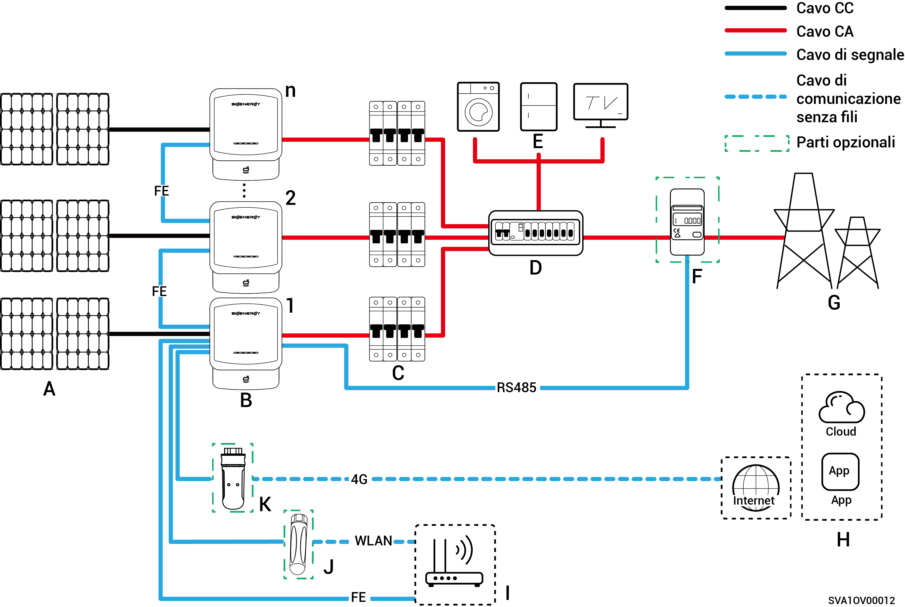

# Cablaggio del sistema fotovoltaico

Sigen Hybrid è progettato per impianti fotovoltaici residenziali su tetto connessi alla rete. L'impianto fotovoltaico connesso alla rete è composto da stringhe FV, inverter, quadri di distribuzione e altri componenti.

<figure><figcaption></figcaption></figure>

<table><thead><tr><th width="59.5555419921875" align="center">N.</th><th width="128">Descrizione</th><th width="61.111083984375" align="center">N.</th><th>Descrizione</th><th width="60.333251953125" align="center">N.</th><th>Descrizione</th></tr></thead><tbody><tr><td align="center"><strong>A</strong></td><td>Pannello fotovoltaico</td><td align="center"><strong>B</strong></td><td>Sigen Hybrid</td><td align="center"><strong>C</strong></td><td>Interruttore CA</td></tr><tr><td align="center"><strong>D</strong></td><td>Quadro di distribuzione CA</td><td align="center"><strong>E</strong></td><td>Carichi domestici</td><td align="center"><strong>F</strong></td><td>Sensore di potenza</td></tr><tr><td align="center"><strong>G</strong></td><td>Rete elettrica</td><td align="center"><strong>H</strong></td><td>mySigen</td><td align="center"><strong>I</strong></td><td>Router</td></tr><tr><td align="center"><strong>J</strong></td><td>Antenna</td><td align="center"><strong>K</strong></td><td>CommMod</td><td align="center"></td><td></td></tr></tbody></table>



* <mark style="color:blue;">È possibile collegare in cascata fino a 20 unità Sigen Hybrid.</mark>
* <mark style="color:blue;">La tensione nominale dell'interruttore CA collegato a ciascun</mark> <mark style="color:blue;">inverter Sigen Hybrid (2.0-6.0) serie SP2</mark> <mark style="color:blue;">deve essere ≥ 240 V CA e le specifiche della corrente nominale raccomandate sono:</mark>
  * <mark style="color:blue;">Sigen Hybrid (2.0-4.0) serie SP2: La corrente nominale è 25 A.</mark>
  * <mark style="color:blue;">Sigen Hybrid (4.6-6.0) serie SP2: La corrente nominale è 40 A.</mark>
* <mark style="color:blue;">La tensione nominale dell'interruttore CA collegato a ciascun</mark> <mark style="color:blue;">inverter Sigen Hybrid (3.0-12.0) serie TP2</mark> <mark style="color:blue;">deve essere ≥ 415 V CA e le specifiche della corrente nominale raccomandate sono:</mark>
  * <mark style="color:blue;">Sigen Hybrid (3.0, 4.0) serie TP2: la corrente nominale è 10 A.</mark>
  * <mark style="color:blue;">Sigen Hybrid (5.0, 6.0) serie TP2: la corrente nominale è 16 A.</mark>
  * <mark style="color:blue;">Sigen Hybrid (7.5, 8.0) serie TP2: La corrente nominale è 25 A.</mark>
  * <mark style="color:blue;">Sigen Hybrid (10.0, 12.0) serie TP2: la corrente nominale è 32 A.</mark>
* <mark style="color:blue;">Se D (quadro di distribuzione CA) è dotato di protezione contro le dispersioni, si raccomanda che la corrente operativa residua nominale sia maggiore o uguale al numero di inverter x 100 mA.</mark>
* <mark style="color:blue;">L'interruttore CA del pannello di distribuzione deve avere una tensione nominale ≥ 240 V CA e una corrente nominale ≥ (corrente di uscita massima dell'inverter x numero di unità in parallelo x 1,25)</mark><mark style="color:blue;">\[1]<mark style="color:blue;">
* <mark style="color:blue;">Si consiglia di utilizzare Fast Ethernet e una WLAN per la comunicazione con gli inverter. Quando il traffico 4G gratuito di CommMod si esaurisce, l'utente deve ricaricare il proprio account o sostituire la scheda SIM.</mark>

<mark style="color:blue;">Nota \[1]: La corrente di uscita massima di un inverter è riportata nella relativa scheda tecnica.</mark>
