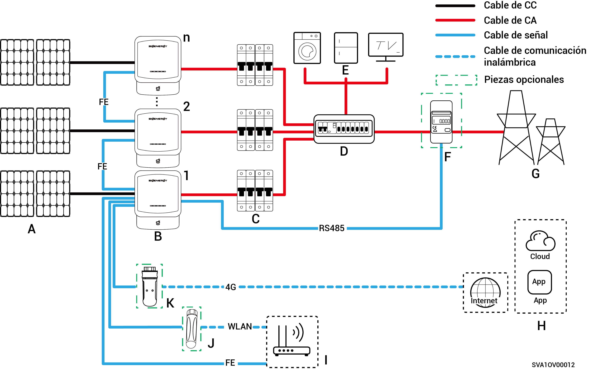

# Cableado del sistema fotovoltaico

Sigen Hybrid se ha diseñado para sistemas solares conectados a la red de tejados de viviendas. El sistema conectado a la red está formado por cadenas fotovoltaicas, inversores, paneles de distribución y otros componentes.

<figure><figcaption></figcaption></figure>

<table><thead><tr><th width="59.5555419921875" align="center">N.º</th><th width="128">Descripción</th><th width="61.111083984375" align="center">N.º</th><th>Descripción</th><th width="60.333251953125" align="center">N.º</th><th>Descripción</th></tr></thead><tbody><tr><td align="center"><strong>A</strong></td><td>Panel FV</td><td align="center"><strong>B</strong></td><td>Sigen Hybrid</td><td align="center"><strong>C</strong></td><td>Interruptor de CA</td></tr><tr><td align="center"><strong>D</strong></td><td>Panel de distribución de CA</td><td align="center"><strong>E</strong></td><td>Cargas domésticas</td><td align="center"><strong>F</strong></td><td>Sensor de energía</td></tr><tr><td align="center"><strong>G</strong></td><td>Red eléctrica</td><td align="center"><strong>H</strong></td><td>mySigen</td><td align="center"><strong>I</strong></td><td>Enrutador</td></tr><tr><td align="center"><strong>J</strong></td><td>Antena</td><td align="center"><strong>K</strong></td><td>CommMod</td><td align="center"></td><td></td></tr></tbody></table>



* <mark style="color:blue;">No pueden utilizarse más de 20 unidades Sigen Hybrid en cascada.</mark>
* <mark style="color:blue;">El voltaje nominal del conmutador de CA conectado a cada</mark> <mark style="color:blue;">inversor de la serie Sigen Hybrid (2.0-6.0) SP2</mark> <mark style="color:blue;">debe ser ≥ 240 Vca y se recomienda la siguiente corriente nominal:</mark>
  * <mark style="color:blue;">Sigen Hybrid (2.0-4.0) serie SP2: La corriente nominal es de 25 A.</mark>
  * <mark style="color:blue;">Sigen Hybrid (4.6-6.0) serie SP2: La corriente nominal es de 40 A.</mark>
* <mark style="color:blue;">El voltaje nominal del conmutador de CA conectado a cada</mark> <mark style="color:blue;">inversor de la serie Sigen Hybrid (3.0-12.0) TP2</mark> <mark style="color:blue;">debe ser ≥ 415 Vca y se recomienda la siguiente corriente nominal:</mark>
  * <mark style="color:blue;">Sigen Hybrid (3.0-4.0) serie TP2: La corriente nominal es de 10 A.</mark>
  * <mark style="color:blue;">Sigen Hybrid (5.0, 6.0) serie TP2: La corriente nominal es de 16 A.</mark>
  * <mark style="color:blue;">Sigen Hybrid (7.5-8.0) serie TP2: La corriente nominal es de 25 A.</mark>
  * <mark style="color:blue;">Sigen Hybrid (10.0-12.0) serie TP2: La corriente nominal es de 32 A.</mark>
* <mark style="color:blue;">Si D (panel de distribución de CA) cuenta con protección contra fugas, se recomienda que la corriente de funcionamiento residual nominal sea mayor o igual al número de inversores x 100 mA.</mark>
* <mark style="color:blue;">El interruptor de CA del panel de distribución debe tener un voltaje nominal ≥ 240 Vca y una corriente nominal ≥ (corriente máxima de salida del inversor x número de unidades en paralelo x 1,25)</mark><mark style="color:blue;">\[1]<mark style="color:blue;">
* <mark style="color:blue;">Se recomienda utilizar Fast Ethernet y WLAN para la comunicación con los inversores. Cuando el tráfico 4G gratuito de CommMod se agote, los usuarios deben ampliar sus cuentas o sustituir la tarjeta SIM.</mark>

<mark style="color:blue;">Nota \[1]: La corriente máxima de salida de un inversor se indica en la correspondiente ficha técnica.</mark>
