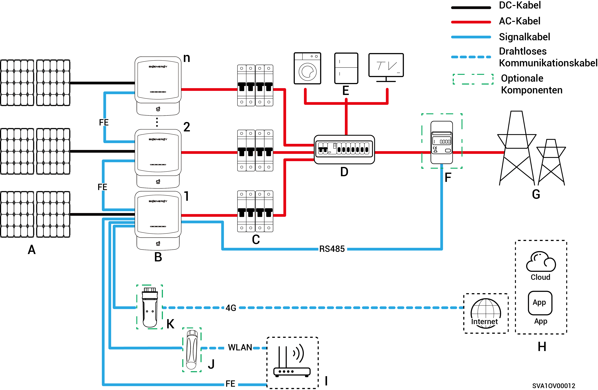

# Wechselrichter-Systemverdrahtung

Sigen Hybrid ist für netzgekoppelte Solarsysteme auf Hausdächern ausgelegt. Das netzgekoppelte Solarsystem besteht aus PV-Strängen, Wechselrichtern, Verteilerkästen sowie weiteren Bauteilen.

<figure><figcaption></figcaption></figure>

<table><thead><tr><th width="59.5555419921875" align="center">Nr.</th><th width="128">Beschreibung</th><th width="61.111083984375" align="center">Nr.</th><th>Beschreibung</th><th width="60.333251953125" align="center">Nr.</th><th>Beschreibung</th></tr></thead><tbody><tr><td align="center"><strong>A</strong></td><td>PV-Modul</td><td align="center"><strong>B</strong></td><td>Sigen Hybrid</td><td align="center"><strong>C</strong></td><td>AC-Schalter</td></tr><tr><td align="center"><strong>D</strong></td><td>AC-Verteilertafel</td><td align="center"><strong>E</strong></td><td>Haushaltslasten</td><td align="center"><strong>F</strong></td><td>Leistungssensor</td></tr><tr><td align="center"><strong>G</strong></td><td>Stromnetz</td><td align="center"><strong>H</strong></td><td>mySigen</td><td align="center"><strong>I</strong></td><td>Router</td></tr><tr><td align="center"><strong>J</strong></td><td>Antenne</td><td align="center"><strong>K</strong></td><td>CommMod</td><td align="center"></td><td></td></tr></tbody></table>



* <mark style="color:blue;">Es können nicht mehr als 20 Sigen Hybrid-Einheiten kaskadiert werden.</mark>
* <mark style="color:blue;">Die Nennspannung des Wechselstromschalters, der an jeden Wechselrichter der</mark> <mark style="color:blue;">Sigen Hybrid (2.0-6.0) SP2-Baureihe</mark> <mark style="color:blue;">angeschlossen ist, muss ≥ 240 V AC sein, und die empfohlenen Nennstromspezifikationen sind:</mark>
  * <mark style="color:blue;">Sigen Hybrid (2.0-4.0) SP2-Baureihen: Nennstrom 25 A.</mark>
  * <mark style="color:blue;">Sigen Hybrid (4.6-6.0) SP2-Baureihen: Nennstrom 40 A.</mark>
* <mark style="color:blue;">Die Nennspannung des Wechselstromschalters, der an jeden Wechselrichter der Baureihe</mark> <mark style="color:blue;">Sigen Hybrid (3.0-12.0) TP2 angeschlossen ist,</mark> <mark style="color:blue;">muss muss ≥ 415 V AC sein, und die empfohlenen Nennstromspezifikationen sind:</mark>
  * <mark style="color:blue;">Sigen Hybrid (3.0, 4.0) TP2-Baureihen: Nennstrom 10 A.</mark>
  * <mark style="color:blue;">Sigen Hybrid (5.0, 6.0) TP2-Baureihen: Nennstrom 16 A.</mark>
  * <mark style="color:blue;">Sigen Hybrid (7.5, 8.0) TP2-Baureihes: Nennstrom 25 A.</mark>
  * <mark style="color:blue;">Sigen Hybrid (10.0, 12.0) TP2-Baureihen: Nennstrom 32 A.</mark>
* <mark style="color:blue;">Wenn D (AC-Verteilertafel) über einen Leckageschutz verfügt, wird empfohlen, dass der Nenn-Restbetriebsstrom größer oder gleich der Anzahl der Wechselrichter x 100 mA ist.</mark>
* <mark style="color:blue;">Der AC-Schalter der Schalttafel muss eine Nennspannung ≥ 240 V AC und einen Nennstrom ≥ (maximaler Ausgangsstrom des Wechselrichters x Anzahl der parallelen Geräte x 1,25) haben.</mark><mark style="color:blue;">\[1]<mark style="color:blue;">
* <mark style="color:blue;">Es wird empfohlen, schnelles Ethernet und WLAN zur Kommunikation mit Wechselrichtern zu verwenden. Wenn der kostenlose 4G-Datenverkehr von CommMod aufgebraucht ist, muss der Nutzer sein Konto aufladen oder die SIM-Karte austauschen.</mark>

<mark style="color:blue;">Hinweis \[1]: Der maximale Ausgangsstrom eines Wechselrichters kann dem jeweiligen Datenblatt entnommen werden.</mark>
