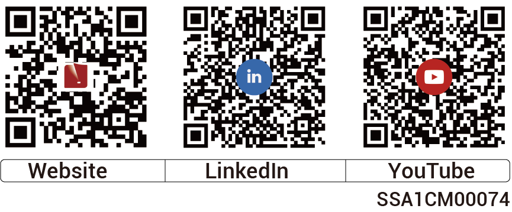

# 著作権の表示

Copyright© 2025 Sigenergy Technology Co., Ltd. 無断転用禁止。この資料に記載されている説明には、財務や営業成績、製品ポートフォリオ、新技術、製品の構成や機能に関する予測表現が含まれている場合があります。複数の要因により実際に生じる結果と予測表現にて明示または暗示されているものとの間で食い違いが生じる可能性があります。それゆえ、この資料に記載されている説明は参照目的でのみ提供されており、申込みや承諾のいずれをも構成するものではありません。Sigenergy Technology Co., Ltd.はこれらの情報を通知なくして随時変更する場合があります。

およびその他のSigenergyの商標は、Sigenergy Technology Co., Ltd. が所有しています。本書に記載されている商標と登録商標は、すべて各所有者に帰属します。

<figure><figcaption></figcaption></figure>

URL：[www.sigenergy.com](https://www.sigenergy.com/)
