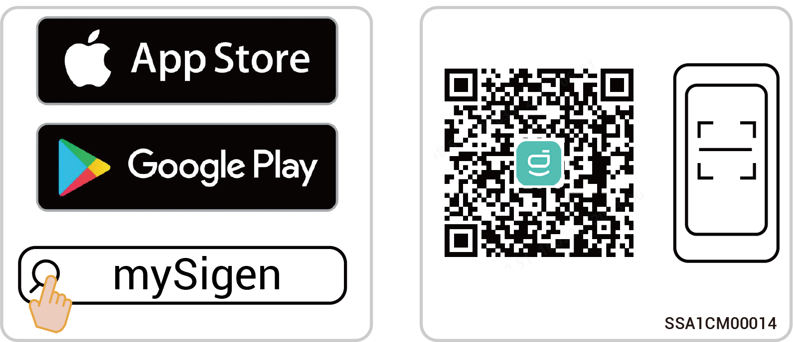
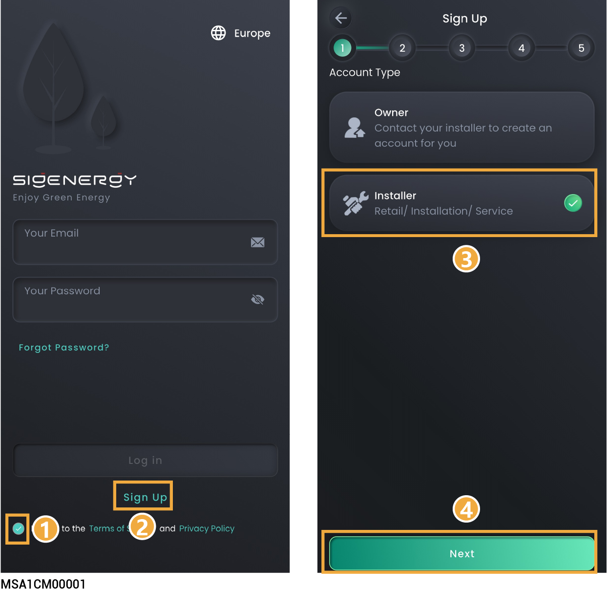
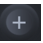

# Creating new systems and commissioning



* <mark style="color:blue;">This document takes version 3.1.0 as an example to introduce relevant operations. The screenshots given in this document are for illustration purposes only. Interfaces in different periods may differ. The actual interface display shall prevail.</mark>
* <mark style="color:blue;">Before creating new systems, please make sure that the device is powered on.</mark>

## Downloading the App



<mark style="color:blue;">Mobile operating systems: Android 6.0, iOS 12.0, and later versions.</mark>

Use the following two methods to download the App.

<figure><figcaption></figcaption></figure>

## Registration of installer account

### **Method 1: Web-based operation**

Please visit [https://www.sigenergy.com](https://www.sigenergy.com/) and go to "Partner" →"Become a Partner" and sign up for your account.

<figure><figcaption></figcaption></figure>

### **Method 2: App-based operation**

On the "Sign Up" screen of the App, sign up for your account.

<figure><figcaption></figcaption></figure>

## Creating new systems



<mark style="color:blue;">Create a new system step by step as instructed on the screen. The screen display may differ depending on the device model. For detailed steps, check the</mark> <mark style="color:blue;">mySigen App Creating New Systems Guide.</mark>

1. Click  in the upper right corner of the "Home" to go to the station creation screen, where you can finish creating a power station. The App will send the owner account to the owner's email address.

<figure><figcaption></figcaption></figure>

2. Please ask the owner to check the email titled "sigencloud" within 24 hours and activate the account.
