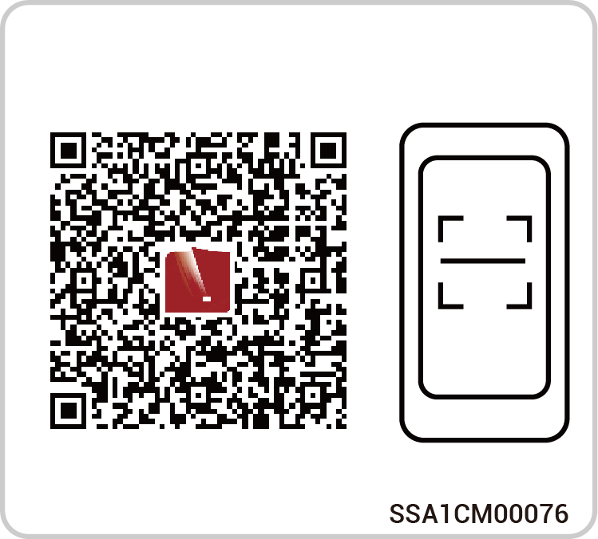

# 开局调测



* <mark style="color:blue;">本文档以3.3.0版本为例，介绍相关操作。文档中的截图仅为示意，不同时期的界面可能会存在差异，请以实际界面为准。</mark>
* <mark style="color:blue;">进行开局操作前，请确保设备已上电。</mark>

## **App下载**



<mark style="color:blue;">手机操作系统要求：Android 6.0、iOS 12.0及以上版本。</mark>

通过以下两种方式下载。

<figure><figcaption></figcaption></figure>

## **安装商账号注册**

### **方式一：网页操作**

请进入本公司官网（[https://www.sigenergy.com](https://www.sigenergy.com/)）的“Partner” →“Become a Partner”，根据实际情况完成账号注册。

.png>)

### **方式二：App操作**

在App的“Sign Up”界面下，根据实际情况完成账号注册。

<figure><figcaption></figcaption></figure>

## **设备开局**



<mark style="color:blue;">按照界面提示完成开局步骤。不同设备界面有所不同，可查《mySigen App Creating New Systems Guide》查看具体步骤。</mark>

<figure><figcaption></figcaption></figure>

1. 点击“首页”右上角 ，进入新建电站界面，完成建站操作，App将户主账号推送到户主邮箱。

<figure><figcaption></figcaption></figure>

2. 请通知户主在24h内查询“sigencloud”邮件，并激活账号。
