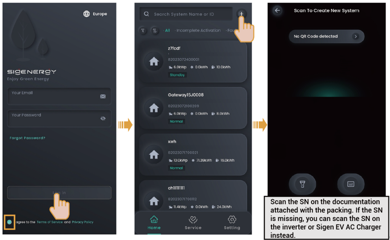

# Creating new systems

1. Click in the upper right corner of the "Home" to go to the station creation screen, where you can finish creating a power station. The App will send the owner account to the owner's email address.

<figure><figcaption></figcaption></figure>



<mark style="color:blue;">**Create a new system step by step as instructed on the screen. The screen display may differ depending on the device model. For detailed steps, check the supporting documentation.**</mark>

2. Please ask the owner to check the email titled "sigencloud" within 24 hours and activate the account.
