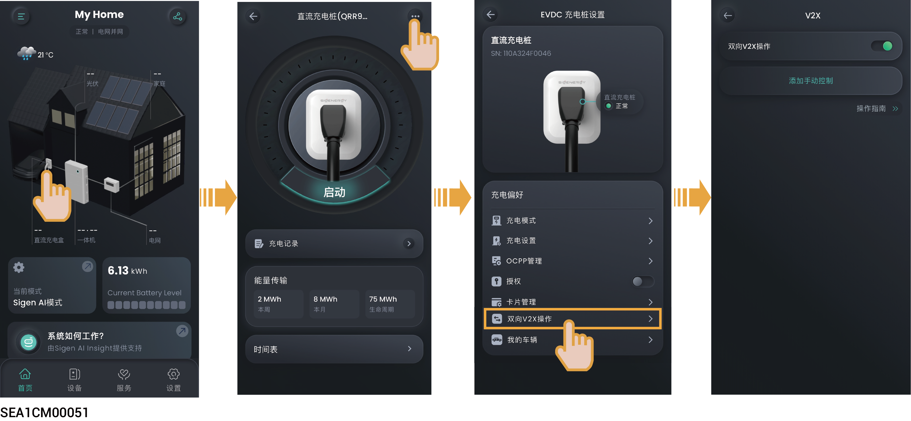

# （可选）V2X功能设置



* 开通V2X功能后，可将SigenStor EVDC作为额外 “储能” 参与电站调度，为家用设备供电。
* 当SigenStor软件版本为SPC110及以上时，可支持V2X功能。

<figure><figcaption></figcaption></figure>

* 首次开通V2X功能时，点击“双向V2X操作”，签署风险告知协议、填写车型等基础信息后方可将“双向V2X操作”设置为。
* 当“鉴权”设置为，且充电枪已经安装到位时，您可通过“添加手动控制”设置SigenStor EVDC放电时间段与功率。若SigenStor EVDC在设置的时间段内放电时，您想强制停止，可点击“停止放电”。
* 若您有多辆电动车，您可通过“我的车辆”添加车辆信息，并设置其中一台车为首选车辆。
