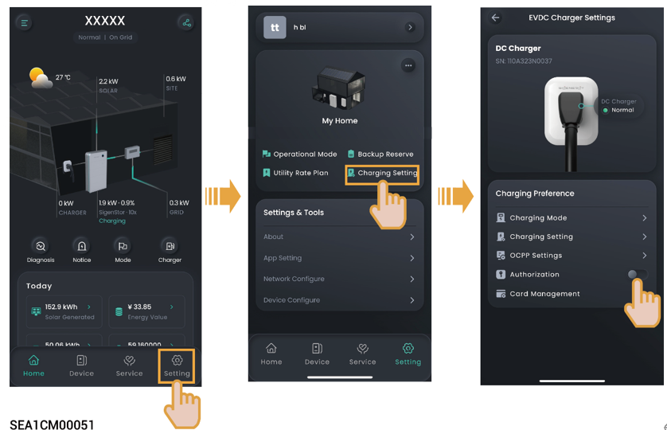

# 无鉴权充电

1. 将“授权”设置为 。

<figure><figcaption></figcaption></figure>

2. 将充电枪安装到位。



* <mark style="color:blue;">**开启无鉴权充电后，他人的车辆均可使用设备充电，请谨慎开启。**</mark>
* <mark style="color:blue;">**当您将充电枪安装于车辆后，设备即刻进行自检测，并与车辆建立连接，约30s\~40s后，对车辆进行充电。在此期间，请耐心等待，请勿对设备操作，包含但不限于拔充电枪。**</mark>
* <mark style="color:blue;">**若出现车辆无法充电情况，可尝试重新拔插充电枪，确保充电枪与车辆连接到位后，重新启动充电。**</mark>
