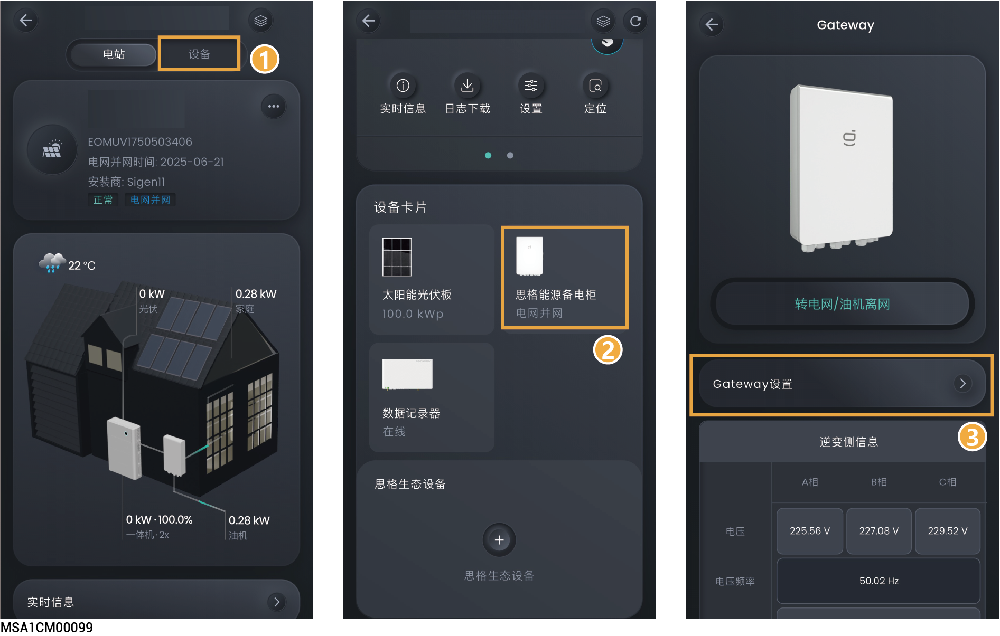

# 思格能源备电柜

## **内置思格能源备电柜**

<figure><figcaption></figcaption></figure>

## **外置思格能源备电柜**

<figure><figcaption></figcaption></figure>

<table><thead><tr><th width="76" align="center">序号</th><th width="236">参数名称</th><th>说明</th></tr></thead><tbody><tr><td align="center"><strong>1</strong></td><td>电网恢复延迟时间</td><td>设置电网故障恢复后，设备启动时间。</td></tr><tr><td align="center"><strong>2</strong></td><td>离网使能</td><td>当设置为 时，设备可离网运行【1】。</td></tr><tr><td align="center"><strong>3</strong></td><td>油机电网口使能</td><td>当设置为 时，支持柴油发电机从电网口接入。</td></tr></tbody></table>

注【1】：并离网切换，还可通过点击“思能能源备电柜”→“转电网离网”实现。
