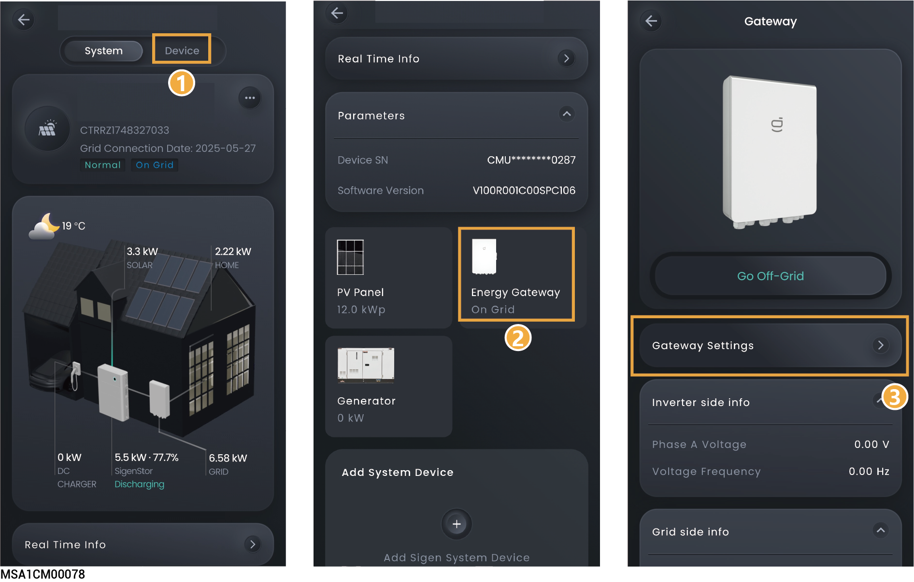

# Gateway设置

## 外置Gateway

<figure><figcaption></figcaption></figure>

## 内置Gateway

<figure><figcaption></figcaption></figure>

### Operating Settings

<table><thead><tr><th width="76" align="center">序号</th><th width="236">参数名称</th><th>说明</th></tr></thead><tbody><tr><td align="center">1</td><td>Grid recovery delay time</td><td>设置电网故障恢复后，设备启动时间。</td></tr><tr><td align="center">2</td><td>Neutral Grounding</td><td>当设置为 时，设备离网运行时，中性点使能。</td></tr></tbody></table>

注【1】：并离网切换，还可通过点击“Gateway”→“Go-Off-Grid” 实现。

<table><thead><tr><th width="76" align="center">序号</th><th width="236">参数名称</th><th>说明</th></tr></thead><tbody><tr><td align="center">1</td><td>Off-Grid Enable</td><td>当设置为 时，设备可离网运行【1】。</td></tr><tr><td align="center">2</td><td>Generator via grid port</td><td>当设置为 时，支持柴油发电机从电网口接入。</td></tr></tbody></table>
