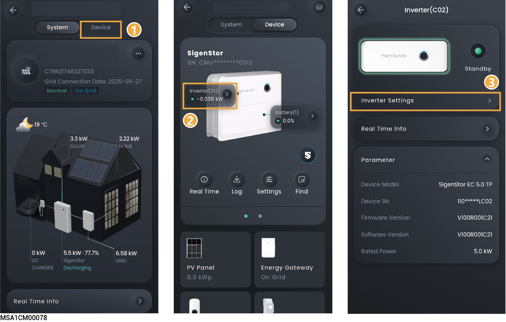

# Inverter

<figure><figcaption></figcaption></figure>

## **IPS (only available for Italian grid code CEI-021)**

<table><thead><tr><th width="60" align="center">No.</th><th width="264">Parameter name</th><th>Description</th></tr></thead><tbody><tr><td align="center">1</td><td>IPS external command signal</td><td>Specifies IPS external command signal.</td></tr><tr><td align="center">2</td><td>IPS local command signal</td><td>Specifies IPS local command signal.</td></tr></tbody></table>

## **Power**

<table><thead><tr><th width="59" align="center">No.</th><th width="266">Parameter name</th><th>Description</th></tr></thead><tbody><tr><td align="center">1</td><td>Maximum apparent power</td><td>You can set this parameter to adjust the maximum apparent power of the device.</td></tr><tr><td align="center">2</td><td>Maximum Active Power Output</td><td>You can set this parameter to adjust the maximum output active power of the device.</td></tr><tr><td align="center">3</td><td>Maximum Active Power Input</td><td>You can set this parameter to adjust the maximum input active power of the device.</td></tr></tbody></table>

## **System Parameters**

<table><thead><tr><th width="60" align="center">No.</th><th width="249.272705078125">Parameter name</th><th>Description</th></tr></thead><tbody><tr><td align="center">1</td><td>Insulation impedance threshold</td><td>To ensure the safety of the equipment, the equipment cannot operate if the equipment detects that the measured insulation resistance to the ground output by the PV array is lower than the value set for this parameter.</td></tr><tr><td align="center">2</td><td>PV input start voltage</td><td>You can set a lower starting voltage when few PV strings are connected.</td></tr><tr><td align="center">3</td><td>Ground fault detection</td><td>When it is set to , a grounding error alarm is generated when the device is not grounded or properly grounded.</td></tr><tr><td align="center">4</td><td>MPPT Multi-peak Scanning</td><td>When it is set to,</td></tr></tbody></table>

## **Fan parameters**

<table><thead><tr><th width="59" align="center">No.</th><th width="165">Parameter name</th><th>Description</th></tr></thead><tbody><tr><td align="center">1</td><td>External fan silent mode regulation</td><td>When it is set to , the maximum fan speed is limited to reduce fan noise.</td></tr></tbody></table>

## **EMS Control**

<table><thead><tr><th width="60" align="center">No.</th><th width="162">Parameter name</th><th>Description</th></tr></thead><tbody><tr><td align="center">1</td><td>Single-Machine Active Power Dispatch Enable</td><td>
When it is set to , the power is scheduled for a single device, and you can set it to either active power mode or reactive power mode.

Inverters with this parameter set cannot participate in EMS control.
</td></tr></tbody></table>

## AFCI

<table><thead><tr><th width="63" align="center">No.</th><th width="169.1817626953125">Parameter name</th><th>Description</th></tr></thead><tbody><tr><td align="center">1</td><td>AFCI Enables</td><td>When it is set to , the device will conduct the DC arc testing.</td></tr></tbody></table>
