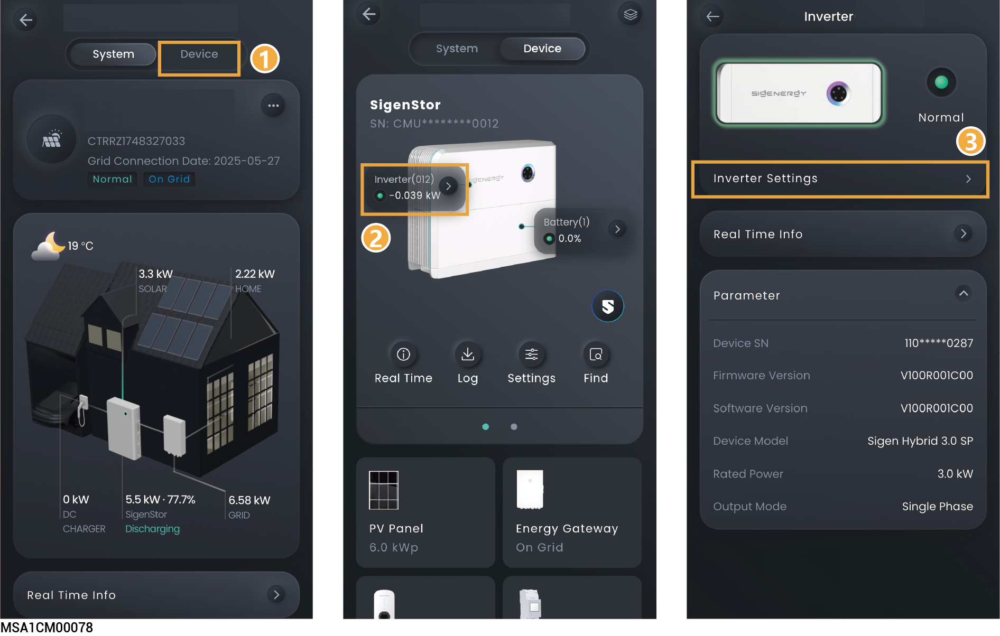

# Inverter Settings

<figure><figcaption></figcaption></figure>

## **IPS (only available for Italian grid code CEI-021)**

<table><thead><tr><th width="60" align="center">No.</th><th width="264">Parameter name</th><th>Description</th></tr></thead><tbody><tr><td align="center">1</td><td>IPS external command signal</td><td>Specifies IPS external command signal.</td></tr><tr><td align="center">2</td><td>IPS local command signal</td><td>Specifies IPS local command signal.</td></tr></tbody></table>

## **System Parameters**

<table><thead><tr><th width="75" align="center">No.</th><th width="246.272705078125">Parameter name</th><th>Description</th></tr></thead><tbody><tr><td align="center">1</td><td>Insulation impedance threshold</td><td>To ensure the safety of the equipment, the equipment cannot operate if the equipment detects that the measured insulation resistance to the ground output by the PV array is lower than the value set for this parameter.</td></tr><tr><td align="center">2</td><td>PV input start voltage</td><td>You can set a lower starting voltage when few PV strings are connected.</td></tr><tr><td align="center">3</td><td>Ground fault detection</td><td>When it is set to , a grounding error alarm is generated when the device is not grounded or properly grounded.</td></tr><tr><td align="center">4</td><td>MPPT Multi-peak Scanning</td><td>
When it is set to, Can trigger multi-peak scanning.
<ul><li>MPPT Multi-Peak Scanning Interval: Set the multi-peak scanning cycle time, and it will scan once every set interval.</li></ul></td></tr><tr><td align="center">5</td><td>Leakage current optimization enabled</td><td>When it is set to, It can reduce the machine's leakage current to the ground, but may also increase the device's power loss.</td></tr><tr><td align="center">6</td><td>Grid Power Loss No-Auto-Start Endble</td><td>After a power grid failure, the inverter cannot recover automatically and requires manual confirmation before clearing the fault alarm on the App.</td></tr></tbody></table>

## **Power**

<table><thead><tr><th width="59" align="center">No.</th><th width="266">Parameter name</th><th>Description</th></tr></thead><tbody><tr><td align="center">1</td><td>Maximum apparent power</td><td>You can set this parameter to adjust the maximum apparent power of the device.</td></tr><tr><td align="center">2</td><td>Maximum Active Power Output</td><td>You can set this parameter to adjust the maximum output active power of the device.</td></tr><tr><td align="center">3</td><td>Maximum Active Power Input</td><td>You can set this parameter to adjust the maximum input active power of the device.</td></tr><tr><td align="center">4</td><td>Max. Continuous Current</td><td>Set maximum apparent current.</td></tr></tbody></table>

## **Fan parameters**

<table><thead><tr><th width="165">Parameter name</th><th>Description</th></tr></thead><tbody><tr><td>External fan silent mode regulation</td><td>When it is set to , the maximum fan speed is limited to reduce fan noise.</td></tr></tbody></table>

## **EMS Control**

<table><thead><tr><th width="162">Parameter name</th><th>Description</th></tr></thead><tbody><tr><td>Single-Machine Active Power Dispatch Enable</td><td>
When it is set to , the power is scheduled for a single device, and you can set it to either active power mode or reactive power mode.

<mark style="color:orange;">Inverters with this parameter set cannot participate in EMS control.</mark>
</td></tr></tbody></table>

## Pack Delayed Activation

<table><thead><tr><th width="193.22222900390625">Parameter name</th><th>Description</th></tr></thead><tbody><tr><td>Pack Delay Activation Enable</td><td>When it is set to <mark style="color:$danger;">,</mark> PACK activation is delayed. During initial startup, the PACK is not activated. After startup is completed, manually activate the PACK via the APP interface as needed.</td></tr></tbody></table>

## PV- positive bias

<table><thead><tr><th width="75.5">No.</th><th width="216">Parameter name</th><th>Description</th></tr></thead><tbody><tr><td>1</td><td>PID Compensation Direction</td><td>
PID compensation direction. Only supports P-type panels or PV positive bias.
<ul><li>PV Positive Bias: When it is set to, PV positive bias can be set.</li></ul></td></tr><tr><td>2</td><td>Pid Repair Enable</td><td>When it is set to, PID repair is activated. Works only during nighttime when the grid relay is disconnected.</td></tr><tr><td>3</td><td>Pid Protection Enabled</td><td>When it is set to, PID protection is activated. Only applicable to IT grids, i.e., grids with an isolation transformer on the output.</td></tr><tr><td>4</td><td>Nighttime PID Protection Enabled</td><td>When it is set to, nighttime PID protection is activated. If an abnormality is detected in the PID module during nighttime operation, the system shuts down for protection.</td></tr></tbody></table>

## Islanding

<table><thead><tr><th width="76.25">No.</th><th width="235">Parameter name</th><th>Description</th></tr></thead><tbody><tr><td>1</td><td>Active Anti-islanding</td><td>When it is set to , active anti-islanding is activated.</td></tr><tr><td>2</td><td>Passive Islanding Enable</td><td>When set to , islanding detection is performed by monitoring changes in voltage, frequency, phase, or harmonics at the equipment output when the grid power is off. Passive Islanding Phase Angle Protection Value: When the phase jump of the grid voltage exceeds the set protection value, it will trigger the passive islanding protection action.</td></tr></tbody></table>

## AFCI

<table><thead><tr><th width="169.1817626953125">Parameter name</th><th>Description</th></tr></thead><tbody><tr><td>AFCI Enables</td><td>When it is set to , the device will conduct the DC arc testing.</td></tr></tbody></table>
