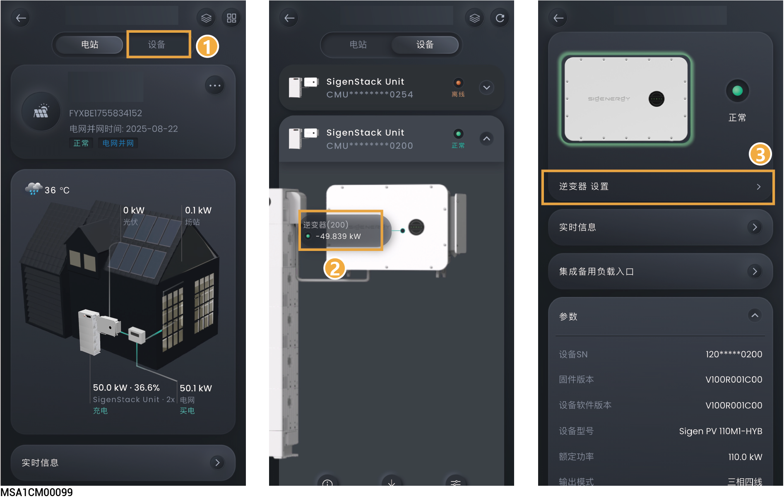

# 逆变器

<figure><figcaption></figcaption></figure>

## IPS（仅意大利CEI-021电网标准码存在）

<table><thead><tr><th width="83" align="center">序号</th><th width="264">参数名称</th><th>说明</th></tr></thead><tbody><tr><td align="center">1</td><td>IPS 外部指令信号</td><td>设置IPS外部指令信号。</td></tr><tr><td align="center">2</td><td>IPS本地指令信号</td><td>设置IPS内部指令信号。</td></tr></tbody></table>

## **功率**

<table><thead><tr><th width="79" align="center">序号</th><th width="264">参数名称</th><th>说明</th></tr></thead><tbody><tr><td align="center">1</td><td>最大视在功率</td><td>设置本参数可调整设备的最大视在功率。</td></tr><tr><td align="center">2</td><td>最大输出有功功率</td><td>设置本参数可调整设备的最大输出有功功率。</td></tr><tr><td align="center">3</td><td>最大输入有功功率</td><td>设置本参数可调整设备的最大输入有功功率。</td></tr></tbody></table>

## **系统参数**

<table><thead><tr><th width="70" align="center" valign="middle">序号</th><th width="205.00006103515625" valign="middle">参数名称</th><th valign="top">说明</th></tr></thead><tbody><tr><td align="center" valign="middle">1</td><td valign="middle">绝缘阻抗阈值</td><td valign="top">为保护设备安全，当设备检测到实际光伏阵列输出的对地绝缘阻抗值＜此参数所设置的值时，设备无法运行。</td></tr><tr><td align="center" valign="middle">2</td><td valign="middle">光伏输入启动电压</td><td valign="top">当接入的PV组串较少时，可设置更低的启动电压。</td></tr><tr><td align="center" valign="middle">3</td><td valign="middle">漏电流优化使能</td><td valign="top">当设置为时，当设备未接地或接地不良时，将产生接地异常告警。</td></tr><tr><td align="center" valign="middle">4</td><td valign="middle">MPPT 多峰扫描</td><td valign="top">
当设置为时，可触发多峰扫描。
<ul><li>MPPT 多峰扫描周期: 设置多峰扫描周期时间，每隔设置时间扫描一次。</li></ul></td></tr><tr><td align="center" valign="middle">5</td><td valign="middle">漏电流优化使能</td><td valign="top">当设置为时，可减少机器对地的漏电流，但是同时可能会增加设备功率损耗。</td></tr></tbody></table>

## **风扇参数**

<table><thead><tr><th width="215" valign="middle">参数名称</th><th valign="top">说明</th></tr></thead><tbody><tr><td valign="middle">外置风扇静音模式</td><td valign="top">当设置为时，风扇最大转速将被限制，从而降低风扇产生的噪音。</td></tr></tbody></table>

## **EMS控制**

<table><thead><tr><th width="203" valign="middle">参数名称</th><th valign="top">说明</th></tr></thead><tbody><tr><td valign="middle">单台功率调度使能</td><td valign="top">
设置为时，针对单台设备进行功率调度，可设置有功功率调节模式，无功功率调节模式。

<mark style="color:orange;">设置了本参数的逆变器，将无法参与EMS控制。</mark>
</td></tr></tbody></table>

## AFCI 

<table><thead><tr><th width="241">参数名称</th><th>说明</th></tr></thead><tbody><tr><td>AFCI 使能</td><td>当设置为时 , 设备将进行直流电弧测试。</td></tr></tbody></table>
