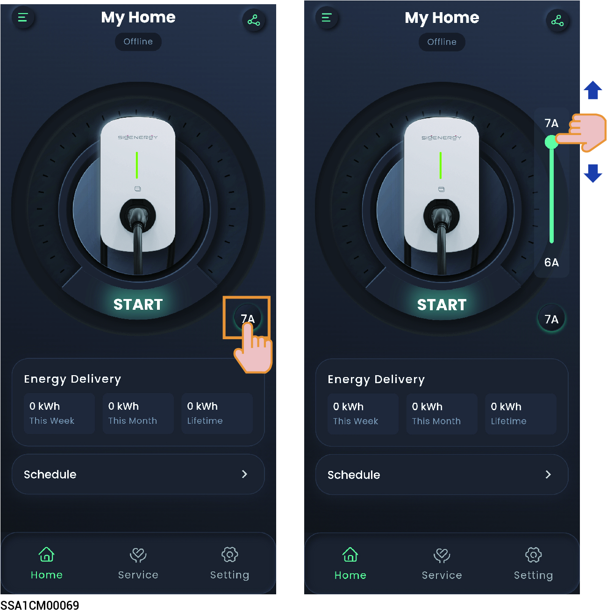
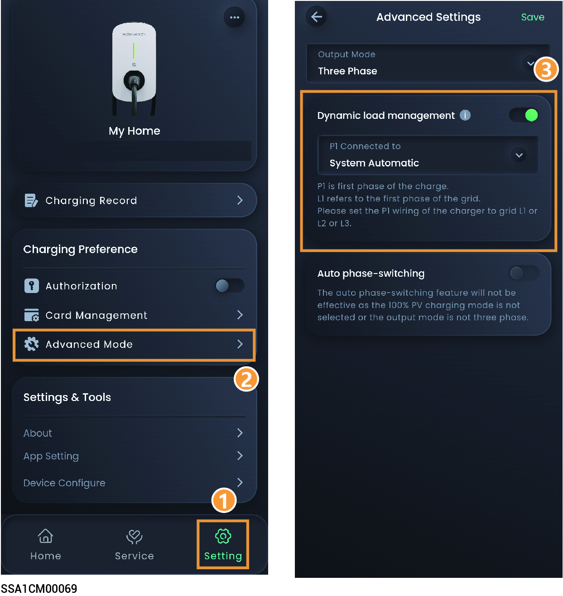

# Sigen EV AC Charger设置



<mark style="color:blue;">纯充场景仅可接入一台Sigen EV AC Charger，光充或光储场景一台SigenStor最多可接入两台Sigen EV AC Charger。</mark>

## **纯充场景**

<figure><figcaption></figcaption></figure>

## **光充或光储充场景**



* <mark style="color:blue;">接入一台Sigen EV AC Charger需和SigenStor连接FE网线。</mark>
* <mark style="color:blue;">接入两台Sigen EV AC Charger需和SigenStor连接相同WLAN网络，添加步骤参见</mark> [售后服务](../../station-parameter-setup/an-zhuang-shang-gong-ju/after-sales-service.md)<mark style="color:blue;">**。**</mark>

<figure><figcaption></figcaption></figure>

<table><thead><tr><th width="159.818115234375">参数名称</th><th>说明</th></tr></thead><tbody><tr><td>Schedule</td><td>若接入的车支持预约充电功能，可设置预约充放电时段。</td></tr></tbody></table>

### **Charging Preference**

<table><thead><tr><th width="77" align="center">序号</th><th width="166.54541015625">参数名称</th><th>说明</th></tr></thead><tbody><tr><td align="center">1</td><td>Charging Record</td><td>点击可查看充电记录。</td></tr><tr><td align="center">2</td><td>Charging Mode</td><td>
<strong>Fast Charging</strong>
<ul><li>Battery Boost：设置为时，家用电池给Sigen EV AC Charger充电。</li><li>Cut-OFF SOC：Battery Boost使能时，当实际SOC＜设置参数时，家用电池停止给Sigen EV AC charger充电。</li></ul>
<strong>PV Surplus Charging</strong>
<ul><li>Grid Charging：设置为时，可设置连接设备的额定功率。</li><li>The maximum power from the grid：在PV余电充电模式下，当PV功率不足时，可以从电网获取的最大功率值</li><li>Surplus PV priority：选中设备，上下拖动可修改设备优先级。</li></ul>
<strong>Sigen AI Mode：</strong>
<ul><li>若需使用此模式，开通步骤参见（<a href="ke-xuan-sigen-ev-ac-charger-kai-tong-sigen-ai-mode.md">可选）Sigen EV AC Charger开通Sigen AI Mode</a></li><li>通过整合当地波峰波谷电价、天气数据并结合用户用电习惯，定制智能用电解决方案，实现充电全流程智能化调度，以最大程度为用户节约充电成本并带来便捷体验。</li></ul></td></tr><tr><td align="center">3</td><td>OCPP Management</td><td><ul><li>OCPP Status：显式OCPP连接状态。</li><li>OCPP Settings：设置为 时，Sigen EV AC Charger可以连接到OCPP的服务器，使用者可以从URL下拉菜单选择OCPP的平台。</li></ul></td></tr><tr><td align="center">4</td><td>Authorization</td><td>充电鉴权设置。设置为 时，可无鉴权充电。</td></tr><tr><td align="center">5</td><td>Card Management</td><td>绑定Sigen RFID card。</td></tr><tr><td align="center">6</td><td>Advanced Mode</td><td><ul><li>Output Mode：根据实际安装的电网情况，选择单相或三相输出充电。</li><li><mark style="color:$danger;">P1 Connected to：当Output Mode设置为单相时，可设置P1连接到哪一相。</mark></li><li>Dynamic load management：组网中安装Power Sensor后，且非离网状态，设置为 时，Sigen EV AC Charger将支持动态负载管理（DLM）。Sigen EV AC Charger通过比较Power Sensor上报的并网点功率信息和安装商开局时设置的“Rated Household Circuit Breaker Current”值，快速并智能的调整充电电流（功率），防止配电单元内Household Circuit Breaker断开。</li><li>Home air circuit breaker rated current：入户空开的电流规格，控制交流桩的充电功率，使入户电流小于该设置值。</li><li>Allow charging when off-grid：设置为 时，离网运行时允许充电。</li></ul></td></tr><tr><td align="center">7</td><td>Indicator Settings</td><td>点击可设置Sigen EV AC Charger的LED灯开关。</td></tr><tr><td align="center">8</td><td>Connectivity</td><td>
<strong>Ethernet</strong>
<ul><li>显示FE连接状态。</li><li>FE网络连接参数默认DHCP自动获取。若您需要更改，请按以下步骤操作：</li></ul><ol><li>配置一个可以正常上网的WLAN，或插入4G流量卡。</li><li>待“WLAN”或“Cellular”显示已连接后，拔出设备用于连接网络的网线。</li><li>将“Obtain IP address automatically”设置为，修改参数。</li></ol>
4. 重新将用于连接网络的网线插入设备。

<strong>WLAN</strong>

显示WLAN连接状态。若此处显示未连接，但您想采用WLAN连接网络，可选择支持2.4g频段的WLAN热点进行连接。 注：
<ul><li>连接非加密WLAN，可能导致网络不可用，不推荐使用。</li><li>当设备仅可用WLAN连接网络时，不可切换其他无线路由器WLAN。</li></ul>
<strong>Cellular</strong>
<ul><li>显示4G连接状态。若此处显示未连接，但您想采用4G连接网络，请确保4G流量卡已插入。</li><li>当采用4G通信时，可查看当前每月使用的流量，同时可设置每月使用流量阈值。</li></ul></td></tr></tbody></table>

### **Charger Settings**

<table><thead><tr><th width="81" align="center">序号</th><th width="199">参数名称</th><th>说明</th></tr></thead><tbody><tr><td align="center"><strong>1</strong></td><td>Grid Code</td><td>根据设备所在的国家/地区设置电网标准码。</td></tr><tr><td align="center"><strong>2</strong></td><td>Ground mode</td><td>根据当地电网类型设置接地类型。</td></tr><tr><td align="center"><strong>3</strong></td><td>Home air circuit breaker rated current</td><td>根据配电单元内的家庭总输入断路器设置额定电流值。</td></tr><tr><td align="center"><strong>4</strong></td><td>Input circuit breaker rated current</td><td>根据配电单元内设备连接的断路器设置额定电流值。</td></tr><tr><td align="center"><strong>5</strong></td><td>Charging pile type</td><td>可选择充电桩类型。</td></tr><tr><td align="center"><strong>6</strong></td><td>Phase Type</td><td>根据设备实际接线设置相线类型。</td></tr><tr><td align="center"><strong>7</strong></td><td>Maintenance</td><td><ul><li>Reset：设备重启。</li><li>Erase All Content：可清除5min性能数据、告警、小时&#x26;日&#x26;月&#x26;年发电量、运行日志、设备信息等，请谨慎操作。</li></ul></td></tr><tr><td align="center">8</td><td><mark style="color:$danger;">Modbus Settings</mark></td><td><mark style="color:$danger;">Modbus Native (Slave) Address：点击设置Modbus 从机地址。</mark></td></tr></tbody></table>



<mark style="color:blue;">Sigen EV AC Charger用户日常使用方式及注意事项请参见《Sigen EV AC Charger用户手册》。</mark>

## 充电电流调节



<mark style="color:blue;">输出电流值越高，充电功率越大。</mark>

#### 手动调节

<figure><figcaption></figcaption></figure>

#### DLM自动调节



<mark style="color:$primary;">系统电站中必须安装功率传感器。</mark>

<figure><figcaption></figcaption></figure>

## 充电/停止充电设置

### 纯充电场景

在"首页"界面点击"开始"或"停止"。

### 光伏充电或光伏+储能+充电场景

在"设备"界面点击"交流充电桩"，然后点击"开始"或"停止"。
