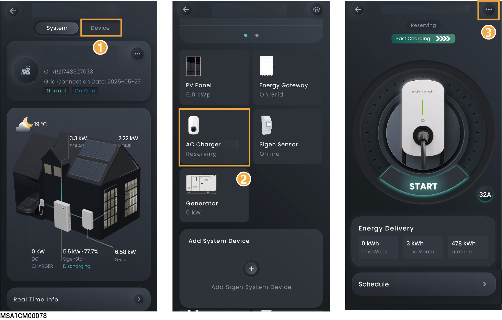

# Sigen EV AC Charger



<mark style="color:blue;">In pure charging scenarios, only one Sigen EV AC Charger can be connected. In PV charging or PV storage scenarios, one SigenStor can connect up to two Sigen EV AC Chargers.</mark>

## **Pure charging application**

<figure><figcaption></figcaption></figure>

## **PV charging or PV storage & charging application**



* <mark style="color:blue;">To connect a Sigen EV AC Charger, you need to connect the FE network cable to SigenStor.</mark>
* <mark style="color:blue;">To connect two Sigen EV AC Chargers, you need to connect them to the same WLAN network as SigenStor. For the steps to add them, refer to</mark> [Post-Sales service.](../../station-parameter-setup/installer-tool/after-sales-service.md)

<figure><figcaption></figcaption></figure>

## **Charging Preference** 

<table><thead><tr><th width="72" align="center">No.</th><th width="154.8887939453125">Parameter name</th><th>Description</th></tr></thead><tbody><tr><td align="center">1</td><td>Schedule</td><td>If the connected car supports the scheduled Charging function, you can set the scheduled charging and discharging periods.</td></tr><tr><td align="center">2</td><td>Charging Record</td><td>You can view the charging records.</td></tr><tr><td align="center">3</td><td>Charging Mode</td><td>
<strong>Fast Charging</strong>
<ul><li>Battery Boost: When set to , it allows charging from the home battery.</li><li>Cut-OFF SOC: When Battery Boost is enabled, the battery will stop charging the Sigen EV AC charger if the actual SOC is less than the set parameter.</li></ul>
<strong>PV Surplus Charging</strong>
<ul><li>Battery Boost: When set to , it allows charging from the home battery.</li><li>Cut-OFF SOC: When Battery Boost is enabled, the battery will stop charging the Sigen EV AC charger if the actual SOC is less than the set parameter.</li><li>Grid Charging: When set to , it allows setting the rated power of the connected device.</li><li>Surplus PV priority: If this parameter is set, it will redirect to the priority page for PV power generation.</li></ul></td></tr><tr><td align="center">4</td><td>OCPP Setting</td><td><ul><li>OCPP Status: Display explicit OCPP connection status.</li></ul><ul><li>When it is set to , Sigen EV AC Charger can be connected to the OCPP server, and users can select the OCPP platform from the URL drop-down list.</li></ul></td></tr><tr><td align="center">5</td><td>Authorization</td><td>Set the charging authentication. When it is set to , unauthenticated charging is allowed.</td></tr><tr><td align="center">6</td><td>Card Management</td><td>Bind a Sigen RFID card.</td></tr><tr><td align="center">7</td><td>Advanced Mode</td><td><ul><li>Output Mode: Select single-phase or three-phase output as needed.</li></ul><ul><li>Dynamic load management: When Power Sensor is installed in the networking and is not in off-grid state, and if it is set to , Sigen EV AC Charger will support dynamic load management (DLM). Sigen EV AC Charger quickly and intelligently regulates the charging current (power) by comparing the power at the grid-connection point reported by the Power Sensor with the "Rated Household Circuit Breaker Current" set by the installer when creating new systems to prevent the Household Circuit Breaker in the distribution panel from being disconnected.</li><li>Home air circuit breaker rated current: The current specification of the household circuit breaker controls the charging power of the AC pile so that the household current is less than the set value.</li><li>Allow charging when off-grid: When it is set to , charging is allowed during off-grid operation.</li></ul></td></tr><tr><td align="center">8</td><td>Indicator Settings</td><td>Click to set the LED light on/off for the Sigen EV AC Charger.</td></tr><tr><td align="center">9</td><td>Connectivity</td><td>
<strong>Ethernet</strong>
<ul><li>Displays the connection status of Fast Ethernet.</li><li>For Fast Ethernet, network parameters are automatically obtained using a DHCP server. To edit parameters, do the following:</li></ul><ol><li>Configure a WLAN that can access the internet or insert a 4G SIM card.</li><li>Wait until "WLAN" or "Cellular" is displayed as "Connected,” and disconnect the network cable.</li><li>Set "Obtain IP address automatically" to and edit parameters.</li><li>Re-connect the network cable to the device.</li></ol>
<strong>WLAN</strong>

Displays the connection status of WLAN. If the connection status is displayed as "Not connected" and you want to use the WLAN to access internet, select a WLAN hotspot supporting 2.4 GHz band.

Notes:
<ul><li>Non-encrypted WLAN is not recommended as it may lead to Internet access failure.</li><li>When WLAN is the only connection path for the devices to access the internet, switching WLAN to any other wireless router will be prohibited.</li></ul>
<strong>Cellular</strong>
<ul><li>Displays the connection status of 4G network. If the connection status is displayed as "Not connected," and you want to use the 4G network to access the internet, ensure that you insert the 4G SIM card.</li><li>When 4G is used for communication, users can view the monthly traffic usage and set a traffic usage threshold for each month.</li></ul></td></tr></tbody></table>

## **Charger Settings** 

<table><thead><tr><th width="76" align="center">No.</th><th width="183.2222900390625">Parameter name</th><th>Description</th></tr></thead><tbody><tr><td align="center">1</td><td>Grid Code</td><td>Specifies a grid code based on the country/region when devices are used.</td></tr><tr><td align="center">2</td><td>Ground mode</td><td>Specifies the grounding type according to local grid type.</td></tr><tr><td align="center">3</td><td>Home air circuit breaker</td><td>Specifies the rated current according to the home main incoming circuit breaker within the distribution panel.</td></tr><tr><td align="center">4</td><td>Input circuit breaker rated current</td><td>Specifies the rated current according to circuit breakers connected to devices in the distribution panel.</td></tr><tr><td align="center">5</td><td>Charging pile type</td><td>You can choose the charging pile type.</td></tr><tr><td align="center">6</td><td>Phase Type</td><td>Specifies the phase type according to actual wiring.</td></tr><tr><td align="center">7</td><td>Maintenance</td><td><ul><li>Reset: The device restarts.</li><li>This will clear 5-minute performance data, alarms, hourly/daily/monthly/annual power generation records, operation logs, device information, etc. Proceed with caution.</li></ul></td></tr></tbody></table>



<mark style="color:blue;">For use and precautions of the Sigen EV AC Charger, refer to the Sigen EV AC Charger User Manual.</mark>
