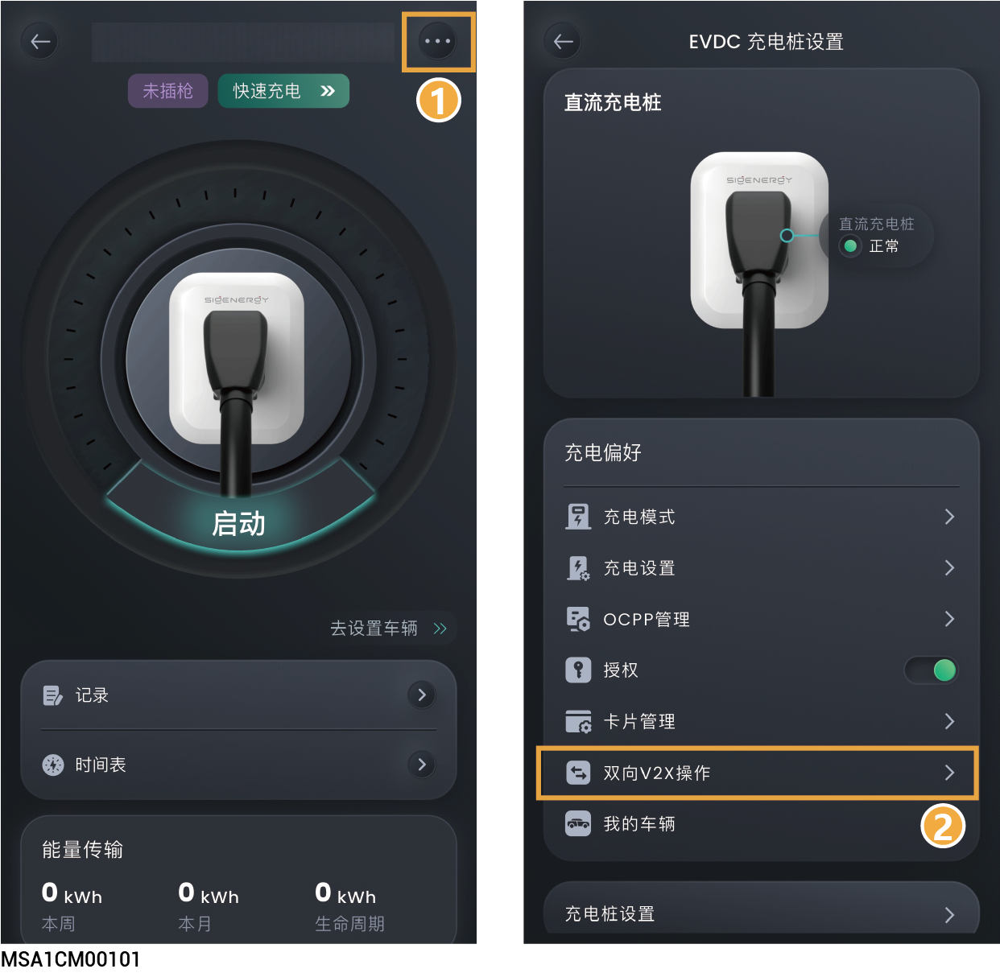

# （可选）V2X功能开通与开启



* <mark style="color:blue;">若要开通V2X功能，需将SigenStor软件版本升级到SPC110。</mark>
* <mark style="color:blue;">开启V2X功能后，将直流充电桩作为额外的“储能”，参与整个电站的调度，为家用设备或电网放电。</mark>

<figure><figcaption></figcaption></figure>

<table><thead><tr><th width="82.45452880859375">序号</th><th width="125.40399169921875">参数名称</th><th>说明</th></tr></thead><tbody><tr><td>1</td><td>双向V2X操作</td><td>

<ul><li><strong>开通V2X功能：</strong>首次使用，点击此参数，需签署风险告知协议、填写车型基础信息后，可开通V2X功能。</li><li><strong>开启V2X功能</strong>：开通V2X功能后，点击此参数，将双向V2X操作设置为时，开启V2X功能。</li><li><strong>控制添加手动：</strong>设置后可强制让直流充电桩在特定时间放电。</li></ul></td></tr></tbody></table>
