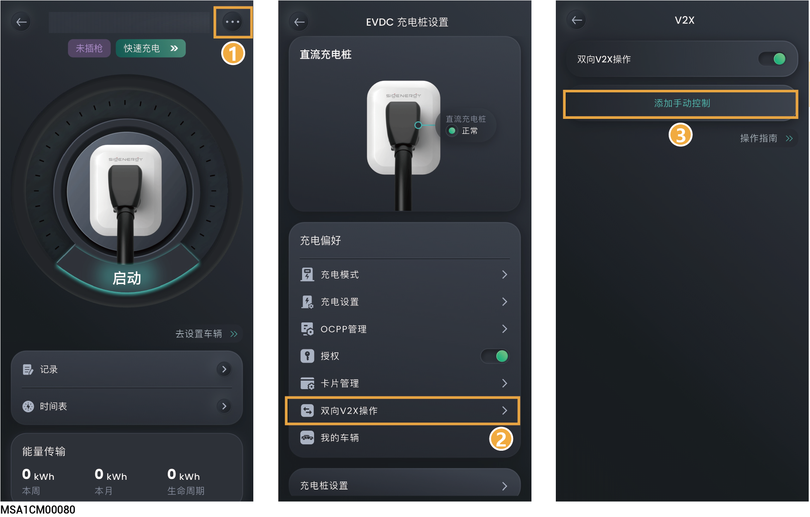

# （可选）V2X功能开通与一键放电

## **V2X功能开通**



* <mark style="color:blue;">开</mark>通V2X功能后可将直流充电桩作为额外 “储能” 参与电站调度，在离网时为家庭放电，或在电池放电时与其他 “储能” 一同参与放电。
* 设备软件版本（SPC110）需支持V2X放电使能功能。

<figure><figcaption></figcaption></figure>

<table><thead><tr><th width="82.45452880859375">序号</th><th width="125.40399169921875">参数名称</th><th>说明</th></tr></thead><tbody><tr><td>1</td><td>双向V2X操作</td><td>首次使用，点击开通V2X功能，需签署风险告知协议、填写车型基础信息。</td></tr><tr><td>2</td><td>我的车辆</td><td><ul><li>添加的电动车需支持V2X功能。</li></ul><ul><li>可添加多台电动车，并设置其中一台车为首选车辆。</li></ul><ul><li>电池容量：设置电动车电池容量。根据车辆实际电池容量填写。</li></ul></td></tr></tbody></table>

## **一键放电**



* 需开通V2X功能后可设置此参数。
* 设置后强制使直流充电桩放电，系统优先执行此参数。

<figure><figcaption></figcaption></figure>

<table><thead><tr><th width="77">序号</th><th width="184.09088134765625">参数名称</th><th>说明</th></tr></thead><tbody><tr><td>1</td><td>添加手动控制</td><td><ul><li>持续时间：设置直流充电桩放电持续时间。</li><li>功率：设置直流充电桩放电功率，可设置范围为0~25。</li></ul></td></tr><tr><td>2</td><td>停止充电</td><td>点击可停止强制直流充电桩反向放电。</td></tr></tbody></table>
