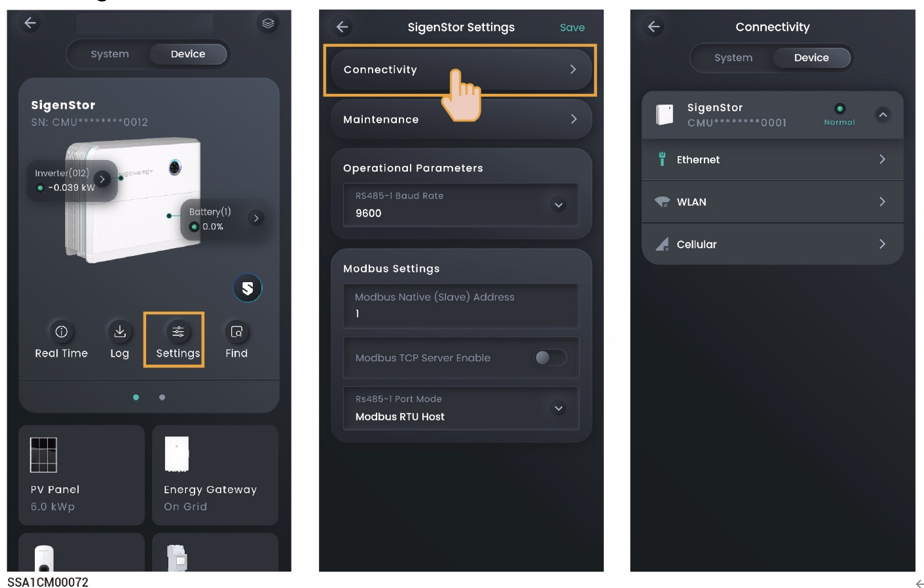

# SigenStor

.jpeg>)

## Internet connection

Click the "Connectivity" area to view the communication method of the device connecting to the network.

<figure><figcaption></figcaption></figure>

<table><thead><tr><th width="60" align="center">No.</th><th width="146">Parameter name</th><th>Description</th></tr></thead><tbody><tr><td align="center"><strong>1</strong></td><td>Ethernet</td><td><ul><li>Displays the connection status of Fast Ethernet.</li><li><strong>For Fast Ethernet, network parameters are automatically obtained using a DHCP server. To edit parameters, do the following:</strong></li></ul><ol><li>Configure a WLAN that can be normally connected to the Internet, or insert Sigen CommMod.</li><li>Wait until "WLAN" or "Cellular" is displayed as "Connected,” and disconnect the network cable.</li><li>Set "Obtain IP address automatically" to  and edit parameters.</li><li>Re-connect the network cable to the device.</li></ol></td></tr><tr><td align="center"><strong>2</strong></td><td>WLAN</td><td>
<strong>Displays the connection status of WLAN. If the connection status is displayed as "Not connected,” but you want to use the WLAN to connect to the Internet, do the following:</strong>
<ul><li>In parallel mode, identify the connection status of WLAN in "System Settings.” If the status is displayed as "Connected,” the device is communicated over WLAN, and no more action is required. If the status is displayed as "Not connected,” configure the WLAN as described in ‎2.3.1.5 Grid scheduling.</li><li>In non-parallel mode, configure the WLAN as described in ‎2.3.1.5 Grid scheduling.</li></ul></td></tr><tr><td align="center"><strong>3</strong></td><td>Cellular</td><td>
<strong>Displays the connection status of 4G network. If the connection status is displayed as "Not connected" and you want to use the 4G network to access Internet, do the following:</strong>
<ul><li>In parallel mode, identify the connection status of 4G network in "System Settings.” If the status is displayed as "Connected,” the device is communicated over the 4G network, and no more action is required. If the status is displayed as "Not connected,” please make sure that Sigen CommMod is inserted.</li><li>In non-parallel mode, please make sure that Sigen CommMod is inserted.</li><li>When 4G is used for communication, users can view the monthly traffic usage and set a traffic usage threshold for each month.</li></ul></td></tr></tbody></table>

## History maintenance

By clicking "Maintenance,” you can clear historical data.



* <mark style="color:blue;">**When you click "Reset,” the device restarts.**</mark>
* <mark style="color:blue;">**When you click "Erase All Content,” performance data within 5 minutes, alarms, and hourly/daily/monthly/yearly generating capacity, operation logs, device information will be cleared. Please exercise caution with this action.**</mark>

## Power on/off

By clicking "Maintenance" and then "Power-off" or "Power-on,” you can power the system on or off.

## Operational Parameters

<table><thead><tr><th width="60" align="center">No.</th><th width="183">Parameter name</th><th>Description</th></tr></thead><tbody><tr><td align="center">1</td><td>RS485-1 Baud Rate</td><td>Specifies the data transfer rate of the RS485 port.</td></tr></tbody></table>

## ModBus parameters

You need to set these parameters when the device is communicated with a third-party EMS over the ModBus-TCP protocol.

<table><thead><tr><th width="60" align="center">No.</th><th width="148">Parameter name</th><th>Description</th></tr></thead><tbody><tr><td align="center"><strong>1</strong></td><td>ModBus Server Address</td><td>Specifies the IP address of a third-party EMS server when the device functions as the Modbus TCP client.</td></tr><tr><td align="center"><strong>2</strong></td><td>ModBus Server Port</td><td>Specifies the port for the device to communicate with a third-party EMS when the device functions as the Modbus TCP client.</td></tr><tr><td align="center"><strong>3</strong></td><td>ModBus Local (Slave) Address</td><td>Specifies the Modbus address of the device when the Modbus protocol is used.You must set different Modbus addresses for devices in parallel mode.</td></tr><tr><td align="center"><strong>4</strong></td><td>ModBus TCP Server Enable</td><td>When this parameter is set to , the device functions as the Modbus TCP server and enables connection with a third-party EMS.</td></tr></tbody></table>
