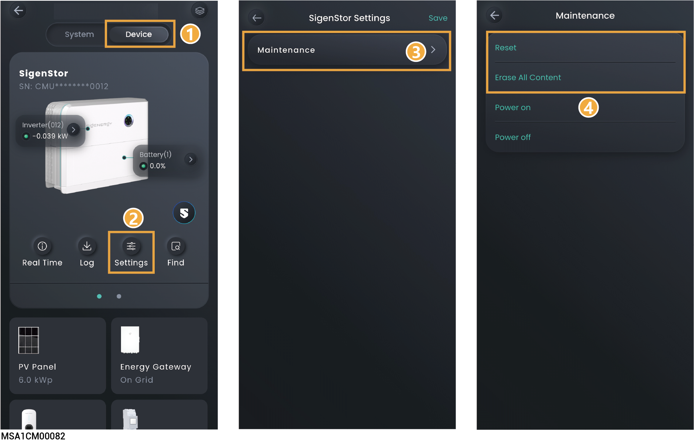
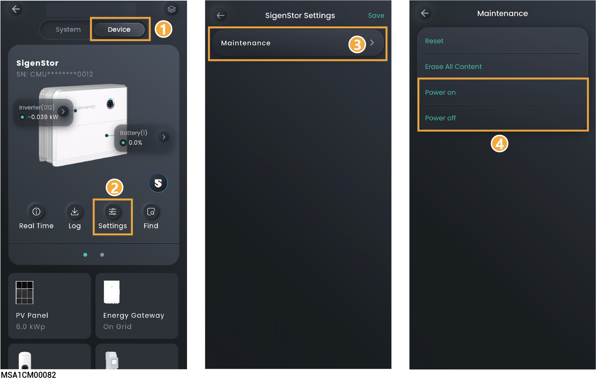

# SigenStor/SigenStack Unit设置

## **历史信息维护**



* <mark style="color:blue;">执行“Reset”，设备将重启。</mark>
* <mark style="color:blue;">执行“Erase All Content”，可清除5min性能数据、告警、小时&日&月&年发电量、运行日志、设备信息等，请谨慎操作。</mark>

<figure><figcaption></figcaption></figure>

## **设备开关机**



<mark style="color:blue;">日本地区不支持此功能。</mark>

<figure><figcaption></figcaption></figure>
