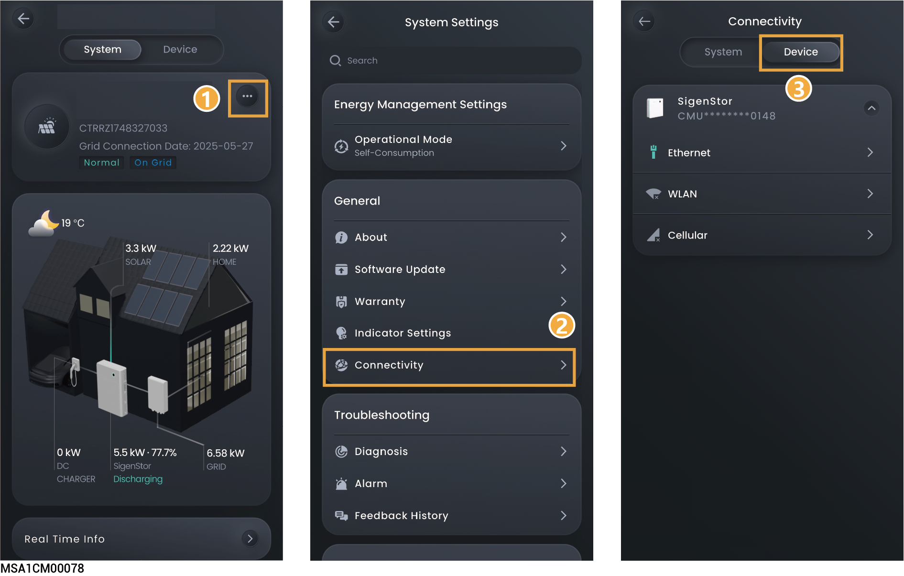

# 设备远端网络连接

<figure><figcaption></figcaption></figure>

<table><thead><tr><th width="68" valign="middle">序号</th><th width="112" valign="middle">参数名称</th><th valign="top">说明</th></tr></thead><tbody><tr><td valign="middle">1</td><td valign="middle">Ethernet</td><td valign="top">
显示FE连接状态。
<ul><li>
<mark style="color:$danger;">Ethernet：此参数设置后，对Ethernet、WLAN、Cellular都生效。</mark>
<ul><li><mark style="color:$danger;">Primary DNS ：主DNS，用于域名解析的DNS服务器，不可编辑。</mark></li><li><mark style="color:$danger;">Secondary DNS：副DNS，用于域名解析备用DNS服务器，可编辑。</mark></li></ul></li><li>
<mark style="color:$danger;">Obtain IP address automatically：设置为</mark><mark style="color:$danger;">时，自动获取IP地址。设置为</mark><mark style="color:$danger;">时，用户需设置静态IP地址。</mark>
<ul><li><mark style="color:$danger;">IP Address：当前SigenStor/SigenStack Unit的FE的IP地址。</mark></li><li><mark style="color:$danger;">Gateway：当前SigenStor/SigenStack Unit的FE的网关。</mark></li><li><mark style="color:$danger;">Subnet Mask：当前SigenStor/SigenStack Unit的FE的子网掩码。</mark></li></ul></li><li>FE网络连接参数默认DHCP自动获取。若您需要更改，请按以下步骤操作：</li></ul><ol><li>配置一个可以正常上网的WLAN，或插入Sigen CommMod。</li><li>待“WLAN”或“Cellular”显示已连接后，拔出设备用于连接网络的网线。</li><li>将“Obtain IP address automatically”设置为，修改参数。</li><li>重新将用于连接网络的网线插入设备。</li></ol></td></tr><tr><td valign="middle">2</td><td valign="middle">WLAN</td><td valign="top">
显示WLAN连接状态。

若此处显示未连接，但您想采用WLAN连接网络，请按以下说明操作：
<ul><li>配置WLAN通信前，请确认设备已安装天线。</li><li>连接非加密WLAN，可能导致网络不可用，不推荐使用。</li><li>当设备仅可用WLAN连接网络时，不可切换其他无线路由器WLAN。</li><li><mark style="color:$danger;">点击“Go Set Up”配置WLAN网络。</mark></li></ul></td></tr><tr><td valign="middle">3</td><td valign="middle">Cellular</td><td valign="top">
显示4G连接状态。

若此处显示未连接，但您想采用4G连接网络，请按以下说明操作：
<ul><li>配置4G通信前，请确保Sigen CommMod已插入。</li><li>当采用4G通信时，可查看当前每月使用的流量。</li></ul></td></tr></tbody></table>
