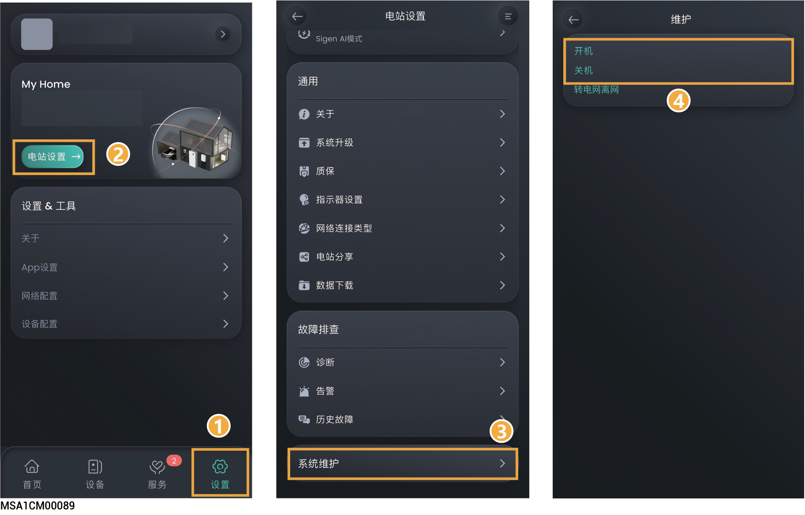
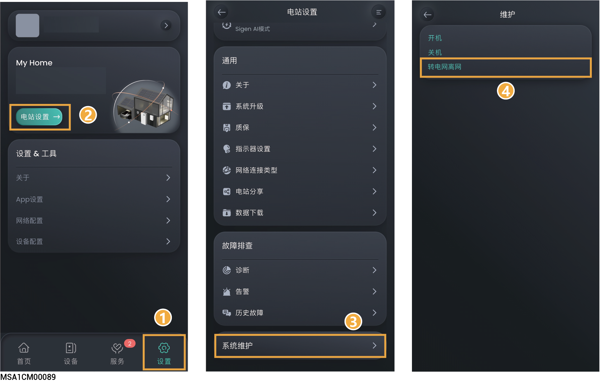
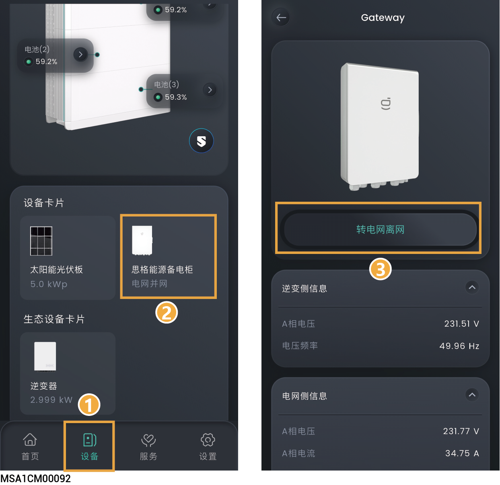

# 电站维护

## **电站设备批量开机/关机**

<figure><figcaption></figcaption></figure>

## **电站并离网切换**



<mark style="color:$primary;">若未配置思格能源备电柜请忽略此章节。</mark>



* <mark style="color:red;">当设置为“</mark>转电网离网<mark style="color:red;">”后，您的逆变器支持离网运行。离网运行时，逆变器防孤岛功能将关闭。</mark>
* <mark style="color:red;">您在进行任何配电系统操作前（包含但不限于安装、接线、更换等），请确保所有供电电源及其对应断路器断开，包括但不限于电网侧、逆变器和柴油发电机电源开关，避免带电操作。</mark>

### **方式一：**

<figure><figcaption></figcaption></figure>

### **方式二：**

<figure><figcaption></figcaption></figure>
