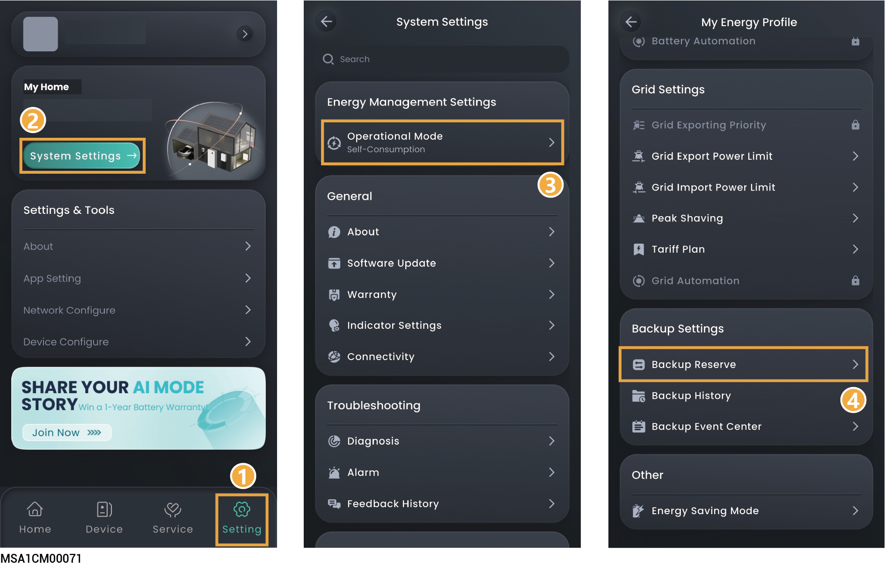
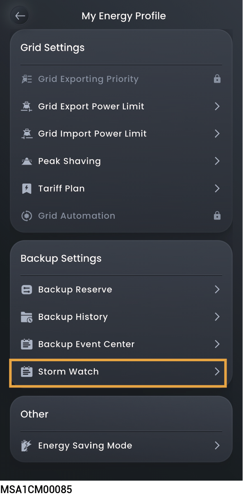

# Backup Setting

## Backup Reserve



* <mark style="color:blue;">Skip this section if no Gateway is configured.</mark>
* <mark style="color:blue;">Users can manually set this parameter according to the power interruption frequency of their regions and leave time.</mark>

If there is a gateway in your networking, you can manually set the "Backup Reserve" value in the mySigen App. In grid connection mode, the battery stops discharging when the backup power SOC setting is reached. In the event of grid power outage, the backup power becomes available.

For example, the backup power SOC is set in Self-Consumption Mode.

<figure><figcaption></figcaption></figure>

<figure><figcaption></figcaption></figure>

## Backup History



<mark style="color:blue;">After installing the Gateway in the system, grid-connection and off-grid events will be automatically recorded. You can view the timing and reasons for grid mode switching through the following methods.</mark>

## Storm Watch



* This function is only available for power stations that have batteries and have enabled the off-grid function.
* After enabling this function, the system will charge the batteries in advance after obtaining extreme weather information.

<figure><figcaption></figcaption></figure>

<table><thead><tr><th width="81.88885498046875" align="center" valign="middle">No.</th><th width="178.3233642578125" valign="middle">Parameter name</th><th width="458.888916015625" valign="top">Description</th></tr></thead><tbody><tr><td align="center" valign="middle">1</td><td valign="middle">Storm Watch</td><td valign="top">When set to，the Storm Watch function is enabled.</td></tr><tr><td align="center" valign="middle">2</td><td valign="middle">Backup Settings</td><td valign="top">Enable backup before the storm：Set the duration for pre - charging before extreme weather, which can be set from 1 - 24 hours.</td></tr><tr><td align="center" valign="middle">3</td><td valign="middle">Weather Warnings</td><td valign="top">Select the type of extreme weather.</td></tr></tbody></table>
