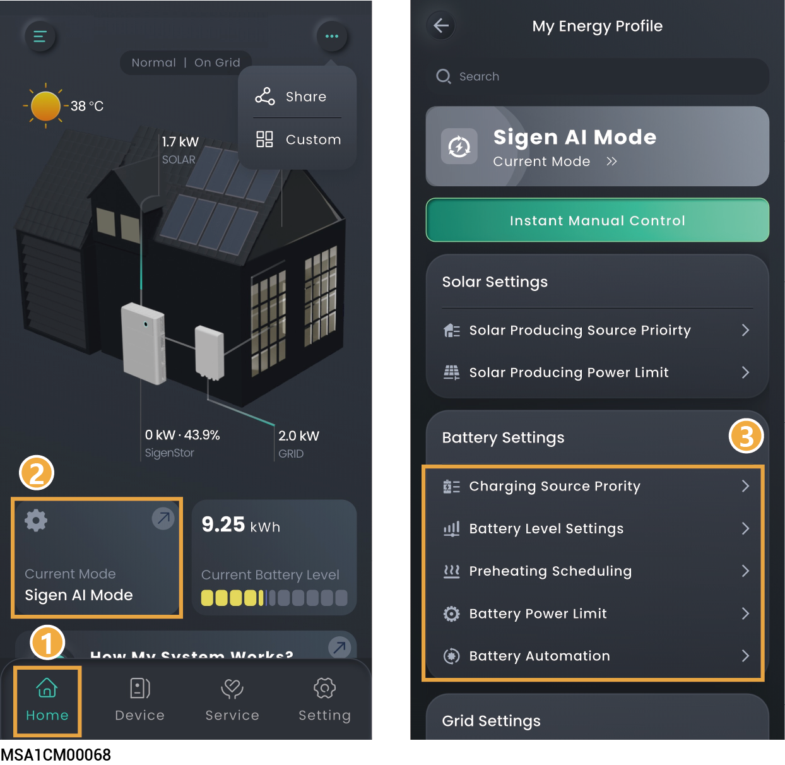

# Battery Settings

Setting battery-related parameters can optimize battery performance, extend battery life, and achieve intelligent charging and discharging strategies.

<figure><figcaption></figcaption></figure>

## Charging Source Prority



* <mark style="color:blue;">The battery acquires power according to the set order.</mark>
* <mark style="color:blue;">By default priority, PV is placed before Grid, PV solar charges the battery first, Grid supplements the remaining charge.</mark>
* <mark style="color:blue;">In the negative electricity price scenario, Grid can be adjusted to be before PV.</mark>

## Battery Discharging Prority



<mark style="color:blue;">Battery releases power according to the set order. The battery discharge priority can be configured based on the actual situation.</mark>

## Battery Level Setting

<table><thead><tr><th width="63" align="center">No.</th><th width="157.36358642578125">Parameter name</th><th>Description</th></tr></thead><tbody><tr><td align="center">1</td><td>Charge Cut-off SOC</td><td>Sets the capacity at which the battery pack stops charging.</td></tr><tr><td align="center">2</td><td>Discharge Cut-off SOC</td><td>
<strong>Sets the capacity at which the battery pack stops discharging.</strong>
<ul><li>Value 0% is recommended for this parameter.</li><li>The priority is given to "Backup Capacity" in backup system wiring mode, while the parameter is applied in non-backup system wiring mode.</li></ul></td></tr><tr><td align="center">3</td><td>Peak shaving</td><td>Set the battery peak shaving cutoff point.</td></tr><tr><td align="center">4</td><td>Backup Reserve SOC</td><td><ul><li>You can set this parameter when a gateway exists in the system wiring.</li><li>In the on-grid scenario, the battery pack stops discharging when the backup capacity value is reached. In the off-grid scenario, the battery pack supplies power to power device and stops discharging when the Discharge Cut-off SOC setting is reached.</li><li>Users can manually set this parameter according to the power interruption frequency of their regions and leave time. Value 0 is not recommended for this parameter to avoid irreversible attenuation due to failure to charge the battery pack in time.</li></ul></td></tr></tbody></table>

## Battery Preheating scheduling



<mark style="color:blue;">Pre-adjust the battery temperature to the optimal working range in low temperature environments to prevent performance degradation and safety hazards caused by low temperature.</mark>

### Residential Energy Storage Station

<table><thead><tr><th width="67" align="center">No.</th><th width="206">Parameter name</th><th>Description</th></tr></thead><tbody><tr><td align="center">1</td><td>Battery Preheating Scheduling</td><td>When set to , the scheduled heating time periods for the battery heating film can be set.</td></tr><tr><td align="center">2</td><td>Heating</td><td>Click to add scheduled heating time periods for the battery heating film.</td></tr></tbody></table>

### Commercial & Industrial Energy Storage Station

After Battery Preheating Scheduling set to, the preheating mode needs to be selected.

#### **Manual Setting**

In manual mode, it is necessary to manually set the scheduled heating time periods for the battery heating film and the expected charging and discharging power.

<table><thead><tr><th width="75">No.</th><th width="217">Parameter Name</th><th>Description</th></tr></thead><tbody><tr><td>1</td><td>Preheating</td><td>When set to, activates the scheduled heating function for the battery heating film.</td></tr><tr><td>2</td><td>Heating</td><td>Click to add scheduled heating time periods for the battery heating film.</td></tr><tr><td>3</td><td>Target Charging Power</td><td>Due to low temperatures limiting battery charging power, heating stops when the charging capability exceeds this value after heating starts.</td></tr><tr><td>4</td><td>Target Discharging Power</td><td>Due to low temperatures limiting battery discharging power, heating stops when the discharging capability exceeds this value after heating starts.</td></tr></tbody></table>

#### **Depends on System (Automatic)**

Automatic mode is only supported when the station is in TOU scheduling mode.

## Battery Power Limit



<mark style="color:blue;">If you need to set more detailed charging and discharging data, you can set this parameter.</mark>

<table><thead><tr><th width="77" align="center">No.</th><th width="259">Parameter name</th><th>Description</th></tr></thead><tbody><tr><td align="center">1</td><td>Battery Max Charging Power</td><td>Set the maximum charging input power allowed by the battery.</td></tr><tr><td align="center">2</td><td>Battery Max Discharging Power</td><td>Set the maximum discharging output power allowed by the battery.</td></tr></tbody></table>

## Battery Automation



<mark style="color:blue;">If this parameter is set, the battery will prioritize executing the parameters set by Battery Automation.</mark>

<table><thead><tr><th width="68" align="center">No.</th><th width="148">Parameter name</th><th>Description</th></tr></thead><tbody><tr><td align="center">1</td><td>Add Time Period</td><td>Click to add Time Period.</td></tr><tr><td align="center">2</td><td>Add your action</td><td>
Click to add battery operation status.

<strong>Battery Charging</strong>
<ul><li>Maximum Charging Power: Set the maximum total input power allowed for the battery charging, including all charging sources.</li><li>Maximum Charging Power From grid to BAT: Set the maximum charging input power from Grid to BAT. This parameter must be ≤ Maximum Charging Power.</li><li>Battery Charging From Grid Cut-off SOC: When the battery SOC reaches this threshold, the grid is forced to stop charging the battery.</li><li>Battery Charging Source Priority: Adjust the battery energy source priority.</li></ul>
<strong>Battery Discharging</strong>
<ul><li>Maximum Discharging Power: Set the maximum total discharging output power allowed for the battery.</li><li>Maximum Discharging Power from BAT to Grid: Set the maximum discharging output power from BAT to Grid.This parameter must be ≤ Maximum Discharging Power.</li><li>Discharge Cut-off SOC from BAT to Grid: When the battery SOC reaches this threshold, the BAT is forced to stop transmitting power to the grid.</li></ul>
<strong>Battery Preserve: Maintain the current SOC without change.</strong>

<strong>Battery Self Consumption</strong>
<ul><li>Maximum Charging Power: Set the maximum charging input power from PV to the battery.</li><li>Maximum Discharging Power: Set the maximum discharging output power of the battery to the household load.</li></ul></td></tr></tbody></table>
