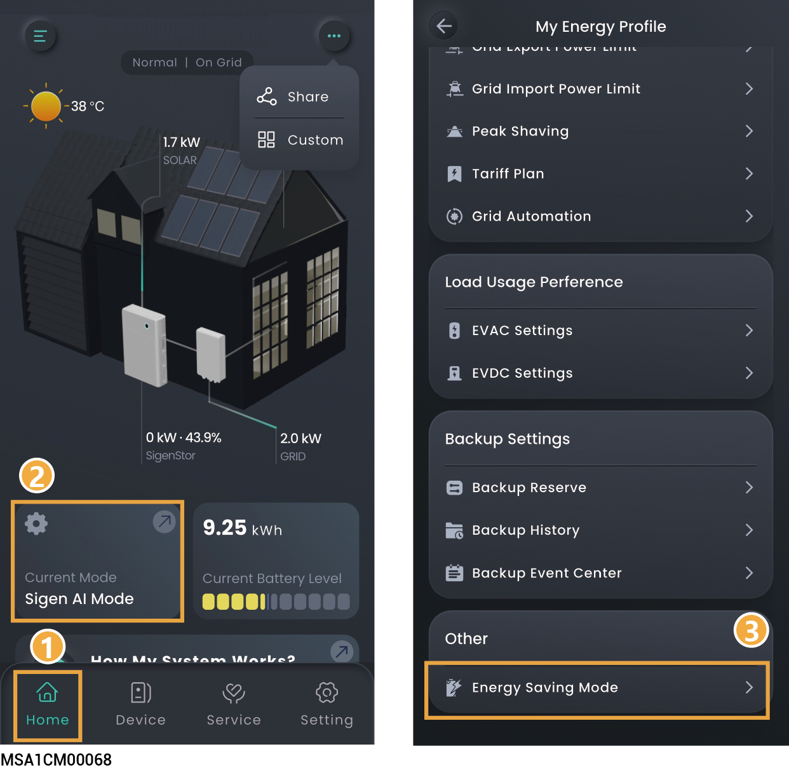

# Energy Saving Mode



<mark style="color:blue;">After configuration, this setting can reduce the power consumption of the power station. You may select either Performance Mode or Deep Energy Saving Mode based on actual requirements.</mark>

<figure><figcaption></figcaption></figure>
