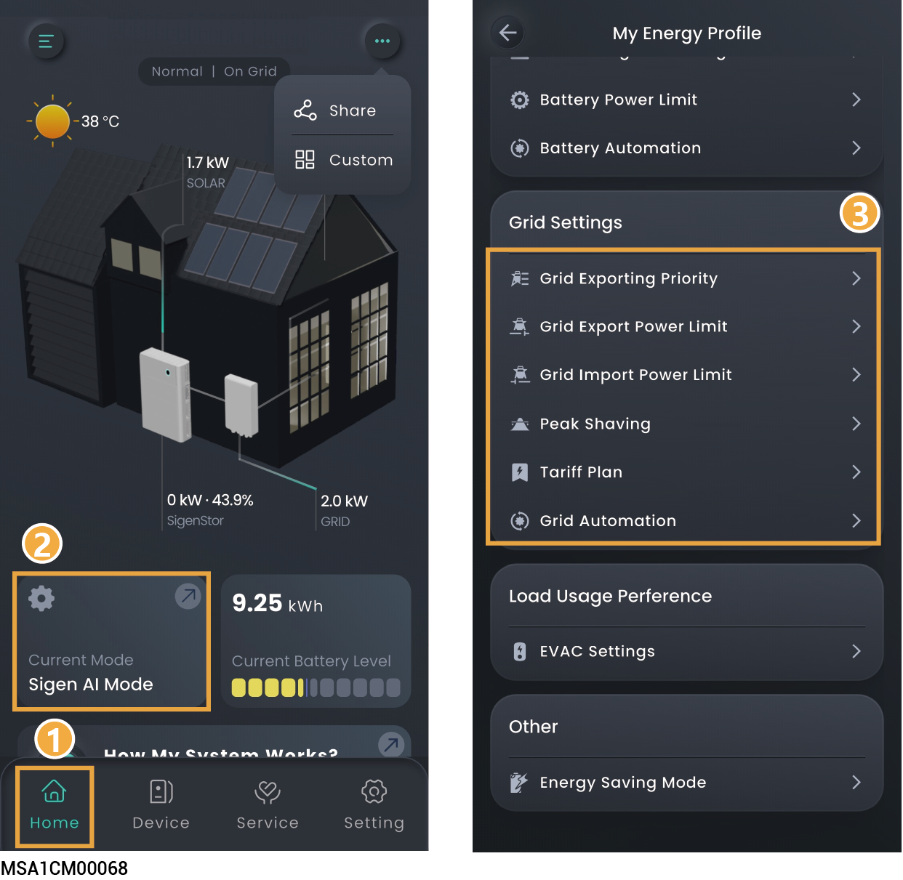

# Grid Settings

Setting grid-related parameters can ensure safe grid connection, compliant electricity sales, and maximum revenue.

<figure><figcaption></figcaption></figure>

## Grid Exporting Priority



* <mark style="color:blue;">By default priority, PV is placed before Battery. PV power prioritizes grid feed-in, with battery supplementing grid sales.</mark>
* <mark style="color:blue;">In the negative electricity price scenario, Battery can be adjusted to be before PV.</mark>
* <mark style="color:blue;">The device sells electricity to the grid according to the set order.</mark>

## Grid power setting

<table><thead><tr><th width="62" align="center">No.</th><th width="203.6666259765625">Parameter name</th><th>Description</th></tr></thead><tbody><tr><td align="center">1</td><td>Grid Export Power Limit</td><td>Set the system's maximum power for selling electricity to the grid.</td></tr><tr><td align="center">2</td><td>Grid Import Power Limit</td><td>Set the system's maximum power for buying electricity from the grid.</td></tr></tbody></table>

## Peak Shaving



* <mark style="color:blue;">The electricity bill in some regions is calculated as follows: Total electricity bill = Cost at peak power + cost for electricity usage + other costs. Wherein, peak power refers to the maximum power imported from the grid. This mode is suitable for areas with peak and valley electricity prices and significant price differences.</mark>
* <mark style="color:blue;">The Peak Shaving function can be used with all working modes, configuring the maximum peak power drawn from the grid to reduce the maximum peak power drawn from the grid during peak periods, thereby lowering the electricity bill.</mark>

#### **Active Power Control**

<table><thead><tr><th width="71" align="center">No.</th><th width="186">Parameter name</th><th>Description</th></tr></thead><tbody><tr><td align="center">1</td><td>Peak shaving SOC</td><td>This parameter setting affects the capacity of peak shaving, and the system charges the battery to the set SOC value during the off-peak period. The larger the parameter setting, the stronger the peak shaving capability.</td></tr><tr><td align="center">2</td><td>Schedule</td><td>A maximum of 24 timetables can be added.</td></tr><tr><td align="center">3</td><td>Maximum Peak Power</td><td>Set the maximum peak power for drawing electricity from the grid for household loads and battery packcharging.</td></tr></tbody></table>

### Example 1: Self-Consumption Mode Settings for Peak Shaving

Assume that the peak shaving SOC is set to 50% and the maximum peak power is 2kW. Because Total electricity bill = Cost at peak power + cost for electricity usage + other costs. Wherein, peak power refers to the maximum power imported from the grid. After Self-Consumption Mode is set to Peak Shaving, the power purchased from the grid drops from 5 kW to 2 kW, so the total electricity bill is reduced.

<figure><figcaption></figcaption></figure>

### Example 2: Time-based Control Mode Settings for Peak Shaving

Assume that the peak shaving SOC is set to 50% and the maximum peak power is 2kW. Because Total electricity bill = Cost at peak power + cost for electricity usage + other costs. Wherein, peak power refers to the maximum power imported from the grid. After Time-based Control Mode is set to Peak Shaving, the power purchased from the grid drops from 5 kW to 2 kW, so the total electricity bill is reduced.

<figure><figcaption></figcaption></figure>

## Tariff Plan



<mark style="color:blue;">Some electricity rate operators require entering a Secret Key. Please refer to the actual display in the App interface.</mark>

### **Tariff Rate Plan**

Static tariff refers to a pricing model in which the electricity tariff remains fixed and is not adjusted based on time, supply and demand conditions, or system cost fluctuations, throughout the entire billing cycle.

<table><thead><tr><th width="72.88885498046875">No.</th><th width="218.111083984375">Parameter name</th><th>Description</th></tr></thead><tbody><tr><td>1</td><td>Utility Company</td><td>Select a utility company.</td></tr><tr><td>2</td><td>(Optional) Secret Key</td><td>Used to set a secret key of the utility company. After the key is set, the app can get and display the electricity tariff.</td></tr><tr><td>3</td><td>Rate Plan Name</td><td>Select an electricity tariff plan.</td></tr><tr><td>4</td><td>Currency Unit</td><td>The value is defaulted to the smallest currency unit of the electricity tariff in the country/region where the power station is located. This parameter cannot be edited.</td></tr><tr><td>5</td><td>Additional Fee</td><td>Automatically match the additional fee.</td></tr><tr><td>6</td><td>Demand Charge</td><td>Click "Go To Settings" to set the demand charge.</td></tr><tr><td>7</td><td>Customize</td><td>Click to switch to Customize Rate Plan.</td></tr></tbody></table>

### **Customize Rate Plan**

Dynamic tariff refers to a pricing model where the electricity tariff changes in real time according to time and different regions.

<table><thead><tr><th width="70" align="center">No.</th><th width="224">Parameter name</th><th>Description</th></tr></thead><tbody><tr><td align="center">1</td><td>Utility Company</td><td>Select a utility company.</td></tr><tr><td align="center">2</td><td>Rate Plan Name</td><td>Enter the name of the electricity rate plan.</td></tr><tr><td align="center">3</td><td>Currency Unit</td><td>The value is defaulted to the smallest currency unit of the electricity tariff in the country/region where the power station is located. This parameter cannot be edited.</td></tr><tr><td align="center">4</td><td>Rate Plan Type</td><td>
<strong>Single Rate Tariff: A single electricity tariff applies to all time periods.</strong>
<ul><li>Rate Tariff: Used to set the electricity tariff rate.</li></ul>
<strong>TOU Rate Plan: Different electricity tariffs are applied in different time periods.</strong>

Click  to add custom time periods, electricity tariffs, and other information.
</td></tr><tr><td align="center">5</td><td>Go to settings to enable it</td><td>Click to switch to Tariff Rate Plan.</td></tr></tbody></table>

### Demand Charge Settings

Demand charge refers to a two-part tariff model in which charges are not only made based on electricity consumption but also made according to the user's highest power demand within a billing cycle.

<table><thead><tr><th width="89">No.</th><th width="180.11114501953125">Parameter name</th><th>Description</th></tr></thead><tbody><tr><td>1</td><td>Currency Unit</td><td>The value is defaulted to the smallest currency unit of the electricity tariff in the country/region where the power station is located. This parameter cannot be edited.</td></tr><tr><td>2</td><td>Demand Interval</td><td>Used to set a billing settlement cycle.</td></tr><tr><td>3</td><td>Reset Frequency</td><td>Used to set a power calculation cycle.</td></tr><tr><td>4</td><td>Rate Plan Type</td><td>
<strong>Single Rate Tariff: The same demand charge applies to all time periods.</strong>
<ul><li>Demand Rate Tariff: Used to set the demand charge rate.</li></ul>
<strong>TOU Rate Plan: Different demand charges are applied in different time periods.</strong>

Click  to add custom time periods, electricity tariffs, and other information.
</td></tr></tbody></table>

## Grid Automation



<mark style="color:blue;">If this parameter is set, the grid will prioritize executing the parameters set by Grid Automation.</mark>

<table><thead><tr><th width="70" align="center">No.</th><th width="152">Parameter name</th><th>Description</th></tr></thead><tbody><tr><td align="center">1</td><td>Add Time Period</td><td>Click to add Time Period.</td></tr><tr><td align="center">2</td><td>Add your action</td><td>
Click to add grid operation status.

<strong>Grid Self-Consumption: The battery's power is supplied to the load first, and the surplus electric energy is sold to the grid.</strong>
<ul><li>Maximum power for importing from grid: Set the maximum input power for importing from the grid.</li><li>Maximum power for exporting to grid: Set the maximum output power for exporting to the grid.</li></ul>
<strong>Grid Importing: Set the maximum total input power for selling electricity to the grid, including all power sources within the system.</strong>
<ul><li>Maximum power for importing from grid：Set the maximum input power for selling electricity to the grid。</li></ul>
<strong>Grid Exporting: Set the maximum total output power for buying electricity from the grid, including all power sources within the system.</strong>
<ul><li>Maximum power for exporting to grid: Set the maximum output power for buying electricity from the grid.</li><li>Grid Exporting Source Priority: The device sells electricity to the grid according to the set order.</li></ul></td></tr></tbody></table>
